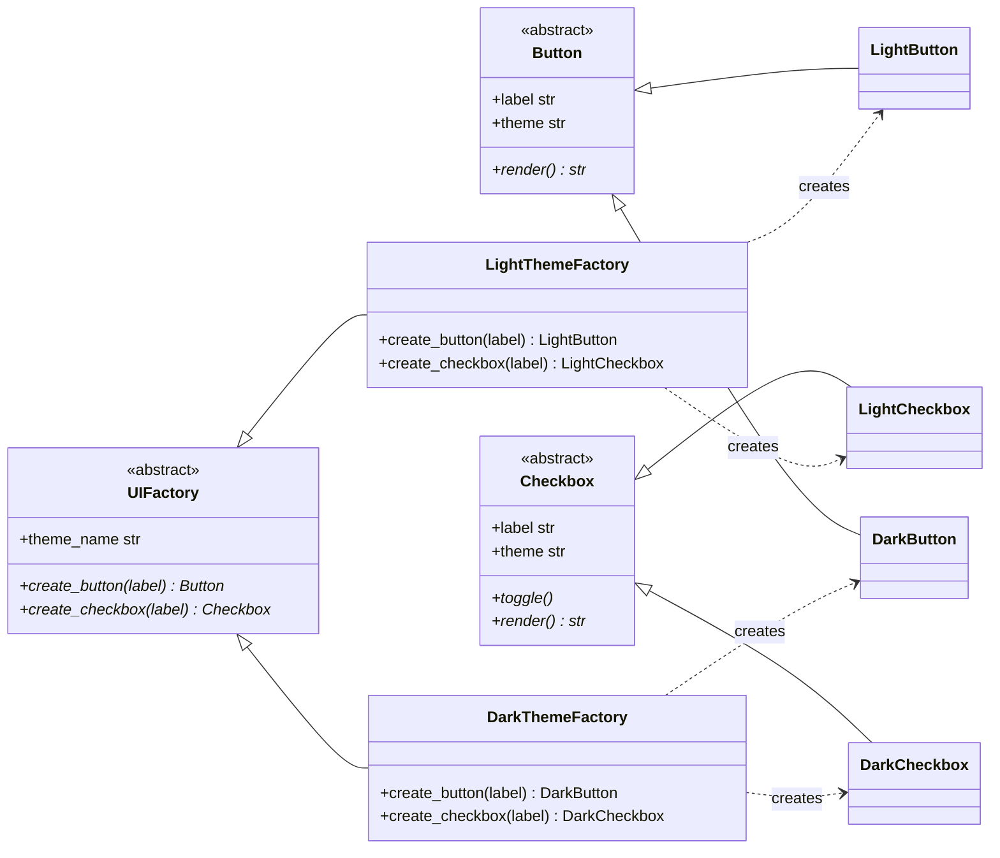

# Abstract Factory Pattern

> **Category:** Creational · **Difficulty:** Intermediate · **Dependencies:** none (Python 3.9+ standard library only)

The **Abstract Factory** pattern provides an interface for creating **families of related objects** without specifying their concrete classes. Where Factory Method decides which *one* class to instantiate, Abstract Factory decides which *matched set* of classes to instantiate — and guarantees the set stays matched.

This directory is a complete, runnable tutorial. You can read it top-to-bottom in about 15 minutes, run the demo, run the tests, and then do the exercises at the end.

---

## Table of contents

1. [The problem it solves](#1-the-problem-it-solves)
2. [Real-world analogy](#2-real-world-analogy)
3. [Structure](#3-structure)
4. [Code walkthrough](#4-code-walkthrough)
5. [Run the demo](#5-run-the-demo)
6. [Run the tests](#6-run-the-tests)
7. [Real-world use cases](#7-real-world-use-cases)
8. [When to use it (and when not to)](#8-when-to-use-it-and-when-not-to)
9. [Related patterns](#9-related-patterns)
10. [Exercises](#10-exercises)
11. [References](#11-references)

---

## 1. The problem it solves

Suppose your application supports a light and a dark theme, and builds its screens like this:

```python
if theme == "dark":
    button = DarkButton("Sign in")
    checkbox = DarkCheckbox("Remember me")
else:
    button = LightButton("Sign in")
    checkbox = LightCheckbox("Remember me")
```

This looks manageable, but three problems creep in as the program grows:

1. **The conditional metastasises.** Every screen that creates widgets repeats the `if theme == ...` branch. Twenty screens × five widget kinds = a hundred creation sites to keep in sync.
2. **Nothing prevents mixed families.** One forgotten branch and you ship a dark button next to a light checkbox. The compiler won't complain; your users will.
3. **Adding a theme means editing everything.** A new "high contrast" theme forces you to revisit every one of those conditionals — the opposite of open/closed.

The Abstract Factory pattern fixes all three by bundling one creation method **per product kind** into a single factory interface (`create_button`, `create_checkbox`). Client code receives *one* factory object and asks it for every widget it needs. Choosing the family becomes a single decision made in a single place — and because one factory answers for the whole family, mixing themes becomes structurally impossible.

## 2. Real-world analogy

Think of a **furniture showroom**. You don't buy a chair from one catalogue, a sofa from another, and a coffee table from a third and hope they match. You pick a *collection* — say, Art Deco or Scandinavian — and order every piece from that collection's catalogue. The catalogue is the factory: whatever you ask it for, the result is guaranteed to match everything else it ever gave you.

In this example:

| Analogy | Code |
| --- | --- |
| "A chair" / "a sofa" (product kinds) | `Button`, `Checkbox` (abstract products) |
| A collection's catalogue | `UIFactory` (abstract factory) |
| The Art Deco catalogue | `LightThemeFactory` / `DarkThemeFactory` (concrete factories) |
| An Art Deco chair | `LightButton`, `DarkCheckbox`, … (concrete products) |
| "Everything in one room matches" | products from one factory share a `theme` |
| You, furnishing a room | `build_login_form(factory)` in [`main.py`](main.py) |

## 3. Structure

One abstract package and two concrete sibling packages with a strict one-way dependency:

```
abstract_factory/
├── ui/                 # ABSTRACT side: knows nothing about themes
│   ├── button.py       #   Button    — abstract product A
│   ├── checkbox.py     #   Checkbox  — abstract product B
│   └── factory.py      #   UIFactory — one create_* method per product kind
├── light_theme/        # CONCRETE family 1: depends on ui/, never vice versa
│   ├── widgets.py      #   LightButton, LightCheckbox
│   └── factory.py      #   LightThemeFactory
├── dark_theme/         # CONCRETE family 2: a sibling, mirrors light_theme/
│   ├── widgets.py      #   DarkButton, DarkCheckbox
│   └── factory.py      #   DarkThemeFactory
├── main.py             # demo client (build_login_form)
└── tests/              # executable specification of the pattern's guarantees
```



`ui/` never imports from `light_theme/` or `dark_theme/`, and the two concrete packages never import each other. You can add a third theme without touching a single existing line — the **Open/Closed Principle** applied to whole families of classes.

## 4. Code walkthrough

### Step 1 — the abstract products ([ui/button.py](ui/button.py), [ui/checkbox.py](ui/checkbox.py))

```python
class Button(ABC):
    @property
    @abstractmethod
    def theme(self) -> str: ...

    @abstractmethod
    def render(self) -> str: ...
```

One abstract interface **per product kind**. `Checkbox` additionally declares `toggle()` because checkboxes carry state. Note the `theme` property: every product must say which family it belongs to, which makes the pattern's central promise testable.

### Step 2 — the abstract factory ([ui/factory.py](ui/factory.py))

```python
class UIFactory(ABC):
    @abstractmethod
    def create_button(self, label: str) -> Button: ...

    @abstractmethod
    def create_checkbox(self, label: str) -> Checkbox: ...
```

This is the pattern's namesake. It is essentially a **bundle of Factory Methods** — one per product kind — on a single interface. Because a client can only hold one factory at a time, it can only ever build one family at a time.

### Step 3 — a concrete family ([light_theme/widgets.py](light_theme/widgets.py), [light_theme/factory.py](light_theme/factory.py))

```python
class LightThemeFactory(UIFactory):
    def create_button(self, label: str) -> Button:
        return LightButton(label)

    def create_checkbox(self, label: str) -> Checkbox:
        return LightCheckbox(label)
```

The concrete factory is almost boring — and that's the point. All it does is answer every `create_*` call with a widget from *its* family. [`dark_theme/`](dark_theme/) is a perfect mirror image with a different visual language.

### Step 4 — the client ([main.py](main.py))

```python
def build_login_form(factory: UIFactory) -> str:
    remember_me = factory.create_checkbox("Remember me")
    sign_in = factory.create_button("Sign in")
    ...
```

Written once, against the abstract types only. The demo renders the same form with two different factories; the client function does not change by a single character between the two runs.

> 💡 Notice there is no `if theme == "dark"` anywhere in the codebase. The variation point moved from *scattered conditionals* to *one constructor call site* — `LightThemeFactory()` vs `DarkThemeFactory()`.

## 5. Run the demo

From the **repository root**:

```bash
python -m abstract_factory.main
```

Expected output:

```text
--- Light theme login form ---
[x] Remember me   (light checkbox)
[ Sign in ]        (light button: black text on white)

--- Dark theme login form ---
(*) Remember me   (dark checkbox)
< Sign in >        (dark button: white text on black)

Same client code, two coherent widget families. No theme mixing.
```

## 6. Run the tests

```bash
python -m unittest discover -s abstract_factory -t .
```

The tests in [tests/](tests/) are written as an executable specification — each one states a guarantee the pattern provides (e.g. *"products from one factory always form a consistent family"*, *"a new family requires no changes to existing code"*). Reading them is a good comprehension check.

## 7. Real-world use cases

You already use this pattern daily, often without noticing:

| Domain | Client asks for… | Factory decides the concrete family |
| --- | --- | --- |
| **GUI toolkits** | "a button, a menu, a scrollbar" | The matching Windows / macOS / GTK native widget set (Java AWT's `Toolkit` is the textbook case) |
| **Database access** | "a connection, a cursor, an error type" | Each DB-API 2.0 driver module (`sqlite3`, `psycopg2`) is a factory for one coherent family |
| **Web frameworks** | "a request, a response, a session" | WSGI/ASGI toolkits supply matched request/response implementations per backend |
| **Cloud SDKs** | "a client, a credential, a retry policy" | One coherent AWS / GCP / Azure family per provider (e.g. `boto3.Session` hands out matching clients) |
| **Testing** | "fake repositories, fake clocks, fake mailers" | A `FakeInfrastructureFactory` vs `RealInfrastructureFactory` — swap one object to swap the whole environment |
| **Game development** | "a soldier, a tower, a projectile" | Medieval / sci-fi / fantasy asset families that must never mix within a level |
| **Document conversion** | "a heading, a table, an image element" | The PDF / DOCX / HTML element family, one renderer per format |
| **OS abstraction** | "a path, a process, a pipe" | Python's `pathlib` picks the `PurePosixPath` / `PureWindowsPath` flavour family per platform |

The common thread: the caller needs **several different objects that must be mutually compatible**, and wants to choose the compatible set once, in one place.

## 8. When to use it (and when not to)

**Use it when:**

- Your code must work with **multiple families** of related products (themes, platforms, vendors, output formats).
- Products from different families must **never be mixed**, and you want that enforced by structure rather than by review.
- You want to swap an entire environment at once — e.g. real infrastructure vs test fakes — by changing one object.
- The families are known to grow: adding one should not mean editing existing client code.

**Don't use it when:**

- There is only **one product kind** — that's plain Factory Method ([`../factory_method/`](../factory_method/)); Abstract Factory would add interfaces with nothing to coordinate.
- There is only **one family** and no second one on the horizon. You'd be paying the abstraction tax with no families to keep apart.
- In Python specifically, lighter tools often suffice: a **module** can act as a factory (import `light_widgets` or `dark_widgets` and call the same function names), and a `dict[str, UIFactory]` or an `Enum` of factories replaces registry ceremony. Reach for the full class-based pattern when you need the *enforced family consistency + polymorphic factory object* combination shown here.

**Trade-off to be aware of:** adding a new product **kind** (say, `Slider`) is expensive — it touches the abstract factory *and every concrete factory*. Abstract Factory optimises for adding families, at the cost of making the product-kind list rigid. If your product kinds change more often than your families, reconsider.

## 9. Related patterns

- **Factory Method** — Abstract Factory is usually *implemented as* a set of factory methods, one per product kind. See [`../factory_method/`](../factory_method/).
- **Builder** — also creates complex results, but step-by-step with a fluent protocol, and focuses on *one* product rather than a family. See [`../builder/`](../builder/).
- **Singleton** — an application typically needs exactly one active factory; concrete factories are often shared as a single instance. See [`../singleton/`](../singleton/).
- **Prototype** — a concrete factory can be built from prototypes, cloning a registered sample of each product instead of instantiating classes. See [`../prototype/`](../prototype/).

## 10. Exercises

Try these to confirm your understanding (each should require **no changes** to `ui/` or to `build_login_form` — if you find yourself editing them, revisit section 3):

1. **New family:** add a `high_contrast/` package with `HighContrastButton`, `HighContrastCheckbox` and `HighContrastFactory` (the test `test_new_family_needs_no_changes_to_ui_or_client` sketches one — turn it into a real sibling package with its own README).
2. **New product kind:** add a `TextField` abstract product and implement it in both themes. Notice how *every* factory has to change — this is the trade-off from section 8. Write down which files you touched.
3. **Break it on purpose:** write a factory whose `create_button` returns a light button while `create_checkbox` returns a dark one. Which test in [`tests/`](tests/) catches the inconsistency, and why can't the type checker catch it?
4. **Pythonic variant:** replace the factory *classes* with two *modules*, `light_skin.py` and `dark_skin.py`, each exposing module-level `create_button` / `create_checkbox` functions, and select one with `importlib.import_module`. What did you gain and what did you lose (hint: try type-annotating the "factory" parameter)?

## 11. References

- Gamma, Helm, Johnson, Vlissides — *Design Patterns: Elements of Reusable Object-Oriented Software* (GoF), Abstract Factory chapter.
- Hiroshi Yuki — *An Introduction to Design Patterns Learned in the Java Language*, Abstract Factory chapter.
- [Refactoring.Guru — Abstract Factory](https://refactoring.guru/design-patterns/abstract-factory)
- [Python `abc` module documentation](https://docs.python.org/3/library/abc.html)
