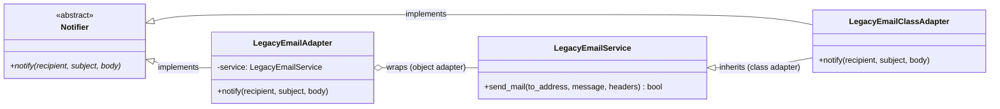

# Adapter Pattern

> **Category:** Structural · **Difficulty:** Beginner-friendly · **Dependencies:** none (Python 3.9+ standard library only)

The **Adapter** pattern converts the interface of an existing class into the interface clients expect. It lets classes work together that couldn't otherwise because of incompatible interfaces — without modifying either side. You keep writing client code against the interface you *want*, and a thin adapter translates every call into the interface you *have*.

This directory is a complete, runnable tutorial. You can read it top-to-bottom in about 15 minutes, run the demo, run the tests, and then do the exercises at the end.

---

## Table of contents

1. [The problem it solves](#1-the-problem-it-solves)
2. [Real-world analogy](#2-real-world-analogy)
3. [Structure](#3-structure)
4. [Code walkthrough](#4-code-walkthrough)
5. [Run the demo](#5-run-the-demo)
6. [Run the tests](#6-run-the-tests)
7. [Real-world use cases](#7-real-world-use-cases)
8. [When to use it (and when not to)](#8-when-to-use-it-and-when-not-to)
9. [Related patterns](#9-related-patterns)
10. [Exercises](#10-exercises)
11. [References](#11-references)

---

## 1. The problem it solves

Your application defines a clean, modern notification interface — `notify(recipient, subject, body)`, failures raised as exceptions. But the only thing that can actually deliver mail is a battle-tested legacy class you are not allowed to touch:

```python
# The API you HAVE (legacy, third-party, frozen):
service.send_mail(to_address, message, headers)   # subject hides in headers["X-Subject"]
                                                  # returns False on failure (no exception!)

# The API you WANT (what all your client code is written against):
notifier.notify(recipient, subject, body)         # raises NotificationError on failure
```

The naive fix is to sprinkle the translation everywhere it's needed:

```python
# ...repeated at every call site in the codebase:
ok = service.send_mail(
    to_address=user.email,
    message=body,
    headers={"X-Subject": subject},   # don't forget the magic header key!
)
if not ok:
    raise NotificationError(...)      # don't forget to check the bool!
```

Three problems creep in as the program grows:

1. **The mismatch leaks everywhere.** Every call site must remember the parameter renaming, the `X-Subject` header convention, and the boolean check. Forget any one of them once and you have a silent bug.
2. **You can't swap implementations.** Client code hard-wired to `send_mail(...)` can never be pointed at a chat webhook or an SMS gateway without rewriting every call site.
3. **You can't fix it at the source.** The legacy class is third-party (or too risky to change) — editing it is not an option, and copy-pasting it into your codebase is worse.

The Adapter pattern fixes all three by putting the translation in exactly **one class**. Client code sees only the modern `Notifier` interface; the legacy service is wrapped, not modified.

## 2. Real-world analogy

Think of a **travel power adapter**. Your laptop's plug (the client) expects a certain socket shape (the Target interface). The wall in another country offers a different socket (the Adaptee). You don't rewire your laptop, and you certainly don't rewire the hotel — you put a small adapter between them that changes the *shape of the connection* while passing the electricity straight through.

In this example:

| Analogy | Code |
| --- | --- |
| Your laptop's plug shape | `Notifier.notify()` (the Target interface) |
| The foreign wall socket | `LegacyEmailService.send_mail()` (the Adaptee) |
| The travel adapter | `LegacyEmailAdapter` / `LegacyEmailClassAdapter` |
| Electricity flowing through unchanged | The message actually being delivered |
| "Never rewire the hotel" | The legacy class is not modified — only wrapped |

## 3. Structure

Three sub-packages with a strict dependency rule — only `adapters/` knows about both sides:

```
adapter/
├── target/           # the interface the app WANTS (knows nothing of legacy code)
│   └── notifier.py           # Notifier (Target) + NotificationError
├── legacy/           # the interface you HAVE (third-party; must not change)
│   └── legacy_email_service.py   # LegacyEmailService (Adaptee)
├── adapters/         # the ONLY place both worlds meet
│   ├── object_adapter.py     # LegacyEmailAdapter       — composition (preferred)
│   └── class_adapter.py      # LegacyEmailClassAdapter  — multiple inheritance
├── main.py           # demo client (written against Notifier only)
└── tests/            # executable specification of the pattern's guarantees
```



`target/` and `legacy/` never import each other. Client code (`main.py`) imports the Target and an adapter — it never touches `send_mail` directly. If the legacy service is ever replaced, only `adapters/` changes.

## 4. Code walkthrough

### Step 1 — the Target ([target/notifier.py](target/notifier.py))

```python
class Notifier(ABC):
    @abstractmethod
    def notify(self, recipient: str, subject: str, body: str) -> None:
        """Raises NotificationError if delivery fails."""
```

The interface your application is written against. Note the contract includes the *error style* (raise, don't return `False`) — an interface is more than method names.

### Step 2 — the Adaptee ([legacy/legacy_email_service.py](legacy/legacy_email_service.py))

```python
class LegacyEmailService:
    def send_mail(self, to_address: str, message: str, headers: dict[str, str]) -> bool:
        ...
```

Every incompatibility is deliberate: different method name, subject smuggled inside a `headers` dict under `"X-Subject"`, and a boolean status code instead of an exception. Pretend this file is inside a third-party package — **you cannot edit it**.

### Step 3 — the object adapter ([adapters/object_adapter.py](adapters/object_adapter.py)) — preferred

```python
class LegacyEmailAdapter(Notifier):
    def __init__(self, service: LegacyEmailService) -> None:
        self._service = service                      # HAS-A the adaptee

    def notify(self, recipient: str, subject: str, body: str) -> None:
        delivered = self._service.send_mail(
            to_address=recipient,
            message=body,
            headers={"X-Subject": subject},
        )
        if not delivered:
            raise NotificationError(f"could not notify {recipient!r}")
```

The whole pattern in one method: rename the parameters, repackage the subject, and translate the boolean into an exception. Because the adaptee is **injected**, this adapter can wrap any instance — including a pre-configured one or a test double.

### Step 4 — the class adapter ([adapters/class_adapter.py](adapters/class_adapter.py)) — the comparison

```python
class LegacyEmailClassAdapter(Notifier, LegacyEmailService):
    def notify(self, recipient: str, subject: str, body: str) -> None:
        delivered = self.send_mail(...)              # IS-A the adaptee
        ...
```

Same translation, different wiring: the adapter *inherits* the sending machinery instead of holding it. Less forwarding, but the adapter is welded to one concrete adaptee class, and the legacy API (`send_mail`, `outbox`) leaks into the adapter's public interface — clients *can* bypass the translation. That leak is why the object adapter is the default choice.

> 💡 The tests make this comparison concrete: `test_object_adapter_does_not_expose_the_adaptee_api` passes for the object adapter, while `test_class_adapter_is_both_target_and_adaptee` shows the class adapter deliberately *is* both types.

### Step 5 — the client ([main.py](main.py))

```python
def announce_maintenance(notifier: Notifier) -> None:
    notifier.notify(
        recipient="dev-team@example.com",
        subject="Scheduled maintenance",
        body="The API will be offline 02:00-03:00 UTC.",
    )
```

Written purely against `Notifier`. It runs unchanged with either adapter — or any future notifier that has nothing legacy about it at all.

## 5. Run the demo

From the **repository root**:

```bash
python -m adapter.main
```

Expected output:

```text
=== Object adapter (composition, preferred) ===
[legacy] MAIL to=<dev-team@example.com> subject='Scheduled maintenance' body='The API will be offline 02:00-03:00 UTC.'

=== Class adapter (multiple inheritance) ===
[legacy] MAIL to=<dev-team@example.com> subject='Scheduled maintenance' body='The API will be offline 02:00-03:00 UTC.'

=== Failure translation (status code -> exception) ===
[legacy] REJECTED mail to 'not-an-address' (malformed address)
NotificationError caught: could not notify 'not-an-address'
```

Note that both adapters produce identical `[legacy]` lines — the same old code does the real work either way; only the wiring differs.

## 6. Run the tests

```bash
python -m unittest discover -s adapter -t .
```

The tests in [tests/](tests/) are written as an executable specification — each one states a guarantee the pattern provides (e.g. *"the failure status code becomes an exception"*, *"the adaptee is never modified"*). Reading them is a good comprehension check.

## 7. Real-world use cases

You already use this pattern daily, often without noticing:

| Domain | Client expects… | The adapter wraps… |
| --- | --- | --- |
| **File-like objects** | a `str`-based text stream | a `bytes`-based buffer (Python's `io.TextIOWrapper` adapting `io.BufferedReader`) |
| **Async/sync bridging** | an awaitable call | a blocking function (`asyncio.to_thread`, executor wrappers) |
| **Database access** | one DB-API 2.0 / ORM interface | each vendor's native driver (SQLAlchemy dialects adapt psycopg2, sqlite3, …) |
| **Web servers** | the WSGI/ASGI callable contract | any framework's internal request handling (every framework ships a WSGI adapter) |
| **Payment providers** | one in-house `charge(amount)` interface | Stripe's, PayPal's and Adyen's mutually incompatible SDKs |
| **Testing** | the production interface | `unittest.mock.Mock(spec=...)` shaping a double to a real class's interface |
| **Data science** | a NumPy-array-like object | pandas/Polars columns exposing `__array__` so NumPy functions accept them |
| **Logging** | the stdlib `logging.Handler` API | third-party sinks (Sentry, syslog, chat webhooks) via handler adapters |

The common thread: **useful code already exists** with the wrong interface, and changing either side is impossible or unwise — so a thin translator sits between them.

## 8. When to use it (and when not to)

**Use it when:**

- You want to reuse an existing class (third-party, legacy, generated) whose interface doesn't match what your code expects.
- You are migrating: an adapter lets new code target the new interface *now*, while the old implementation keeps working behind it.
- You need to normalise several incompatible providers (payment gateways, storage backends) behind one interface, adapting each.
- You want incompatibility errors handled in one audited place — like the boolean-to-exception translation here — instead of at every call site.

**Don't use it when:**

- You own both interfaces and can simply change one — an adapter would preserve a mismatch you could delete.
- The "adaptation" is one trivial rename used in one place; a plain function wrapper (or `functools.partial`) is lighter.
- In Python specifically, remember **duck typing**: if the adaptee already responds to the right method names, no adapter is needed at all. And thanks to first-class functions, adapting a single callable is often just `lambda recipient, subject, body: legacy.send_mail(recipient, body, {"X-Subject": subject})` — reach for the class-based pattern when there's real state, multiple methods, or an ABC contract to satisfy.

**Trade-off to be aware of:** every adapter is one more indirection layer and one more class to maintain. A codebase with adapters wrapping adapters usually signals that an interface consolidation is overdue.

**Object adapter vs class adapter — the summary:**

| | Object adapter (composition) | Class adapter (multiple inheritance) |
| --- | --- | --- |
| Coupling to adaptee | any *instance* (subclasses, test doubles) | one concrete *class*, fixed at definition time |
| Adaptee API leakage | hidden — clients can't bypass | leaks — `send_mail` is public on the adapter |
| Overriding adaptee internals | not possible without subclassing | easy — you *are* the subclass |
| Default choice | ✅ prefer this | only when you must override adaptee behaviour |

## 9. Related patterns

- **Bridge** — looks structurally similar (interface + implementation split) but differs in *intent*: Adapter retrofits compatibility onto classes that already exist; Bridge separates the axes up-front, by design. See [`../bridge/`](../bridge/).
- **Decorator** — also wraps an object, but keeps the **same** interface and adds behaviour; Adapter **changes** the interface and adds nothing.
- **Facade** — simplifies a whole subsystem behind a new, smaller interface; Adapter makes one class match one *existing, expected* interface.
- **Factory Method** — often used together: a factory decides *which* adapter (Stripe, PayPal, …) to hand the client. See [`../factory_method/`](../factory_method/).
- **Proxy** — same interface as the wrapped object, but controls *access* (caching, lazy loading, permissions) rather than translating.

## 10. Exercises

Try these to confirm your understanding (none of them should require editing `legacy/` — if you find yourself changing the adaptee, revisit section 1):

1. **New adaptee:** write a `LegacySmsGateway` with the API `push(number: str, text: str) -> int` (returns `0` for success, an error code otherwise) and an `SmsAdapter` making it a `Notifier`. What do you do with `subject`, which SMS doesn't support? Document your decision in the docstring.
2. **Two-way traffic:** write a *reverse* adapter — a class with the legacy `send_mail(to_address, message, headers) -> bool` signature that forwards to any modern `Notifier` (catching `NotificationError` and returning `False`). When would a migration need this?
3. **Break the class adapter on purpose:** using `LegacyEmailClassAdapter`, call `adapter.send_mail("x@example.com", "hi", {})` directly from client code. It works — no translation, no exception contract. Explain why this is the strongest argument for the object adapter.
4. **Pythonic variant:** replace `LegacyEmailAdapter` with a plain function `make_notifier(service) -> Callable[[str, str, str], None]` that returns a closure. Which tests still pass, and what did you lose by dropping the ABC? (Hint: look at `test_object_adapter_is_a_notifier`.)

## 11. References

- Gamma, Helm, Johnson, Vlissides — *Design Patterns: Elements of Reusable Object-Oriented Software* (GoF), Adapter chapter (including the object/class adapter distinction).
- Hiroshi Yuki — *An Introduction to Design Patterns Learned in the Java Language*, Adapter chapter (his Banner/PrintBanner example inspired the two-variant comparison).
- [Refactoring.Guru — Adapter](https://refactoring.guru/design-patterns/adapter)
- [Python `abc` module documentation](https://docs.python.org/3/library/abc.html)
- [Python `io.TextIOWrapper`](https://docs.python.org/3/library/io.html#io.TextIOWrapper) — a stdlib adapter you use every time you `open()` a text file.
