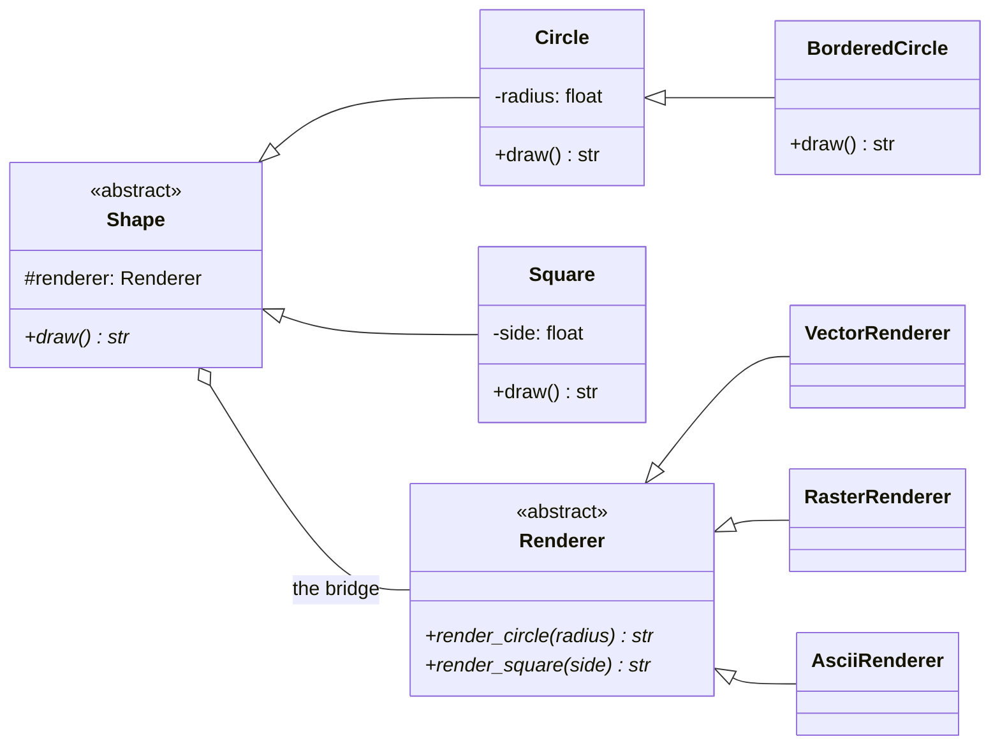

# Bridge Pattern

> **Category:** Structural · **Difficulty:** Intermediate · **Dependencies:** none (Python 3.9+ standard library only)

The **Bridge** pattern decouples an abstraction from its implementation so that the two can vary **independently**. Instead of one inheritance tree that mixes two concerns (what a thing *is* × how it *works*), you build two small hierarchies and connect them with a single object reference — the "bridge". The result: `n + m` classes where naive inheritance would need `n × m`.

This directory is a complete, runnable tutorial. You can read it top-to-bottom in about 15 minutes, run the demo, run the tests, and then do the exercises at the end.

---

## Table of contents

1. [The problem it solves](#1-the-problem-it-solves)
2. [Real-world analogy](#2-real-world-analogy)
3. [Structure](#3-structure)
4. [Code walkthrough](#4-code-walkthrough)
5. [Run the demo](#5-run-the-demo)
6. [Run the tests](#6-run-the-tests)
7. [Real-world use cases](#7-real-world-use-cases)
8. [When to use it (and when not to)](#8-when-to-use-it-and-when-not-to)
9. [Related patterns](#9-related-patterns)
10. [Exercises](#10-exercises)
11. [References](#11-references)

---

## 1. The problem it solves

Suppose your drawing app has shapes, and each shape can be rendered as vector graphics or as raster pixels. The "obvious" design encodes both facts in the class name:

```python
class VectorCircle:  ...      # circle drawn as curves
class RasterCircle:  ...      # circle drawn as pixels
class VectorSquare:  ...
class RasterSquare:  ...
```

This is a **combinatorial explosion in slow motion**:

1. **Multiplication, not addition.** 2 shapes × 2 renderers = 4 classes. Add an `AsciiRenderer` and you must write `AsciiCircle` *and* `AsciiSquare`. Add a `Triangle` and you must write it three times. With `n` shapes and `m` renderers you maintain `n × m` classes forever.
2. **Duplicated knowledge.** Every `*Circle` class repeats what a circle *is* (its radius, its geometry); every `Vector*` class repeats how vector drawing *works*. A bug fix in either concern must be applied in many places.
3. **The combination is frozen at class level.** `VectorCircle` can never become raster-rendered; choosing a renderer per-user, per-platform or per-document means `if`-ladders around constructors.

The Bridge pattern splits the single hierarchy along its two axes: a `Shape` hierarchy (what is drawn) and a `Renderer` hierarchy (how it is drawn). Every shape **holds** a renderer and delegates the primitive drawing calls to it. 3 shapes and 3 renderers are 6 classes producing 9 combinations — and combination number 10 is free.

## 2. Real-world analogy

Think of a **TV remote control and the TV**. The remote (abstraction) offers high-level operations — volume up, next channel. The TV (implementation) exposes primitive ones — set volume to N, tune to frequency F. Any remote works with any TV because they meet over one small agreed interface (the infrared protocol). Remote manufacturers add fancy remotes (with macros, timers — *refined abstractions*) without asking TV makers; TV makers ship new models without breaking a single remote. Nobody manufactures a `SonyTV_SamsungRemote` combined unit.

In this example:

| Analogy | Code |
| --- | --- |
| The remote control | `Shape` (Abstraction — high-level operations) |
| Fancy programmable remote | `BorderedCircle` (RefinedAbstraction) |
| The infrared protocol | `Renderer`'s primitive methods (`render_circle`, `render_square`) |
| A specific TV model | `VectorRenderer` / `RasterRenderer` / `AsciiRenderer` (ConcreteImplementors) |
| "Any remote, any TV" | Any shape paired with any renderer at construction time |

## 3. Structure

Two sub-packages, one for each axis of variation — connected only by the `renderer` reference every shape holds:

```
bridge/
├── shapes/           # ABSTRACTION axis: what is drawn
│   ├── shape.py              # Shape           — holds the bridge reference
│   ├── circle.py             # Circle          — concrete abstraction
│   ├── square.py             # Square          — concrete abstraction
│   └── bordered_circle.py    # BorderedCircle  — refined abstraction
├── renderers/        # IMPLEMENTOR axis: how it is drawn
│   ├── renderer.py           # Renderer        — primitive operations (ABC)
│   ├── vector_renderer.py    # VectorRenderer  — curves
│   ├── raster_renderer.py    # RasterRenderer  — pixels
│   └── ascii_renderer.py     # AsciiRenderer   — terminal characters
├── main.py           # demo client: 3 x 3 combinations from 6 classes
└── tests/            # executable specification of the pattern's guarantees
```



`renderers/` never imports from `shapes/`. The two hierarchies grow independently and meet only through the `Shape.__init__` parameter — that composition arrow in the diagram *is* the bridge.

## 4. Code walkthrough

### Step 1 — the Implementor ([renderers/renderer.py](renderers/renderer.py))

```python
class Renderer(ABC):
    @abstractmethod
    def render_circle(self, radius: float) -> str: ...
    @abstractmethod
    def render_square(self, side: float) -> str: ...
```

Deliberately **primitive**: just "put a circle/square somewhere". No notion of borders, styling or composition — those belong to the abstraction side. Keeping the implementor interface small is what makes new backends cheap.

### Step 2 — the concrete Implementors ([renderers/](renderers/))

```python
class RasterRenderer(Renderer):
    def render_circle(self, radius: float) -> str:
        pixels = round(math.pi * radius * radius)
        return f"[raster] circle(radius={radius:g}) drawn as {pixels} pixels"
```

Three interchangeable backends. Each knows *how* to draw but has no idea what shapes exist — grep them: not one imports from `shapes/`.

### Step 3 — the Abstraction ([shapes/shape.py](shapes/shape.py))

```python
class Shape(ABC):
    def __init__(self, renderer: Renderer) -> None:
        self._renderer = renderer          # <- this attribute IS the bridge

    @abstractmethod
    def draw(self) -> str: ...
```

The single most important line of the pattern: a shape **HAS-A** renderer instead of IS-A renderer. The combination is chosen per-*instance* at construction time, not per-*class* at definition time.

### Step 4 — concrete Abstractions ([shapes/circle.py](shapes/circle.py), [shapes/square.py](shapes/square.py))

```python
class Circle(Shape):
    def draw(self) -> str:
        return self._renderer.render_circle(self._radius)
```

Note what is *absent*: drawing code. `Circle` owns the geometry (its radius) and forwards the "how" to whichever renderer it holds.

### Step 5 — the refined Abstraction ([shapes/bordered_circle.py](shapes/bordered_circle.py))

```python
class BorderedCircle(Circle):
    def draw(self) -> str:
        circle = super().draw()
        border = self._renderer.render_square(2 * self._radius)
        return f"{circle}, inside a border: {border}"
```

New behaviour on the abstraction axis, built entirely from primitives the implementor already offers. No renderer was edited — so every renderer, including ones written years from now, supports bordered circles for free.

> 💡 This is the pattern's litmus test: if adding a feature to the abstraction hierarchy forces you to edit implementors (or vice versa), your bridge interface is drawn in the wrong place.

### Step 6 — the client ([main.py](main.py))

```python
for renderer in renderers:                       # vary the "how" axis...
    shapes = [Circle(renderer, 5), Square(renderer, 4), BorderedCircle(renderer, 3)]
    for shape in shapes:                         # ...while reusing the "what" axis
        print(shape.draw())
```

Every pairing is created by plain construction — no `VectorCircle` class exists anywhere.

## 5. Run the demo

From the **repository root**:

```bash
python -m bridge.main
```

Expected output:

```text
--- VectorRenderer ---
[vector] circle(radius=5) drawn with smooth curves
[vector] square(side=4) drawn with smooth curves
[vector] circle(radius=3) drawn with smooth curves, inside a border: [vector] square(side=6) drawn with smooth curves

--- RasterRenderer ---
[raster] circle(radius=5) drawn as 79 pixels
[raster] square(side=4) drawn as 16 pixels
[raster] circle(radius=3) drawn as 28 pixels, inside a border: [raster] square(side=6) drawn as 36 pixels

--- AsciiRenderer ---
[ascii] circle(radius=5) drawn as ( )
[ascii] square(side=4) drawn as [ ]
[ascii] circle(radius=3) drawn as ( ), inside a border: [ascii] square(side=6) drawn as [ ]

9 combinations from 3 shape classes + 3 renderer classes (n + m, not n * m).
```

## 6. Run the tests

```bash
python -m unittest discover -s bridge -t .
```

The tests in [tests/](tests/) are written as an executable specification — each one states a guarantee the pattern provides (e.g. *"a new renderer plugs in without touching any shape"*, *"a shape never IS-A renderer"*). Reading them is a good comprehension check.

## 7. Real-world use cases

You already use this pattern daily, often without noticing:

| Domain | Abstraction axis (what) | Implementation axis (how) |
| --- | --- | --- |
| **GUI toolkits** | windows, dialogs, widgets | per-platform drawing backends (Tk on X11/Win32/Aqua under Python's `tkinter`) |
| **Plotting** | figures, axes, artists | Matplotlib backends (`Agg`, `SVG`, `PDF`, `Qt`) — same figure, any output |
| **Databases / ORMs** | `Engine`, query constructs | SQLAlchemy **dialects** (PostgreSQL, MySQL, SQLite) driving DBAPI drivers |
| **Logging** | loggers and their levels/filters | stdlib `logging` **handlers** (file, stream, syslog, HTTP) — one logger, many sinks |
| **Device drivers** | "a printer", "a disk" as the OS sees it | vendor driver implementing the kernel's driver interface |
| **Messaging** | "publish this event" | broker-specific transports (Kafka, RabbitMQ, SQS) behind one publisher API |
| **Cross-platform apps** | app screens and controls | per-OS rendering engines (Flutter's framework vs. its embedders) |
| **Payments** | `Charge`, `Refund` domain operations | per-provider transport implementations (Stripe/Adyen/PayPal clients) |

The common thread: two dimensions that would multiply — kept apart so each can grow on its own, and so the pairing can be chosen at runtime (config file, CLI flag, platform detection).

## 8. When to use it (and when not to)

**Use it when:**

- You can already see two independent reasons for a hierarchy to change (shape *and* rendering; message *and* transport; report *and* output format).
- You want to select or swap the implementation **at runtime** — per platform, per configuration, per test run.
- A class explosion of the `VectorCircle` / `RasterCircle` kind is happening (or about to).
- You want to unit-test the abstraction with a fake implementor — the test `test_new_renderer_plugs_in_without_touching_any_shape` shows how naturally that falls out.

**Don't use it when:**

- There is only one implementation and no concrete prospect of another — a bridge to nowhere is pure indirection.
- The "axes" are not truly independent: if most shape features need renderer-specific special-casing, the split will leak and you'll fight the interface constantly.
- In Python specifically, remember that **duck typing already gives you half the pattern**: any object with `render_circle`/`render_square` methods works as an implementor without inheriting from `Renderer`. For tiny cases, injecting a module or a couple of plain functions may be enough machinery. Reach for the explicit two-ABC structure when you want the contracts documented, type-checked and enforced at instantiation time.

**Trade-off to be aware of:** the indirection has a cognitive cost — to understand one drawn circle you now read two classes. The pattern pays for itself only when both axes really do vary.

## 9. Related patterns

- **Adapter** — structurally similar (interface + delegation) but different in *intent*: Adapter retrofits compatibility between interfaces that already exist and don't match; Bridge separates concerns up-front, by design. GoF's summary: *Adapter makes things work after they're designed; Bridge makes them work before they are.* See [`../adapter/`](../adapter/).
- **Strategy** — also swaps behaviour via composition. Strategy swaps one *algorithm* behind one interface; Bridge splits an entire *hierarchy* in two, and the abstraction side typically has subclasses of its own (`BorderedCircle`).
- **Abstract Factory** — often creates and pairs the two sides of a bridge (e.g. picking the right renderer family for the current platform).
- **Factory Method** — a factory can choose which concrete renderer a shape receives, keeping construction knowledge out of client code. See [`../factory_method/`](../factory_method/).

## 10. Exercises

Try these to confirm your understanding (a correct solution never edits the *other* axis — if adding a renderer makes you touch `shapes/`, revisit section 3):

1. **New implementor:** add an `SvgRenderer` whose `render_circle` returns `<circle r="5"/>`-style markup. Count the files you had to modify (the right answer: zero outside `renderers/`, plus the demo if you want to show it off).
2. **New abstraction:** add a `Triangle(renderer, base, height)`. What must you add to `Renderer` for it to work — and what does that tell you about the cost of growing the *primitive* interface versus growing either hierarchy?
3. **Runtime re-bridging:** give `Shape` a `with_renderer(renderer: Renderer) -> Shape` method returning the same shape bound to a different renderer. Use it to render one `Circle` three ways without constructing three circles by hand.
4. **Spot the difference:** rewrite `Circle` so it *inherits* from `VectorRenderer` instead of holding a renderer. Now try to express "this circle, but raster-rendered". Write two sentences on why the HAS-A version handles this and the IS-A version cannot.

## 11. References

- Gamma, Helm, Johnson, Vlissides — *Design Patterns: Elements of Reusable Object-Oriented Software* (GoF), Bridge chapter (the Window/WindowImp example).
- Hiroshi Yuki — *An Introduction to Design Patterns Learned in the Java Language*, Bridge chapter (his Display/DisplayImpl example shows the same two-axis split).
- [Refactoring.Guru — Bridge](https://refactoring.guru/design-patterns/bridge)
- [Python `abc` module documentation](https://docs.python.org/3/library/abc.html)
- [Matplotlib backends](https://matplotlib.org/stable/users/explain/figure/backends.html) — a production-scale bridge you have probably already used.
