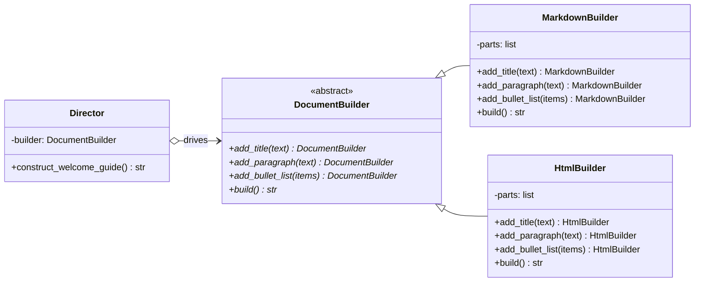

# Builder Pattern

> **Category:** Creational · **Difficulty:** Beginner-friendly · **Dependencies:** none (Python 3.9+ standard library only)

The **Builder** pattern separates the construction of a complex object from its representation, so that the same construction process can create different representations. It splits "what steps to perform, in what order" (the **Director**) from "what each step actually produces" (the **Builder**) — letting recipes and output formats vary independently.

This directory is a complete, runnable tutorial. You can read it top-to-bottom in about 15 minutes, run the demo, run the tests, and then do the exercises at the end.

---

## Table of contents

1. [The problem it solves](#1-the-problem-it-solves)
2. [Real-world analogy](#2-real-world-analogy)
3. [Structure](#3-structure)
4. [Code walkthrough](#4-code-walkthrough)
5. [Run the demo](#5-run-the-demo)
6. [Run the tests](#6-run-the-tests)
7. [Real-world use cases](#7-real-world-use-cases)
8. [When to use it (and when not to)](#8-when-to-use-it-and-when-not-to)
9. [Related patterns](#9-related-patterns)
10. [Exercises](#10-exercises)
11. [References](#11-references)

---

## 1. The problem it solves

Suppose your application generates a welcome guide, and needs it in both Markdown and HTML:

```python
def welcome_guide_markdown() -> str:
    return "# Welcome\n\nFirst, install...\n\n- step one\n- step two\n"

def welcome_guide_html() -> str:
    return "<h1>Welcome</h1>\n<p>First, install...</p>\n<ul>..."
```

This looks straightforward, but three problems creep in as the program grows:

1. **The document structure is duplicated.** The *recipe* — title, then intro, then steps — is written once per format. Add a closing paragraph and you must edit every function, in lock-step, forever.
2. **Content and formatting are tangled.** Each function mixes *what the document says* with *how the format spells it*. There is no single place to look up "what does a welcome guide contain?" or "how do we render a list in HTML?".
3. **Format-specific rules get forgotten.** HTML needs `&`/`<`/`>` escaped; Markdown doesn't. When formatting code is scattered through string literals, one of the copies will eventually skip the escaping.

The Builder pattern fixes all three by defining a small vocabulary of **abstract construction steps** (`add_title`, `add_paragraph`, `add_bullet_list`). The recipe is written *once*, in a `Director`, as a sequence of those steps; each output format implements the steps in its own concrete `Builder`. New format = new builder, zero recipe changes. New recipe = new director method, zero builder changes.

## 2. Real-world analogy

Think of an **architect and contractors**. The architect draws one plan: foundation, then frame, then roof, in that order. The plan never says *how* to pour a foundation — a timber-frame contractor and a brick contractor each execute the same plan with their own materials and techniques. Same sequence of steps, very different houses. And crucially: the architect can design a new building without learning bricklaying, and a contractor can improve their technique without redrawing every plan.

In this example:

| Analogy | Code |
| --- | --- |
| The architect's plan (fixed step sequence) | `Director.construct_welcome_guide()` |
| "Lay the foundation" (an abstract step) | `DocumentBuilder.add_title()` etc. |
| A timber-frame contractor | `MarkdownBuilder` |
| A brick contractor | `HtmlBuilder` |
| The finished house | the string returned by `build()` |
| The homeowner picking a contractor | the client in [`main.py`](main.py) |

## 3. Structure

A flat package — the pattern here has four roles, one file each:

```
builder/
├── document_builder.py   # Builder   — abstract step vocabulary (ABC)
├── markdown_builder.py   # ConcreteBuilder 1 — steps rendered as Markdown
├── html_builder.py       # ConcreteBuilder 2 — steps rendered as HTML (+ escaping)
├── director.py           # Director  — the recipe: which steps, in what order
├── main.py               # demo client
└── tests/                # executable specification of the pattern's guarantees
```



`director.py` imports only the abstract `DocumentBuilder`. You can add ten new output formats without touching the Director — and add ten new recipes without touching any builder. Each axis of change has its own home: that is the **Single Responsibility Principle** driving the design.

## 4. Code walkthrough

### Step 1 — the abstract Builder ([document_builder.py](document_builder.py))

```python
class DocumentBuilder(ABC):
    @abstractmethod
    def add_title(self, text: str) -> "DocumentBuilder": ...

    @abstractmethod
    def add_paragraph(self, text: str) -> "DocumentBuilder": ...

    @abstractmethod
    def add_bullet_list(self, items: Sequence[str]) -> "DocumentBuilder": ...

    @abstractmethod
    def build(self) -> str: ...
```

The step vocabulary. Notice the steps are **format-neutral** — there is no `add_h1` or `add_markdown_heading`. Each `add_*` step returns the builder itself, so recipes read as one fluent chain.

### Step 2 — a concrete Builder ([markdown_builder.py](markdown_builder.py))

```python
class MarkdownBuilder(DocumentBuilder):
    def add_title(self, text: str) -> "MarkdownBuilder":
        self._parts.append(f"# {text}")
        return self
```

Each step appends its Markdown rendering to an internal list; `build()` joins the parts. Every scrap of Markdown syntax in the package lives in this one file.

### Step 3 — a second concrete Builder ([html_builder.py](html_builder.py))

```python
def add_paragraph(self, text: str) -> "HtmlBuilder":
    self._parts.append(f"<p>{html.escape(text)}</p>")
    return self
```

Same interface, different representation — and note the `html.escape(...)`. Escaping is a rule of the *HTML representation*, so it lives inside the HTML builder. The Director never knows escaping exists, and the Markdown builder correctly doesn't do it. Tangle-prone concerns like this are exactly what the pattern keeps sorted.

### Step 4 — the Director ([director.py](director.py))

```python
def construct_welcome_guide(self) -> str:
    return (
        self._builder
        .add_title("Welcome to the Builder Pattern")
        .add_paragraph("The same construction steps can produce ...")
        .add_bullet_list([...])
        .add_paragraph("Swap the builder and rerun: nothing else changes.")
        .build()
    )
```

The recipe, written exactly once. The Director decides **which** steps run and **in what order**; it has no idea what the steps produce.

### Step 5 — the client ([main.py](main.py))

```python
print(Director(MarkdownBuilder()).construct_welcome_guide())
print(Director(HtmlBuilder()).construct_welcome_guide())
```

The only mentions of concrete classes in the whole demo. Choosing the representation is a one-word decision.

> 💡 In Python you will often meet builders **without** a Director — e.g. chaining calls on `io.StringIO`-style writers or ORM query builders. The Director earns its keep when the same recipe must be replayed against multiple builders, as here.

## 5. Run the demo

From the **repository root**:

```bash
python -m builder.main
```

Expected output:

```text
=== The same recipe, rendered as Markdown ===
# Welcome to the Builder Pattern

The same construction steps can produce entirely different representations.

- The Director chooses WHICH steps run, and in what order.
- Each Builder decides HOW a step is rendered.
- The client only picks a builder and asks the Director to build.

Swap the builder and rerun: nothing else changes.

=== The same recipe, rendered as HTML ===
<h1>Welcome to the Builder Pattern</h1>
<p>The same construction steps can produce entirely different representations.</p>
<ul>
  <li>The Director chooses WHICH steps run, and in what order.</li>
  <li>Each Builder decides HOW a step is rendered.</li>
  <li>The client only picks a builder and asks the Director to build.</li>
</ul>
<p>Swap the builder and rerun: nothing else changes.</p>

```

## 6. Run the tests

```bash
python -m unittest discover -s builder -t .
```

The tests in [tests/](tests/) are written as an executable specification — each one states a guarantee the pattern provides (e.g. *"one recipe yields two representations"*, *"representation-specific concerns stay inside the builder"*). Reading them is a good comprehension check.

## 7. Real-world use cases

You already use this pattern daily, often without noticing:

| Domain | Client asks for… | Builder decides the representation |
| --- | --- | --- |
| **Document generation** | "title, sections, tables" | `python-docx` / `openpyxl` / `reportlab` — each accumulates parts and serialises its own format |
| **HTML/XML assembly** | "elements, one by one" | `xml.etree.ElementTree.TreeBuilder` in the stdlib is a literal Builder (`start`/`data`/`end`/`close`) |
| **SQL queries** | "where, order by, limit" | SQLAlchemy / Django `QuerySet` chains build the statement; the dialect renders it |
| **HTTP requests** | "method, headers, body" | Request-builder APIs (e.g. `urllib.request.Request` assembly, botocore request serialisation) |
| **String assembly** | "append, append, result" | `io.StringIO` + `getvalue()` — the minimal builder everyone has used |
| **Test data** | "a valid order, but overdue" | Test-object builders (`an_order().overdue().build()`) keep test setup readable |
| **Compilers / parsers** | "emit node after node" | AST builders and code emitters accumulate a program piece by piece |
| **Configuration objects** | "many optional settings" | Fluent config builders replace 15-parameter constructors (common in Java; in Python, see section 8) |

The common thread: the result is assembled **incrementally through a fixed step vocabulary**, and the caller doesn't want to care how the parts become a whole.

## 8. When to use it (and when not to)

**Use it when:**

- The **same construction sequence** must produce **different representations** (Markdown/HTML, JSON/XML, real object/test double).
- Building is inherently **step-by-step** — parts arrive one at a time (parsers, streaming APIs, report generators).
- Construction involves representation-specific rules (escaping, indentation, encoding) that must never leak into calling code.
- A constructor is drowning in optional parameters and you want readable, incremental assembly instead.

**Don't use it when:**

- The object is simple enough for a constructor call. `Report(title, body)` needs no builder — the pattern would be ceremony.
- Only the *parameter list* is the problem, not the assembly. In Python, **keyword-only arguments with defaults** and `@dataclass` solve "telescoping constructors" natively — you rarely need the Java-style builder-for-optional-arguments idiom.
- There is exactly one representation and one recipe, with no second on the horizon.

**Pythonic alternatives and trade-offs:** a builder can shrink to a plain **function per format** taking a common data structure (e.g. render a `list[Block]` to Markdown or HTML). That is simpler and often better — but the step *interface* disappears, so nothing stops a renderer from silently ignoring a block type; the ABC version fails loudly at class-definition time. **Trade-off to be aware of:** the pattern doubles the number of moving parts (director + builder per format), and the built product is stringly-typed here — for richer products, have `build()` return a proper object.

## 9. Related patterns

- **Factory Method** — also isolates creation, but picks *which class* to instantiate in one shot; Builder assembles *one complex result* step by step. See [`../factory_method/`](../factory_method/).
- **Abstract Factory** — returns a *family* of separate products immediately; Builder returns a single product only when construction finishes. See [`../abstract_factory/`](../abstract_factory/).
- **Template Method** — the Director's recipe is a cousin of a template method, but composition (Director *has a* Builder) replaces inheritance. See [`../template_method/`](../template_method/).
- **Prototype** — an alternative way to get complex pre-configured objects: clone a sample instead of rebuilding it. See [`../prototype/`](../prototype/).

## 10. Exercises

Try these to confirm your understanding (the first two should require **no changes** to `director.py` — if you find yourself editing it, revisit section 3):

1. **New representation:** write a `PlainTextBuilder` that renders the title in UPPERCASE underlined with `=`, and bullets as `* ` lines. Run it through the existing Director.
2. **Counting builder:** write a `StatsBuilder` whose `build()` returns `"1 title, 2 paragraphs, 3 bullets"` — proving a builder may produce something that isn't a document at all.
3. **New recipe:** add `Director.construct_release_notes(version: str, changes: list[str])`. Confirm both existing builders render it with zero modifications.
4. **Break it on purpose:** make a builder whose `add_paragraph` returns `None` instead of `self`, and run the Director. Where exactly does it explode, and what does that teach you about the fluent-interface convention?

## 11. References

- Gamma, Helm, Johnson, Vlissides — *Design Patterns: Elements of Reusable Object-Oriented Software* (GoF), Builder chapter.
- Hiroshi Yuki — *An Introduction to Design Patterns Learned in the Java Language*, Builder chapter (its Director-driven text document example inspired this one).
- [Refactoring.Guru — Builder](https://refactoring.guru/design-patterns/builder)
- [Python `abc` module documentation](https://docs.python.org/3/library/abc.html)
- [Python `html.escape` documentation](https://docs.python.org/3/library/html.html#html.escape)
- [Python `xml.etree.ElementTree.TreeBuilder`](https://docs.python.org/3/library/xml.etree.elementtree.html#xml.etree.ElementTree.TreeBuilder) — a Builder in the standard library.
