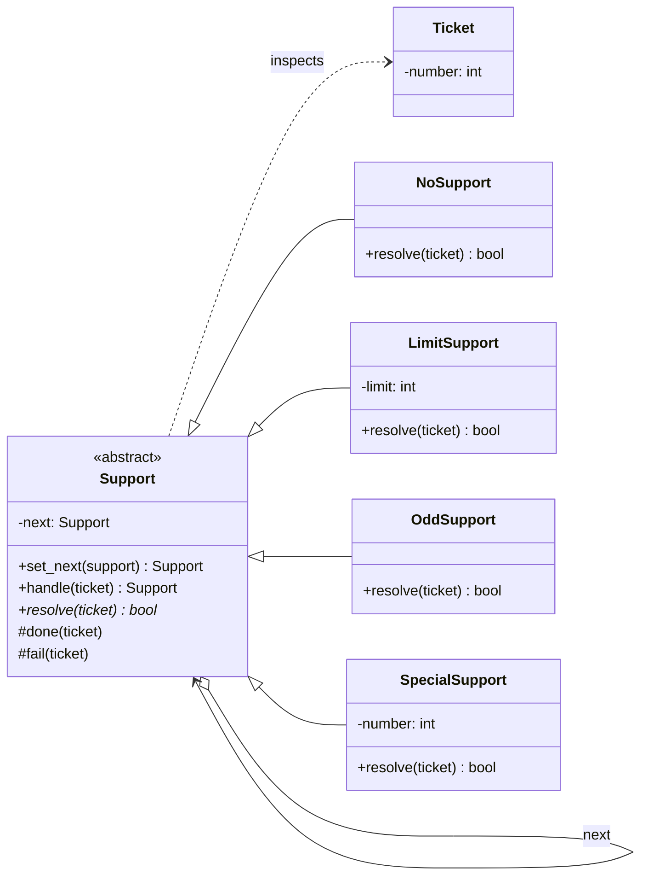

# Chain of Responsibility Pattern

> **Category:** Behavioral · **Difficulty:** Beginner-friendly · **Dependencies:** none (Python 3.9+ standard library only)

The **Chain of Responsibility** pattern lets you pass a request along a chain of handlers. Each handler decides either to process the request or to forward it to the next handler in line. The sender only knows the *head* of the chain — it never learns (and never needs to learn) which handler actually did the work.

This directory is a complete, runnable tutorial. You can read it top-to-bottom in about 15 minutes, run the demo, run the tests, and then do the exercises at the end.

---

## Table of contents

1. [The problem it solves](#1-the-problem-it-solves)
2. [Real-world analogy](#2-real-world-analogy)
3. [Structure](#3-structure)
4. [Code walkthrough](#4-code-walkthrough)
5. [Run the demo](#5-run-the-demo)
6. [Run the tests](#6-run-the-tests)
7. [Real-world use cases](#7-real-world-use-cases)
8. [When to use it (and when not to)](#8-when-to-use-it-and-when-not-to)
9. [Related patterns](#9-related-patterns)
10. [Exercises](#10-exercises)
11. [References](#11-references)

---

## 1. The problem it solves

Suppose your help desk routes support tickets to whoever can handle them:

```python
def route(ticket):
    if ticket.number < 100:
        bob.take(ticket)
    elif ticket.number == 429:
        charlie.take(ticket)
    elif ticket.number < 300:
        diana.take(ticket)
    elif ticket.number % 2 == 1:
        elmo.take(ticket)
    else:
        print("nobody can handle this")
```

This `if/elif` ladder looks harmless, but three problems creep in as the program grows:

1. **One class knows everything.** The router must understand every handler's capability rule (`< 100`, `== 429`, "odd numbers"…). Change any handler and you must edit the router too.
2. **The routing order is frozen in code.** Want Charlie the specialist consulted *before* Bob? That's surgery on the ladder, with every branch re-checked for overlap.
3. **You can't compose routings at runtime.** A premium customer might deserve a different escalation path than a free-tier one — with a hard-coded ladder you end up copy-pasting the whole function.

The Chain of Responsibility pattern fixes all three by putting the capability rule *inside each handler* and linking the handlers into a runtime-configurable chain. The sender hands the ticket to the first link and walks away; the chain sorts out the rest.

## 2. Real-world analogy

Think of **escalating a problem at a company's front desk**. You explain your issue once, to whoever sits at reception. If reception can fix it, done. If not, they pass you to first-line support; first-line passes hard cases to a specialist; the specialist escalates the truly weird ones to engineering. You never need the org chart — you talk to one person and your problem travels on its own. And occasionally, nobody can help, and you're politely told so.

In this example:

| Analogy | Code |
| --- | --- |
| Your problem, explained once | `Ticket` (the request object) |
| Any employee in the escalation path | `Support` (abstract handler) |
| "Can I fix this myself?" | `resolve()` (the overridden predicate) |
| "Let me hand you over to…" | `set_next()` link + forwarding in `handle()` |
| Reception, first-line, specialist… | `NoSupport`, `LimitSupport`, `SpecialSupport`, `OddSupport` |
| "I'm sorry, we can't help with that" | `fail()` at the end of the chain |

## 3. Structure

Two packages with a strict one-way dependency, mirroring the layout used across this repository:

```
chain_of_responsibility/
├── framework/            # ABSTRACT side: the chain machinery
│   ├── ticket.py         #   Ticket  — the request that travels the chain
│   └── support.py        #   Support — abstract handler: set_next + handle
├── supports/             # CONCRETE side: depends on framework/, never vice versa
│   ├── no_support.py     #   NoSupport      — never resolves (pass-through)
│   ├── limit_support.py  #   LimitSupport   — resolves numbers below a limit
│   ├── odd_support.py    #   OddSupport     — resolves odd numbers
│   └── special_support.py#   SpecialSupport — resolves one exact number
├── main.py               # demo client
└── tests/                # executable specification of the pattern's guarantees
```



The self-referencing `next` link on the abstract class is the pattern's signature: the recursion that walks the chain is written once, in `framework/`, and every concrete handler inherits it. Adding a new handler type never touches `framework/` — the Open/Closed Principle again.

## 4. Code walkthrough

### Step 1 — the request ([framework/ticket.py](framework/ticket.py))

```python
class Ticket:
    def __init__(self, number: int) -> None: ...
```

A ticket carries just enough data for a handler to decide "can I resolve this?" — here, a number that doubles as the ticket's difficulty. Handlers inspect it; they never modify it.

### Step 2 — the abstract handler ([framework/support.py](framework/support.py))

```python
class Support(ABC):
    def set_next(self, next_support: "Support") -> "Support":
        self._next = next_support
        return next_support          # <- returning the ARGUMENT enables chaining

    @final
    def handle(self, ticket: Ticket) -> Optional["Support"]:
        if self.resolve(ticket):     # step delegated to subclass
            self.done(ticket)
            return self
        if self._next is not None:
            return self._next.handle(ticket)   # forward along the chain
        self.fail(ticket)            # fell off the end
        return None
```

Two details deserve a close look:

- `set_next` returns **its argument**, not `self`. That is what makes `alan.set_next(bob).set_next(charlie)` build the chain `alan → bob → charlie` — each call attaches to the handler linked by the previous one. (If it returned `self`, you'd get a star with `alan` at the centre.)
- `handle` is marked `@final`: the walk itself — *try, else forward, else fail* — is the pattern's invariant. Subclasses vary only in **whether they can resolve**, expressed through the single abstract hook `resolve()`.

> 💡 `handle()` is a small **template method** — the same technique that powers `Factory.create()` in [`../factory_method/`](../factory_method/). Fixed procedure in the abstract class, variable step in the subclass.

### Step 3 — the concrete handlers ([supports/](supports/))

```python
class LimitSupport(Support):
    def resolve(self, ticket: Ticket) -> bool:
        return ticket.number < self._limit
```

Each concrete handler is a name plus one predicate. `NoSupport` always declines, `LimitSupport` takes anything below its limit, `OddSupport` takes odd numbers, `SpecialSupport` takes exactly one number. None of them knows the others exist — that ignorance is the decoupling the pattern buys.

### Step 4 — the client ([main.py](main.py))

```python
alan.set_next(bob).set_next(charlie).set_next(diana).set_next(elmo)

head: Support = alan
for number in (45, 104, 212, 305, 429, 430):
    head.handle(Ticket(number))
```

The client composes the chain once, then only ever talks to `alan`. Rewire the chain — reorder it, insert a handler, drop one — and the request loop does not change by a character.

## 5. Run the demo

From the **repository root**:

```bash
python -m chain_of_responsibility.main
```

Expected output:

```text
Support chain: Alan -> Bob(<100) -> Charlie(#429) -> Diana(<300) -> Elmo(odd)

Ticket #45 is resolved by Bob.
Ticket #104 is resolved by Diana.
Ticket #212 is resolved by Diana.
Ticket #305 is resolved by Elmo.
Ticket #429 is resolved by Charlie.
Ticket #430 cannot be resolved by anyone.
```

Read the output against the chain: #45 stops at the *first* capable handler (Bob), even though Diana could also handle it. #429 is caught by the specialist before the generalist behind him. And #430 satisfies nobody's predicate, so it falls off the end — the chain reports failure instead of crashing.

## 6. Run the tests

```bash
python -m unittest discover -s chain_of_responsibility -t .
```

The tests in [tests/](tests/) are written as an executable specification — each one states a guarantee the pattern provides (e.g. *"the first capable handler wins"*, *"an unhandled request falls off the end"*). Reading them is a good comprehension check.

## 7. Real-world use cases

You already use this pattern daily, often without noticing:

| Domain | Client asks for… | The chain provides |
| --- | --- | --- |
| **Logging** | "log this record" | Python's `logging` propagates a record up the logger hierarchy, each logger's handlers getting a chance (`logging` docs call it exactly this) |
| **Web middleware** | "handle this HTTP request" | WSGI/ASGI middleware stacks and Django middleware — each layer processes and/or passes the request inward |
| **GUI events** | "someone handle this click" | Event *bubbling* in DOM/Qt/wxWidgets: the event climbs the widget tree until a handler consumes it |
| **Exception handling** | "someone catch this" | Python's own `try/except` unwinding: the exception travels up the call stack to the first matching handler |
| **HTTP client plumbing** | "send this request" | `urllib.request`'s chained handler classes (`OpenerDirector` walks its handlers until one returns a response) |
| **Support/approval workflow** | "approve this expense" | Team lead → manager → director, each with a spending limit — the classic business version of `LimitSupport` |
| **Servlet/API filters** | "pre-process this call" | Java servlet `FilterChain`, FastAPI/Express middleware — `next()` *is* `set_next` spelled differently |
| **Spam/rule engines** | "classify this message" | Ordered rule lists where the first matching rule decides (mail filters, firewall rules, nginx `location` matching) |

The common thread: the sender wants a request **dealt with** and does not want to know **who** will deal with it or **in what order** candidates are consulted.

## 8. When to use it (and when not to)

**Use it when:**

- More than one object may handle a request, and the handler isn't known in advance.
- You want to issue a request without naming the receiver — total sender/receiver decoupling.
- The set of handlers, or their order, should be configurable at runtime (per customer, per environment, per feature flag).
- "Nobody handled it" is a legitimate, expected outcome you want to represent cleanly.

**Don't use it when:**

- Exactly one object always handles the request — a direct call is simpler and easier to trace.
- Every handler must *always* run. That's not first-handler-wins; see the middleware variant below.
- The request/handler mapping is a simple lookup — in Python a `dict` of predicates or a list of `(predicate, action)` pairs may be all you need:

  ```python
  RULES = [(lambda t: t.number < 100, bob_action), ...]
  next(action for pred, action in RULES if pred(ticket))
  ```

  Reach for the full class-based chain when handlers carry state, need a fluent runtime wiring API, or belong to an extensible class family.

**Two flavours of chain.** This tutorial shows **first-handler-wins**: `handle()` *stops* at the first `resolve() == True`. The equally common **middleware style** has every handler do some work and *always* forward (logging, authentication, compression…). The change is tiny — do your work, then call `self._next.handle(ticket)` unconditionally — but the semantics differ: first-wins chains *choose one* handler, middleware chains *compose all* of them. Python's `logging` propagation and WSGI stacks are middleware-style; exception handling and `urllib.request` are first-wins. Exercise 3 asks you to build the middleware variant.

**Trade-offs to be aware of:** receipt of a request is not guaranteed (a mis-assembled chain silently drops everything — which is why the tests pin the fall-off behaviour), and debugging means stepping through the chain hop by hop. Long chains also add call overhead versus a direct dispatch.

## 9. Related patterns

- **Factory Method** — see [`../factory_method/`](../factory_method/); both patterns use an abstract class to fix a procedure (`handle`, `create`) while delegating one decision to subclasses.
- **Command** — see [`../command/`](../command/); requests travelling a chain are often reified as Command objects, so handlers can inspect, queue or log them.
- **Composite** — chains frequently run over a Composite's parent links (GUI event bubbling climbs the widget tree).
- **Decorator** — structurally similar (objects wrapping objects), but Decorator *always* delegates and adds behaviour, while a first-wins chain *stops* at one handler.

## 10. Exercises

Try these to confirm your understanding (each should require **no changes** to `framework/` — if you find yourself editing it, revisit section 3):

1. **New handler:** add an `EvenSupport` that resolves even-numbered tickets, append it after Elmo, and confirm ticket #430 is now resolved.
2. **Rewire, don't rewrite:** move `SpecialSupport("Charlie", 429)` to the *end* of the chain. Which handler resolves #429 now, and why? Predict first, then run.
3. **Middleware variant:** write a `LoggingSupport` that prints every ticket it sees and *always* forwards, then place it at the head of the chain. You have just built the second flavour from section 8.
4. **Chain from config:** build the chain from a list like `[("limit", 100), ("special", 429), ("odd",)]` using a small factory function. Notice the request loop in `main.py` still doesn't change.

## 11. References

- Gamma, Helm, Johnson, Vlissides — *Design Patterns: Elements of Reusable Object-Oriented Software* (GoF), Chain of Responsibility chapter.
- Hiroshi Yuki — *An Introduction to Design Patterns Learned in the Java Language* (this example's trouble/support scenario originates there).
- [Refactoring.Guru — Chain of Responsibility](https://refactoring.guru/design-patterns/chain-of-responsibility)
- [Python `logging` — record propagation through the logger hierarchy](https://docs.python.org/3/library/logging.html#logging.Logger.propagate)
