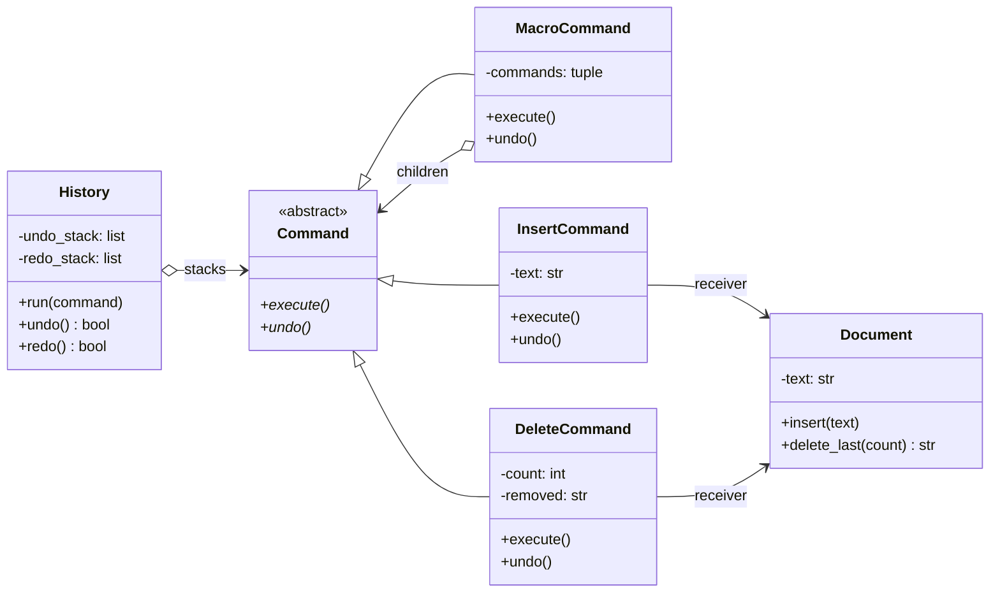

# Command Pattern

> **Category:** Behavioral · **Difficulty:** Beginner-friendly · **Dependencies:** none (Python 3.9+ standard library only)

The **Command** pattern turns a request into a stand-alone object that contains everything needed to perform it. Once "do this" is an object rather than a method call, you can store it, queue it, log it, compose it into bigger commands — and, if the object also knows how to reverse itself, **undo** it.

This directory is a complete, runnable tutorial built around a tiny text editor with undo/redo. You can read it top-to-bottom in about 15 minutes, run the demo, run the tests, and then do the exercises at the end.

---

## Table of contents

1. [The problem it solves](#1-the-problem-it-solves)
2. [Real-world analogy](#2-real-world-analogy)
3. [Structure](#3-structure)
4. [Code walkthrough](#4-code-walkthrough)
5. [Run the demo](#5-run-the-demo)
6. [Run the tests](#6-run-the-tests)
7. [Real-world use cases](#7-real-world-use-cases)
8. [When to use it (and when not to)](#8-when-to-use-it-and-when-not-to)
9. [Related patterns](#9-related-patterns)
10. [Exercises](#10-exercises)
11. [References](#11-references)

---

## 1. The problem it solves

Suppose your editor applies edits by calling the document directly:

```python
def on_key(document, key):
    document.insert(key)        # the action happens…

def on_backspace(document):
    document.delete_last(1)     # …and is immediately forgotten
```

This looks harmless, but three problems creep in as the program grows:

1. **No undo.** The moment `insert()` returns, all knowledge of *what just happened* is gone. To undo, you'd need to remember, for every kind of edit, what it did and how to reverse it — but a plain method call leaves no trace.
2. **Requests can't be treated as data.** You can't put "insert 'Hello'" in a queue, replay it, ship it over a network, or bind it to both a menu item and a keyboard shortcut, because it isn't a *thing* — it's a line of code.
3. **Grouping is ad hoc.** "Do these five edits as one step" (a macro, a transaction) has no natural home; you end up with special-case lists and flags scattered through the UI code.

The Command pattern fixes all three by reifying each request as an object with two methods — `execute()` and `undo()` — and letting a dumb invoker push those objects onto a history stack.

## 2. Real-world analogy

Think of a **restaurant order slip**. You don't shout your meal at the chef. The waiter writes an order slip — a small object capturing exactly what you asked for — and pins it in the kitchen queue. The slip can wait its turn, be handed between staff, be re-fired if a dish is dropped, and be *voided* (with a strikethrough) if you change your mind. The chef executes slips without caring which waiter wrote them; the waiter takes orders without knowing how dishes are cooked.

In this example:

| Analogy | Code |
| --- | --- |
| The order slip | a `Command` object |
| Writing the slip | constructing `InsertCommand(document, "Hello")` |
| The kitchen queue / spike of done slips | `History` (undo/redo stacks) |
| The chef who cooks | `Document` (the receiver) |
| Voiding a slip | `undo()` |
| A fixed multi-course set menu | `MacroCommand` (a command made of commands) |

## 3. Structure

Two packages with a strict one-way dependency, mirroring the layout used across this repository:

```
command/
├── framework/              # ABSTRACT side: knows nothing about text editing
│   ├── command.py          #   Command      — execute() + undo() interface
│   ├── macro_command.py    #   MacroCommand — a composite of commands
│   └── history.py          #   History      — the invoker: undo/redo stacks
├── editor/                 # CONCRETE side: depends on framework/, never vice versa
│   ├── document.py         #   Document      — the receiver (a text buffer)
│   ├── insert_command.py   #   InsertCommand — appends text; undo deletes it
│   └── delete_command.py   #   DeleteCommand — removes text; remembers it for undo
├── main.py                 # demo client
└── tests/                  # executable specification of the pattern's guarantees
```



Note the two arrows *into* `Command`: `History` stores commands and `MacroCommand` contains commands, yet neither knows a single concrete command class. All editing knowledge lives in `editor/`.

## 4. Code walkthrough

### Step 1 — the abstract Command ([framework/command.py](framework/command.py))

```python
class Command(ABC):
    @abstractmethod
    def execute(self) -> None: ...
    @abstractmethod
    def undo(self) -> None: ...
```

The whole pattern in two methods. The contract worth memorising: **calling `undo` right after `execute` must leave the receiver exactly as it was before.** Every concrete command must honour it, and the history relies on it.

### Step 2 — the receiver ([editor/document.py](editor/document.py))

```python
class Document:
    def insert(self, text: str) -> None: ...
    def delete_last(self, count: int) -> str:   # returns what it removed
        ...
```

The receiver knows *how* to edit text but has no idea commands exist — it is plain, testable, and reusable. One deliberate design touch: `delete_last` **returns the removed text**, which is precisely the hook a delete command needs to become undoable.

### Step 3 — concrete commands ([editor/insert_command.py](editor/insert_command.py), [editor/delete_command.py](editor/delete_command.py))

```python
class InsertCommand(Command):
    def execute(self) -> None:
        self._document.insert(self._text)
    def undo(self) -> None:
        self._document.delete_last(len(self._text))
```

`InsertCommand`'s undo is *computed* — it knows what it inserted, so it deletes that many characters. `DeleteCommand` can't compute its undo (you can't restore text you no longer have), so it *stores* state at execute time:

```python
class DeleteCommand(Command):
    def execute(self) -> None:
        self._removed = self._document.delete_last(self._count)  # remember!
    def undo(self) -> None:
        self._document.insert(self._removed)
```

> 💡 This is the pattern's signature move: **a command object is the natural home for the state its own reversal needs.** No global "undo journal" required — each slip of paper remembers its own strikethrough.

### Step 4 — the composite ([framework/macro_command.py](framework/macro_command.py))

```python
class MacroCommand(Command):
    def execute(self) -> None:
        for command in self._commands:
            command.execute()
    def undo(self) -> None:
        for command in reversed(self._commands):
            command.undo()
```

Because `Command` is an ordinary interface, a *group* of commands is itself a command. Undo runs the children in **reverse** — later commands may depend on state produced by earlier ones, so they unwind like a stack. To `History`, a macro is indistinguishable from a single keystroke: one entry, one undo.

### Step 5 — the invoker and the client ([framework/history.py](framework/history.py), [main.py](main.py))

```python
history.run(InsertCommand(document, "Hello"))
history.undo()
history.redo()
```

`History.run()` executes a command, pushes it on the undo stack, and clears the redo stack (once you type something new, the "future" you had undone is gone — the classic editor rule). `undo()` and `redo()` just move commands between the two stacks, calling `undo()`/`execute()` as they go. The invoker never learns what any command does — which means undo/redo automatically works for commands that haven't been written yet.

## 5. Run the demo

From the **repository root**:

```bash
python -m command.main
```

Expected output:

```text
--- Editing ---
run insert 'Hello'       document = 'Hello'
run insert ', world'     document = 'Hello, world'
run delete 7 chars       document = 'Hello'

--- Undo / redo ---
undo (delete)            document = 'Hello, world'
undo (insert)            document = 'Hello'
redo (insert)            document = 'Hello, world'

--- Macro command ---
run macro sign-off       document = 'Hello, world! -- bye'
undo (whole macro)       document = 'Hello, world'
```

Note the last two lines: the macro inserted `"!"` and `" -- bye"` as one history entry, and a single `undo()` removed both — in reverse order.

## 6. Run the tests

```bash
python -m unittest discover -s command -t .
```

The tests in [tests/](tests/) are written as an executable specification — each one states a guarantee the pattern provides (e.g. *"a delete command stores the state its undo needs"*, *"running a new command clears the redo stack"*). Reading them is a good comprehension check.

## 7. Real-world use cases

You already use this pattern daily, often without noticing:

| Domain | Client asks for… | The command object provides |
| --- | --- | --- |
| **Editors & IDEs** | "undo / redo" | Every edit reified with its inverse — exactly this tutorial, at scale |
| **GUI toolkits** | "bind this action to menu + shortcut + button" | One command object, many triggers (Qt's `QAction`/`QUndoCommand`, Tkinter callbacks) |
| **Databases** | "run this statement, maybe roll it back" | SQL statements as objects; transactions = macro commands (Python's `sqlite3` cursors execute statement objects; write-ahead logs replay commands) |
| **Task queues** | "do this later, elsewhere" | Serialized command objects on a broker (Celery tasks, `concurrent.futures` callables) |
| **Version control** | "apply / revert this change" | Commits and patches are commands with built-in inverses (`git revert`) |
| **Smart home / IoT** | "program the remote's buttons" | Each button slot holds a command; reassigning buttons = swapping objects |
| **Games** | "replay / demo mode" | Input recorded as command streams, replayed deterministically |
| **Web frameworks** | "migrate the schema" | Django/Alembic migrations: `upgrade()`/`downgrade()` pairs — `execute`/`undo` by another name |

The common thread: the caller wants to **name a piece of work** and hand it around as a value, while the moment, place and even direction (do vs. undo) of execution are decided elsewhere.

## 8. When to use it (and when not to)

**Use it when:**

- You need undo/redo — this is *the* canonical route to it.
- Operations must be queued, scheduled, logged, persisted or sent across a process boundary.
- The same action is triggered from several places (menu, shortcut, toolbar, API) and should exist exactly once.
- You want transactional grouping — several steps that succeed or roll back as one (`MacroCommand`).

**Don't use it when:**

- A call is fire-and-forget with no history, queuing or grouping requirements — just call the method.
- In Python specifically, remember that **functions are already first-class objects**: a callback list, `functools.partial(document.insert, "Hello")`, or a closure covers "request as data" with zero classes. Reach for the full pattern when requests need *state and a second operation* — i.e. undo — or a whole family of related behaviours (serialization, description, merging of consecutive commands).
- Undo can also be done by snapshotting state instead of reversing operations — that's the **Memento** pattern. Snapshots are simpler but heavier; command inverses are cheap but must be written correctly for every operation. Big editors combine both.

**Trade-off to be aware of:** every operation becomes a class, so the code gains a layer of indirection and the class count grows. For three operations it feels ceremonious; for thirty undoable operations it is the only thing keeping the design sane.

## 9. Related patterns

- **Factory Method** — see [`../factory_method/`](../factory_method/); command objects are frequently built by factories (e.g. mapping a key press to the right command class).
- **Chain of Responsibility** — see [`../chain_of_responsibility/`](../chain_of_responsibility/); the requests travelling a chain are often Command objects, so handlers can inspect or queue them.
- **Composite** — `MacroCommand` *is* a Composite applied to commands: a group usable wherever a single item is.
- **Memento** — the alternative undo strategy: store snapshots of state rather than inverse operations. Commands often carry mementos internally.
- **Iterator** — see [`../iterator/`](../iterator/); a history of commands is typically replayed by iterating over it.

## 10. Exercises

Try these to confirm your understanding (each should require **no changes** to `framework/` — if you find yourself editing it, revisit section 3):

1. **New command:** add a `ReplaceAllCommand(document, old, new)` that substitutes every occurrence of a word. What must it remember at `execute()` time to be undoable? (Hint: the whole previous text is a valid — if heavy — answer.)
2. **Redo the macro:** in `main.py`, add `history.redo()` after the final undo and predict the document's contents before running.
3. **Command log:** give `History` a `replay()` method that, given a fresh `Document`, re-executes every command in the undo stack. You have just built event sourcing in miniature.
4. **Pythonic variant:** re-implement `InsertCommand` as a plain tuple of two closures `(execute, undo)` and make a tiny `FunctionCommand` adapter so `History` can run it. Compare the ergonomics — when would you prefer each style?

## 11. References

- Gamma, Helm, Johnson, Vlissides — *Design Patterns: Elements of Reusable Object-Oriented Software* (GoF), Command chapter.
- Hiroshi Yuki — *An Introduction to Design Patterns Learned in the Java Language* (its Command chapter builds a drawing tool with a command history).
- [Refactoring.Guru — Command](https://refactoring.guru/design-patterns/command)
- [Python `functools.partial`](https://docs.python.org/3/library/functools.html#functools.partial) — the lightweight "request as data" alternative discussed in section 8.
