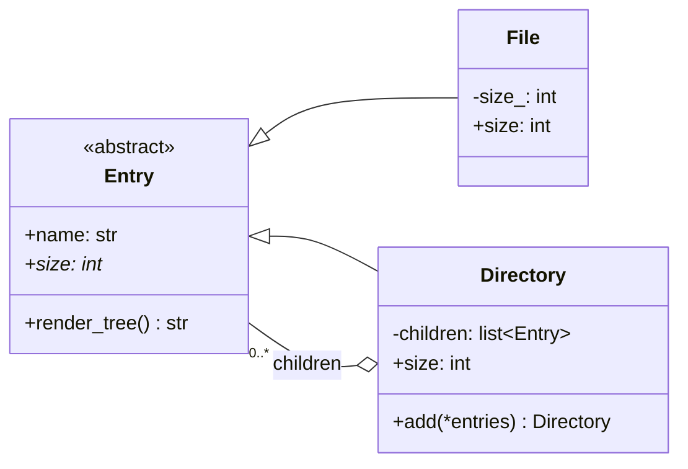

# Composite Pattern

> **Category:** Structural · **Difficulty:** Beginner-friendly · **Dependencies:** none (Python 3.9+ standard library only)

The **Composite** pattern composes objects into tree structures and lets clients treat individual objects and whole compositions **uniformly**. A single file and a directory containing ten thousand files answer the same questions (`size`, `render_tree`) through the same interface — recursion does the rest.

This directory is a complete, runnable tutorial. You can read it top-to-bottom in about 15 minutes, run the demo, run the tests, and then do the exercises at the end.

---

## Table of contents

1. [The problem it solves](#1-the-problem-it-solves)
2. [Real-world analogy](#2-real-world-analogy)
3. [Structure](#3-structure)
4. [Code walkthrough](#4-code-walkthrough)
5. [Run the demo](#5-run-the-demo)
6. [Run the tests](#6-run-the-tests)
7. [Real-world use cases](#7-real-world-use-cases)
8. [When to use it (and when not to)](#8-when-to-use-it-and-when-not-to)
9. [Related patterns](#9-related-patterns)
10. [Exercises](#10-exercises)
11. [References](#11-references)

---

## 1. The problem it solves

Suppose you model a file system with two unrelated classes:

```python
class File:
    def __init__(self, name, size): ...

class Directory:
    def __init__(self, name, items): ...   # items: files AND directories, mixed
```

Now compute the total size of something a user selected:

```python
def total_size(item):
    if isinstance(item, File):                     # case 1: a leaf
        return item.size
    elif isinstance(item, Directory):              # case 2: a container
        return sum(total_size(child) for child in item.items)
    else:
        raise TypeError(...)
```

Three problems creep in as the program grows:

1. **`isinstance` ladders everywhere.** Every operation that walks the structure — sizing, printing, searching, permission checks — re-implements the same leaf-or-container dispatch. Add a third node type (a symlink, an archive) and *every* ladder needs a new branch.
2. **Clients must care about a distinction they don't care about.** Code that wants "the size of what the user selected" is forced to know the taxonomy of node types just to ask the question.
3. **The recursion is the client's problem.** Each caller must remember that directories nest arbitrarily deep and handle it correctly — one forgotten recursive call is a subtle bug.

The Composite pattern fixes all three with one move: give leaf and container a **common interface** (`Entry`), and let the container implement each operation by delegating to its children. `total_size` collapses to `entry.size` — for anything.

## 2. Real-world analogy

Think of **military command**. An order — "relocate to the coast" — can be given to a single soldier or to a division. The general does not care which: the *interface* (receiving an order) is identical. A division executes it by forwarding the order to its regiments, regiments to companies, and so on down to individual soldiers, who actually march. One order, issued once, propagates through an arbitrarily deep hierarchy — because every level speaks the same protocol.

In this example:

| Analogy | Code |
| --- | --- |
| "Anyone who can receive an order" | `Entry` (Component) |
| An individual soldier | `File` (Leaf — does the actual work) |
| A division / regiment / company | `Directory` (Composite — forwards to members) |
| Issuing one order to any unit | calling `size` / `render_tree` on any `Entry` |
| The chain of command | the parent → children recursion |

## 3. Structure

One sub-package containing the three GoF roles, plus the demo and tests:

```
composite/
├── filesystem/       # the tree model
│   ├── entry.py      #   Entry     — Component: the uniform interface
│   ├── file.py       #   File      — Leaf: no children, does the real work
│   └── directory.py  #   Directory — Composite: delegates to children
├── main.py           # demo client: builds a tree, treats nodes uniformly
└── tests/            # executable specification of the pattern's guarantees
```



The diagram's loop — `Directory` contains `Entry`, and `Directory` *is* an `Entry` — is the entire pattern. Because children are typed as the abstract `Entry`, a directory holds files and other directories without telling them apart, and trees nest to any depth with no extra code.

## 4. Code walkthrough

### Step 1 — the Component ([filesystem/entry.py](filesystem/entry.py))

```python
class Entry(ABC):
    @property
    @abstractmethod
    def size(self) -> int: ...

    def render_tree(self) -> str:
        return "\n".join(self._tree_lines())
```

Everything a client can do to *any* node. Note that `render_tree` is concrete — the shared rendering logic lives here, with a small `_tree_lines` hook that composites override to recurse.

### Step 2 — the Leaf ([filesystem/file.py](filesystem/file.py))

```python
class File(Entry):
    @property
    def size(self) -> int:
        return self._size          # no recursion — a leaf just knows
```

The base case of every recursion. Note also what `File` does **not** have: an `add` method. That is a deliberate design choice — see the box below.

### Step 3 — the Composite ([filesystem/directory.py](filesystem/directory.py))

```python
class Directory(Entry):
    @property
    def size(self) -> int:
        return sum(child.size for child in self._children)
```

The pattern's signature move: the composite implements the operation **in terms of its children's implementation of the same operation**. `child.size` might hit a `File` (base case) or another `Directory` (recursion) — this line neither knows nor cares.

`add` accepts any mix of entries, returns `self` for fluent tree building, and rejects cycles (`root.add(root)` raises `ValueError`) so the tree always stays a tree.

### Step 4 — safe vs transparent: a real GoF trade-off

Where should `add` live?

| | **Safe** design (used here) | **Transparent** design |
| --- | --- | --- |
| `add` declared on | `Directory` only | `Entry` (the Component) |
| `File("x").add(...)` | doesn't exist — caught by type checkers and `hasattr` | exists, but raises at **runtime** |
| Uniformity | complete for *operations* (`size`, `render_tree`), partial for *child management* | complete everywhere |
| Failure mode | early, static | late, dynamic |

GoF leans transparent (uniformity is the pattern's point); this example goes **safe**, which suits Python's type-checking era: `mypy` flags `file.add(...)` before it ever runs. Hiroshi Yuki's book demonstrates the transparent variant — his `Entry.add` throws `FileTreatmentException`. Exercise 3 has you build that version and feel the difference.

### Step 5 — the client ([main.py](main.py))

```python
entries: list[Entry] = [File("standalone.txt", 42), bin_dir, root]
for entry in entries:
    print(f"{entry.name}: {entry.size} bytes")   # no isinstance anywhere
```

A lone file, a small directory and the whole tree, processed by the same two lines. The `isinstance` ladder from section 1 has vanished.

## 5. Run the demo

From the **repository root**:

```bash
python -m composite.main
```

Expected output:

```text
=== The whole tree, from the root ===
root/ (30600)
|-- bin/ (25000)
|   |-- vi (10000)
|   `-- latex (15000)
|-- home/ (100)
|   `-- alice/ (100)
|       `-- diary.html (100)
`-- readme.txt (5500)

=== Uniform treatment: leaf and composite through one interface ===
standalone.txt: 42 bytes
bin: 25000 bytes
root: 30600 bytes

=== A tree must stay a tree: cycles are rejected ===
ValueError caught: cannot add 'root' into 'home': it would create a cycle
```

## 6. Run the tests

```bash
python -m unittest discover -s composite -t .
```

The tests in [tests/](tests/) are written as an executable specification — each one states a guarantee the pattern provides (e.g. *"a directory's size aggregates the whole subtree"*, *"client code needs no isinstance checks"*). Reading them is a good comprehension check.

## 7. Real-world use cases

You already use this pattern daily, often without noticing:

| Domain | The leaf | The composite (treated identically) |
| --- | --- | --- |
| **File systems** | a file | a directory (`pathlib.Path` iterates both; `shutil.rmtree` recurses) |
| **GUI toolkits** | a button, a label | a frame/panel containing widgets (Tkinter, Qt widget trees) |
| **Documents / HTML** | a text node | an element with children (`xml.etree.ElementTree`, every DOM) |
| **Test suites** | one `TestCase` | a `TestSuite` of cases *and other suites* — `run()` on either (stdlib `unittest`) |
| **Vector graphics** | a shape | an SVG `<g>` group — transform once, everything inside follows |
| **Organisations** | an employee | a department: head-count and payroll roll up recursively |
| **ASTs / compilers** | a literal, a name | an expression containing sub-expressions (Python's `ast` module) |
| **Scene graphs (games/3D)** | a mesh | a node whose children inherit its transform |

The common thread: a **part–whole hierarchy** where clients want to issue one operation at any level — draw, run, measure, serialise — and have it propagate.

## 8. When to use it (and when not to)

**Use it when:**

- Your domain is genuinely a part–whole tree: containers hold items *and other containers*, to arbitrary depth.
- Clients keep writing `isinstance`-style dispatch just to walk the structure — the pattern deletes exactly that code.
- You want operations (size, render, validate, price) defined *once per node type* and composed by recursion, instead of once per caller.

**Don't use it when:**

- The structure is flat or exactly one level deep — a plain `list[File]` and a `sum()` beat three classes.
- Leaf and container share almost no meaningful operations; forcing a common interface produces methods that lie (`size` of a node for which size is meaningless).
- In Python specifically, consider the lightweight alternatives first: nested `dict`s/`list`s walked by a recursive function are often enough for data-only trees, and structural typing means you can get uniform treatment from duck typing alone. Reach for the class-based pattern when nodes carry **behaviour** (validation, rendering, invariants like this example's cycle check), not just data.

**Trade-off to be aware of:** the uniform interface is deliberately lowest-common-denominator. The safe/transparent tension from section 4 never fully disappears — you choose *where* the awkwardness lives (compile-time narrowness vs runtime surprises), not whether it exists.

## 9. Related patterns

- **Decorator** — a degenerate composite with exactly one child; it adds responsibilities instead of aggregating children. Both rely on recursive composition over a shared interface.
- **Iterator** — the natural companion for walking a composite without exposing its structure (exercise 2 builds one).
- **Visitor** — when many unrelated operations must run over the tree, Visitor moves them out of the node classes instead of growing `Entry` forever.
- **Chain of Responsibility** — composites often double as the chain: a child that can't handle a request forwards it to its parent.
- **Factory Method** — useful for building trees from external descriptions (paths, JSON) without hard-coding node classes. See [`../factory_method/`](../factory_method/).
- **Adapter** / **Bridge** — sibling structural patterns in this repo: see [`../adapter/`](../adapter/) and [`../bridge/`](../bridge/).

## 10. Exercises

Try these to confirm your understanding (each should require **no changes to client code** that already works with `Entry` — that invariance is the pattern's promise):

1. **New leaf type:** add a `Symlink(name, target: Entry)` whose `size` is a constant `0` but which renders as `name -> target-name`. Confirm `Directory.size` and `render_tree` work with it untouched.
2. **Tree iteration:** give `Entry` a `walk()` method yielding every node in the subtree (leaf: yield self; directory: yield self, then recurse). Then re-implement `Directory.size` as a one-liner over `walk()`.
3. **Go transparent:** move `add` up to `Entry`, raising a `FileTreatmentError` in `File` (Hiroshi Yuki's design). Which tests break? Write down one concrete situation where each design catches a bug the other misses.
4. **Path lookup:** implement `Directory.find(path: str) -> Entry` for paths like `"home/alice/diary.html"`. Mind the types: intermediate segments must be directories — how does the safe design help you express that?

## 11. References

- Gamma, Helm, Johnson, Vlissides — *Design Patterns: Elements of Reusable Object-Oriented Software* (GoF), Composite chapter (including the safe/transparent discussion).
- Hiroshi Yuki — *An Introduction to Design Patterns Learned in the Java Language* (this example's file-system scenario originates there).
- [Refactoring.Guru — Composite](https://refactoring.guru/design-patterns/composite)
- [Python `abc` module documentation](https://docs.python.org/3/library/abc.html)
- [Python `unittest.TestSuite`](https://docs.python.org/3/library/unittest.html#unittest.TestSuite) — a stdlib composite: suites contain tests *and other suites*, and `run()` works on both.
