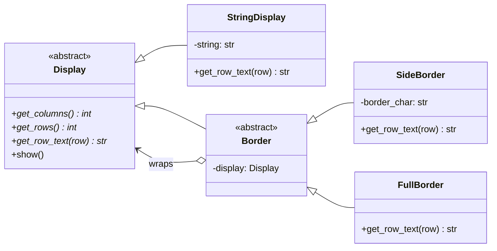

# Decorator Pattern

> **Category:** Structural · **Difficulty:** Beginner-friendly · **Dependencies:** none (Python 3.9+ standard library only)

The **Decorator** pattern attaches additional responsibilities to an object **dynamically, by wrapping it** — instead of statically, by subclassing it. A decorator implements the same interface as the object it wraps, delegates the real work inward, and adds its own thin layer of behaviour around the result. Because decorators wrap the *abstract* type, they stack: you can wrap a wrapper, to any depth.

This directory is a complete, runnable tutorial. You can read it top-to-bottom in about 15 minutes, run the demo, run the tests, and then do the exercises at the end.

---

## Table of contents

1. [The problem it solves](#1-the-problem-it-solves)
2. [Real-world analogy](#2-real-world-analogy)
3. [Structure](#3-structure)
4. [Code walkthrough](#4-code-walkthrough)
5. [Run the demo](#5-run-the-demo)
6. [Run the tests](#6-run-the-tests)
7. [Real-world use cases](#7-real-world-use-cases)
8. [When to use it (and when not to)](#8-when-to-use-it-and-when-not-to)
9. [Related patterns](#9-related-patterns)
10. [Exercises](#10-exercises)
11. [References](#11-references)

---

## 1. The problem it solves

Suppose you render text and want optional embellishments: a `#` on each side, a full frame, or both. The subclassing instinct produces this:

```python
class StringDisplay: ...
class SideBorderedStringDisplay(StringDisplay): ...
class FramedStringDisplay(StringDisplay): ...
class FramedSideBorderedStringDisplay(SideBorderedStringDisplay): ...   # uh oh
class DoubleFramedSideBorderedStringDisplay(...): ...                   # please stop
```

Three problems make this approach collapse:

1. **Combinatorial explosion.** Every *combination* of features needs its own subclass. Three optional decorations already mean up to 2³ = 8 classes — and the demo below stacks the *same* decoration twice, which subclassing cannot express at all.
2. **Compile-time rigidity.** The set of decorations is frozen when the class is written. You cannot decide at runtime "this one gets a frame, that one doesn't" without instantiating a different class.
3. **Bloated base classes.** The tempting alternative — flags like `StringDisplay(framed=True, side_char="#")` — piles every feature into one class that grows forever and knows too much.

The Decorator pattern fixes all three by making each embellishment **its own small class that wraps any `Display`** — including an already-wrapped one. Features combine by composition at runtime: `FullBorder(SideBorder(StringDisplay("Hi"), "#"))`.

## 2. Real-world analogy

Think of **framing a picture**. The picture is complete on its own. A mat border can be placed around it; a wooden frame around that; even a second frame around the first. Each layer surrounds whatever it is given without changing it, and the framed result still hangs on a wall exactly like a bare picture would. Crucially, the frame shop doesn't care whether it's framing a photo or an already-framed photo — anything wall-hangable can be framed.

In this example:

| Analogy | Code |
| --- | --- |
| "Anything you can hang on a wall" | `Display` (the common interface) |
| The picture itself | `StringDisplay` (concrete component) |
| "A frame is hangable and surrounds something hangable" | `Border` (decorator base: *is-a* + *has-a* `Display`) |
| A mat border | `SideBorder` |
| A wooden frame | `FullBorder` |
| Frame around a framed picture | `FullBorder(FullBorder(...))` — stacking |

## 3. Structure

Two packages: what gets decorated, and the decorations. The `border/` package depends on `display/`, never the reverse:

```
decorator/
├── display/          # COMPONENT side: knows nothing about borders
│   ├── display.py            # Display       — the shared interface
│   └── string_display.py     # StringDisplay — plain, undecorated text
├── border/           # DECORATOR side: wraps anything that is a Display
│   ├── border.py             # Border     — is-a Display, has-a Display
│   ├── side_border.py        # SideBorder — adds a char left and right
│   └── full_border.py        # FullBorder — adds a +---+ frame
├── main.py           # demo client
└── tests/            # executable specification of the pattern's guarantees
```



The loop in the diagram — `Border` both inherits from `Display` and holds a `Display` — is the pattern's signature. Follow the `wraps` arrow and you can walk from any decorator back down to the plain component at the core.

## 4. Code walkthrough

### Step 1 — the shared interface ([display/display.py](display/display.py))

```python
class Display(ABC):
    @abstractmethod
    def get_columns(self) -> int: ...
    @abstractmethod
    def get_rows(self) -> int: ...
    @abstractmethod
    def get_row_text(self, row: int) -> str: ...

    @final
    def show(self) -> None:
        for row in range(self.get_rows()):
            print(self.get_row_text(row))
```

One interface for everything renderable — bare or decorated. `show()` is a small template method marked `@final`: rendering is defined once in terms of the abstract geometry methods, so it automatically works for any decoration stack.

### Step 2 — the plain component ([display/string_display.py](display/string_display.py))

```python
class StringDisplay(Display):
    def get_columns(self) -> int: return len(self._string)
    def get_rows(self) -> int: return 1
```

The undecorated object at the centre of the onion. Nothing here anticipates borders.

### Step 3 — the decorator base ([border/border.py](border/border.py))

```python
class Border(Display, ABC):
    def __init__(self, display: Display) -> None:
        self._display = display
```

Two relationships in two lines: `Border` **is a** `Display` (so wrapping is invisible to clients) and **has a** `Display` (so it can delegate inward). Because `self._display` is the abstract type, it may be a `StringDisplay` — or another `Border`.

### Step 4 — concrete decorators ([border/side_border.py](border/side_border.py), [border/full_border.py](border/full_border.py))

```python
class SideBorder(Border):
    def get_columns(self) -> int:
        return 1 + self._display.get_columns() + 1

    def get_row_text(self, row: int) -> str:
        return f"{self._border_char}{self._display.get_row_text(row)}{self._border_char}"
```

The delegate-then-contribute shape: ask the wrapped display for its answer, add exactly one layer around it. `FullBorder` does the same with two extra rows for the frame lines. Neither class inspects what it wrapped.

### Step 5 — the client ([main.py](main.py))

```python
b4: Display = SideBorder(
    FullBorder(FullBorder(SideBorder(FullBorder(StringDisplay("Hello.")), "*"))),
    "/",
)
b4.show()
```

Five layers assembled at runtime, rendered with the same single call as a bare string. No `FramedSideBorderedFramed...` class ever had to exist.

### 💡 Same idea, function flavour: Python's `@decorator` syntax

Python's function decorators are the *same pattern* applied to callables. A function decorator takes a callable, returns a wrapper with the same call interface, and the wrapper delegates inward and adds behaviour around the call:

```python
import functools

def logged(func):                    # takes a "component"
    @functools.wraps(func)           # keep __name__/__doc__ — transparency!
    def wrapper(*args, **kwargs):    # same interface as what it wraps
        print(f"calling {func.__name__}")
        return func(*args, **kwargs) # delegate, then/around: contribute
    return wrapper

@logged                               # greet = logged(greet)
def greet(name: str) -> str:
    return f"Hello, {name}!"
```

The parallels are exact: *same interface* (a callable wrapping a callable), *delegation* (`func(*args, **kwargs)`), *stacking* (multiple `@decorator` lines), and even *transparency* — `functools.wraps` copies `__name__`, `__doc__` and friends onto the wrapper for the same reason our borders subclass `Display`: so the wrapped thing is indistinguishable from the original. See [`functools.wraps`](https://docs.python.org/3/library/functools.html#functools.wraps).

## 5. Run the demo

From the **repository root**:

```bash
python -m decorator.main
```

Expected output:

```text
b1 - the bare component:
Hello, world.

b2 - b1 wrapped in a SideBorder('#'):
#Hello, world.#

b3 - b2 wrapped again in a FullBorder:
+---------------+
|#Hello, world.#|
+---------------+

b4 - five layers of decoration, one show() call:
/+------------+/
/|+----------+|/
/||*+------+*||/
/||*|Hello.|*||/
/||*+------+*||/
/|+----------+|/
/+------------+/
```

Read `b4`'s output from the outside in and you can see every layer of the onion: `/` side border, two full frames, `*` side border, one more frame, and finally `Hello.` at the core.

## 6. Run the tests

```bash
python -m unittest discover -s decorator -t .
```

The tests in [tests/](tests/) are written as an executable specification — each one states a guarantee the pattern provides (e.g. *"decoration is transparent"*, *"decorators stack to any depth"*, *"wrapping never mutates the wrapped object"*). Reading them is a good comprehension check.

## 7. Real-world use cases

You already use this pattern daily, often without noticing:

| Domain | Client asks for… | What the decorator adds |
| --- | --- | --- |
| **File-like I/O** | "a readable stream" | Buffering, text decoding — Python's `io` stacks `TextIOWrapper(BufferedReader(FileIO(...)))`, textbook Decorator |
| **Compression** | "a writable stream" | On-the-fly gzip/bz2 around any file object (`gzip.GzipFile(fileobj=...)`) |
| **Function behaviour** | "this same function" | Caching (`functools.lru_cache`), retry, timing, auth checks — via `@decorator` syntax |
| **Web middleware** | "a WSGI/ASGI app" | Sessions, gzip, CORS — each middleware wraps the app and exposes the app interface (Django/Starlette middleware) |
| **GUI widgets** | "a scrollable view" | Scrollbars/borders wrapped around any widget (the GoF book's own motivating example) |
| **Notifications** | "a notifier" | Extra channels stacked at runtime: SMS around Slack around e-mail |
| **Data streams** | "a reader" | Line counting, checksumming, progress reporting around any underlying reader |
| **Encryption** | "a socket" | TLS wrapping a plain socket (`ssl.SSLSocket` around `socket.socket`) |

The common thread: the caller keeps talking to the **same interface**, while responsibilities are layered on **per object, at runtime**.

## 8. When to use it (and when not to)

**Use it when:**

- You need to add responsibilities to *individual objects* at runtime, not to a whole class at compile time.
- Features must combine freely — any subset, any order, possibly the same feature twice.
- Subclassing is impractical: the combination count explodes, or the class is closed to extension.
- You want each embellishment isolated in its own small, testable class (Single Responsibility).

**Don't use it when:**

- There is exactly one optional feature and it never combines with others — a boolean parameter or a single subclass is simpler and easier to trace.
- The "decoration" needs to see or change the component's *internals*. Decorators only touch the public interface; if you need more, the behaviour probably belongs in the class itself.
- Identity matters to your code: `wrapped is original` is `False`, and `isinstance(x, StringDisplay)` fails once wrapped. Code that type-sniffs concrete classes fights this pattern.
- In Python specifically, for *function-shaped* behaviour, a plain `@decorator` (with `functools.wraps`) is the idiomatic, lighter-weight form of the same idea — reach for the class-based pattern when you're layering behaviour onto *stateful objects with multi-method interfaces*, like `Display` here.

**Trade-off to be aware of:** deep stacks are powerful but opaque — a bug report saying "the output has one `|` too many" now requires peeling the onion layer by layer, and the stack's behaviour depends on wrap *order* (`SideBorder(FullBorder(x))` ≠ `FullBorder(SideBorder(x))`).

## 9. Related patterns

- **Adapter** — also wraps an object, but to *change* its interface; Decorator deliberately *keeps* the interface identical and changes behaviour.
- **Proxy** — structurally the same wrap-and-delegate shape, but the intent is to *control access* (lazy loading, permissions), not to add visible responsibilities. See [`../proxy/`](../proxy/).
- **Composite** — Decorator is like a degenerate Composite with exactly one child; both rely on a shared component interface. Decorator adds responsibilities, Composite aggregates children.
- **Factory Method** — often used to assemble a standard decoration stack in one place instead of at every call site. See [`../factory_method/`](../factory_method/).
- **Facade** — the opposite instinct: Decorator adds layers around one object; Facade hides many objects behind one simple front. See [`../facade/`](../facade/).

## 10. Exercises

Try these to confirm your understanding (each should require **no changes** to `display/` — if you find yourself editing it, revisit section 3):

1. **New decorator:** add an `UpDownBorder(display, ch)` that draws a line of `ch` above and below the wrapped display but leaves the sides open. Stack it with the existing borders.
2. **Decorator with state:** add a `NumberedBorder` that prefixes each row with its 1-based line number (`1: ...`). Careful — the width contribution depends on the row count.
3. **New component:** add a `MultiStringDisplay` holding several rows of (padded) text, and confirm every existing border works on it unchanged. Which package did you have to touch?
4. **Function flavour:** write a `@framed` *function* decorator that takes a function returning a string and returns one whose result is wrapped in a `+---+` frame. Use `functools.wraps`, stack it twice, and note the one-to-one correspondence with `FullBorder`.

## 11. References

- Gamma, Helm, Johnson, Vlissides — *Design Patterns: Elements of Reusable Object-Oriented Software* (GoF), Decorator chapter.
- Hiroshi Yuki — *An Introduction to Design Patterns Learned in the Java Language* (this example's Display/Border scenario originates there).
- [Refactoring.Guru — Decorator](https://refactoring.guru/design-patterns/decorator)
- [Python `functools.wraps` documentation](https://docs.python.org/3/library/functools.html#functools.wraps) and the [glossary entry for "decorator"](https://docs.python.org/3/glossary.html#term-decorator)
