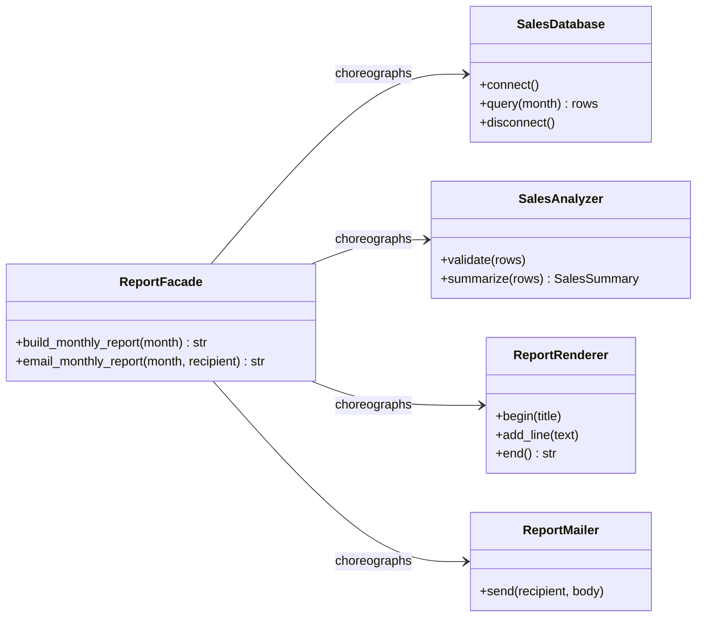

# Facade Pattern

> **Category:** Structural · **Difficulty:** Beginner-friendly · **Dependencies:** none (Python 3.9+ standard library only)

The **Facade** pattern provides a single, simple interface to a complicated subsystem. The subsystem's classes stay exactly as they are — small, independent, and fully usable — but everyday clients no longer have to know four classes, their call order, and their connection lifecycles. They call **one method on one object**, and the facade performs the choreography.

This directory is a complete, runnable tutorial. You can read it top-to-bottom in about 15 minutes, run the demo, run the tests, and then do the exercises at the end.

---

## Table of contents

1. [The problem it solves](#1-the-problem-it-solves)
2. [Real-world analogy](#2-real-world-analogy)
3. [Structure](#3-structure)
4. [Code walkthrough](#4-code-walkthrough)
5. [Run the demo](#5-run-the-demo)
6. [Run the tests](#6-run-the-tests)
7. [Real-world use cases](#7-real-world-use-cases)
8. [When to use it (and when not to)](#8-when-to-use-it-and-when-not-to)
9. [Related patterns](#9-related-patterns)
10. [Exercises](#10-exercises)
11. [References](#11-references)

---

## 1. The problem it solves

Suppose generating a monthly sales report requires four classes. Every client that needs a report writes this:

```python
database = SalesDatabase()
database.connect()                 # forget this -> RuntimeError
rows = database.query("2026-04")
database.disconnect()              # forget this -> connection leak

summary = SalesAnalyzer().summarize(rows)

renderer = ReportRenderer()
renderer.begin("Monthly Sales Report 2026-04")   # forget this -> RuntimeError
for product, units, unit_price in rows:
    renderer.add_line(...)         # ~6 more lines of formatting
report = renderer.end()
```

This works — once. Then the problems compound:

1. **Knowledge tax on every client.** Each caller must know four classes, their call *order*, and their little protocols (`connect` before `query`, `begin` before `add_line`). That's a lot of API surface to learn just to say "give me April's report".
2. **Duplicated, diverging choreography.** The same 15-line dance gets copy-pasted into every screen, cron job and CLI tool that needs a report. One copy forgets `disconnect()`; another formats revenue differently. Now "the report" means five slightly different things.
3. **Tight coupling to subsystem internals.** When you swap `SalesDatabase` for a real driver or add a caching layer, *every* client breaks — because every client touches the internals directly.

The Facade pattern fixes all three by capturing the choreography **once**, in one class with one obvious method: `facade.build_monthly_report("2026-04")`. Clients depend on one small interface; the subsystem is free to evolve behind it.

## 2. Real-world analogy

Think of a **travel agent**. Booking a trip yourself means dealing with an airline's booking system, a hotel's reservation desk, a car-hire company and travel insurance — four organisations, four phone numbers, four sets of rules, and an ordering constraint (no point booking the hotel before the flight is confirmed). A travel agent gives you a single counter: "One week in Lisbon, please." The agent knows the sequence, handles cancellation if a middle step fails, and — importantly — the airline still sells tickets directly to anyone who prefers to do it themselves.

In this example:

| Analogy | Code |
| --- | --- |
| The travel agent's counter | `ReportFacade` |
| "One week in Lisbon, please" | `facade.build_monthly_report("2026-04")` |
| Airline booking system | `SalesDatabase` (connect/query/disconnect protocol) |
| Hotel reservation desk | `SalesAnalyzer` |
| Car-hire company | `ReportRenderer` (begin/add_line/end protocol) |
| Insurance paperwork sent to you | `ReportMailer` |
| Booking directly with the airline | Importing `facade.subsystem` yourself — still allowed |

## 3. Structure

One facade class in front of one subsystem package, with a strict one-way dependency:

```
facade/
├── subsystem/            # the complicated machinery (knows nothing of the facade)
│   ├── database.py       #   SalesDatabase  — connect / query / disconnect
│   ├── analyzer.py       #   SalesAnalyzer  — validate / summarize
│   ├── renderer.py       #   ReportRenderer — begin / add_line / end
│   └── mailer.py         #   ReportMailer   — send (records an outbox)
├── report_facade.py      # ReportFacade — the one simple entry point
├── main.py               # demo client: the hard way vs. the facade way
└── tests/                # executable specification of the pattern's guarantees
```



All arrows leave the facade; none enter it. `subsystem/` never imports `report_facade.py`, and the subsystem classes never import each other — the facade is the *only* place that knows how the pieces combine.

## 4. Code walkthrough

### Step 1 — a subsystem class with a protocol ([subsystem/database.py](subsystem/database.py))

```python
class SalesDatabase:
    def query(self, month: str) -> ...:
        if not self._connected:
            raise RuntimeError("query() called before connect()")
```

Each subsystem class is individually sensible but has rules the caller must respect. Real subsystems (DB drivers, SMTP clients, XML writers) are exactly like this — the pain is authentic, not staged.

### Step 2 — independent workers ([subsystem/analyzer.py](subsystem/analyzer.py), [subsystem/renderer.py](subsystem/renderer.py), [subsystem/mailer.py](subsystem/mailer.py))

```python
class SalesAnalyzer:
    def summarize(self, rows) -> SalesSummary: ...
```

Note what these classes *don't* do: the analyzer never opens a connection; the renderer never queries data. Each has one job and no knowledge of its siblings. Combining them is precisely the knowledge that belongs in the facade.

### Step 3 — the facade ([report_facade.py](report_facade.py))

```python
class ReportFacade:
    def build_monthly_report(self, month: str) -> str:
        self._database.connect()
        try:
            rows = self._database.query(month)
        finally:
            self._database.disconnect()      # closed even on failure
        summary = self._analyzer.summarize(rows)
        self._renderer.begin(f"Monthly Sales Report {month}")
        ...
        return self._renderer.end()
```

Every line of *real work* still happens in the subsystem — the facade contributes no business logic of its own. What it contributes is the **correct order**, written once, with the connection reliably closed via `try/finally` even if a middle step raises. That `try/finally` is the kind of detail that gets forgotten in one of five copy-pasted choreographies; here it can't be.

### Step 4 — facades compose ([report_facade.py](report_facade.py))

```python
def email_monthly_report(self, month: str, recipient: str) -> str:
    report = self.build_monthly_report(month)
    self._mailer.send(recipient, report)
    return report
```

A bigger convenience built from a smaller one. Higher-level operations are cheap to add because the choreography already lives in one place.

### Step 5 — the client ([main.py](main.py))

```python
facade = ReportFacade()
print(facade.build_monthly_report("2026-04"))
```

Compare with `the_hard_way()` in the same file — the full manual choreography, kept side by side deliberately so you can *see* what the facade absorbs. The tests assert the two produce byte-for-byte identical output.

> 💡 The facade does **not** lock the door behind it. `from facade.subsystem.database import SalesDatabase` still works, and sometimes that's the right call for a power user. GoF calls this an *optional* narrowing: the facade adds a simple path, it doesn't remove the detailed one.

## 5. Run the demo

From the **repository root**:

```bash
python -m facade.main
```

Expected output:

```text
=== WITHOUT the facade: the client choreographs 4 classes ===
========================================
      Monthly Sales Report 2026-04
========================================
Widget       3 units x $  500 = $ 1,500
Gadget       2 units x $1,250 = $ 2,500
Gizmo        8 units x $   75 = $   600
----------------------------------------
Total units:   13
Total revenue: $4,600
Best seller:   Gadget

=== WITH the facade: one object, one call ===
========================================
      Monthly Sales Report 2026-04
========================================
Widget       3 units x $  500 = $ 1,500
Gadget       2 units x $1,250 = $ 2,500
Gizmo        8 units x $   75 = $   600
----------------------------------------
Total units:   13
Total revenue: $4,600
Best seller:   Gadget

=== The facade can also compose bigger conveniences ===
[mailer] sent 9-line report to boss@example.com
```

The two reports are identical — that's the point. The difference is in [main.py](main.py): ~25 lines of careful choreography versus one call.

## 6. Run the tests

```bash
python -m unittest discover -s facade -t .
```

The tests in [tests/](tests/) are written as an executable specification — each one states a guarantee the pattern provides (e.g. *"one call equals the whole choreography"*, *"the connection is closed even on failure"*, *"the subsystem stays directly usable"*). Reading them is a good comprehension check.

## 7. Real-world use cases

You already use this pattern daily, often without noticing:

| Domain | Client asks for… | What the facade hides |
| --- | --- | --- |
| **HTTP clients** | `requests.get(url)` | Connection pools, redirects, cookies, TLS, encoding — over `urllib3`'s machinery |
| **Compression/archives** | `shutil.make_archive(...)` | The whole `zipfile`/`tarfile` open-add-close choreography (Python stdlib) |
| **Subprocesses** | `subprocess.run(cmd)` | `Popen` creation, pipe wiring, waiting, return-code handling (Python stdlib) |
| **ORMs** | `session.commit()` | Transaction begin, dirty-object tracking, SQL generation, flush ordering (SQLAlchemy) |
| **Payment processing** | "charge this card" | Tokenisation, fraud checks, gateway protocol, retries behind one SDK call (Stripe SDK) |
| **Video/media tools** | "convert this file" | Demuxing, decoding, filtering, encoding, muxing (`ffmpeg`'s CLI over libav*) |
| **Cloud SDKs** | "upload this file" | Multipart negotiation, signing, retry/backoff (boto3's `upload_file`) |
| **Web frameworks** | `TestClient(app).get("/")` | Server startup, request encoding, transport, response parsing in test facades |

The common thread: the caller wants **one obvious verb** for a common task, and does not want to learn the five-class dance that implements it.

## 8. When to use it (and when not to)

**Use it when:**

- A common task requires choreographing several classes in a specific order, and many call sites need that task.
- You want a stable, minimal API in front of a subsystem that is still evolving (or that you plan to swap out).
- You're layering a system: each layer exposes a facade to the one above (a classic architecture move).
- Onboarding matters — "call this one method" is a better first day than "read these four modules".

**Don't use it when:**

- There's only one client, or the "subsystem" is one class. A facade over nothing is indirection without benefit.
- Clients genuinely need the subsystem's full flexibility — don't force every consumer through a narrow API and then punch it full of pass-through options.
- You're tempted to put *business logic* in the facade. The moment the facade computes things the subsystem can't, it has become a god object wearing a nice name. Keep it to coordination.
- In Python specifically, the lightest facade is often just a **module-level function** (`def build_monthly_report(month): ...`) — modules are namespaces, and a function is a fine facade. Reach for a facade *class* when it must hold subsystem instances, manage lifecycles, or be swapped/mocked as a unit, as here.

**Trade-off to be aware of:** facades accrete. Every user request "can it also do X?" adds a method, and ten years later the facade is the biggest class in the codebase. Split facades by audience (reporting facade, admin facade) before that happens.

## 9. Related patterns

- **Adapter** — also simplifies access to existing code, but to make it *match an interface a client already expects*; Facade *invents* a new, simpler interface. Adapter wraps one class, Facade fronts many.
- **Mediator** — also centralises interaction, but between *colleagues that talk back through it* in an ongoing conversation; a facade is one-way (client → subsystem), and the subsystem doesn't know the facade exists.
- **Singleton** — one facade instance usually suffices; facades are frequent Singleton candidates.
- **Abstract Factory** — can sit behind a facade to hide *how subsystem objects get created*, complementing the facade's hiding of how they're *used*. See [`../factory_method/`](../factory_method/) for the creation-pattern side of that story.
- **Decorator** — the opposite instinct: Facade collapses many objects into one simple front, Decorator layers wrappers around a single object. See [`../decorator/`](../decorator/).

## 10. Exercises

Try these to confirm your understanding (each should require **no changes** to `subsystem/` — if you find yourself editing it, revisit section 3):

1. **Bigger convenience:** add `ReportFacade.build_quarterly_report(months: list[str])` that queries several months and renders one combined report with a grand total. The subsystem already provides everything you need.
2. **Alternative delivery:** add `save_monthly_report(month, path)` that writes the report to a file instead of mailing it. Notice how little the new method needs to know.
3. **Swap a subsystem class:** write a `CsvSalesDatabase` with the same `connect/query/disconnect` protocol reading from a CSV string, and let `ReportFacade.__init__` accept an optional database. How many *clients* had to change?
4. **Feel the pain:** delete the facade (temporarily!) and update `main.py` to email both months' reports manually. Count the lines and the number of protocols you had to remember — then restore the facade and appreciate it.

## 11. References

- Gamma, Helm, Johnson, Vlissides — *Design Patterns: Elements of Reusable Object-Oriented Software* (GoF), Facade chapter.
- Hiroshi Yuki — *An Introduction to Design Patterns Learned in the Java Language* (its PageMaker/Database/HtmlWriter facade inspired this example's shape).
- [Refactoring.Guru — Facade](https://refactoring.guru/design-patterns/facade)
- [Python `shutil` documentation](https://docs.python.org/3/library/shutil.html) and [`subprocess.run`](https://docs.python.org/3/library/subprocess.html#subprocess.run) — two stdlib facades worth reading.
