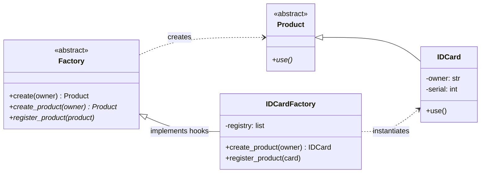

# Factory Method Pattern

> **Category:** Creational · **Difficulty:** Beginner-friendly · **Dependencies:** none (Python 3.9+ standard library only)

The **Factory Method** pattern defines an interface for creating an object, but lets subclasses decide **which class to instantiate**. It moves the `SomeConcreteClass(...)` call out of client code and into a dedicated "creator" class, so that the code *using* objects is decoupled from the code *creating* them.

This directory is a complete, runnable tutorial. You can read it top-to-bottom in about 15 minutes, run the demo, run the tests, and then do the exercises at the end.

---

## Table of contents

1. [The problem it solves](#1-the-problem-it-solves)
2. [Real-world analogy](#2-real-world-analogy)
3. [Structure](#3-structure)
4. [Code walkthrough](#4-code-walkthrough)
5. [Run the demo](#5-run-the-demo)
6. [Run the tests](#6-run-the-tests)
7. [Real-world use cases](#7-real-world-use-cases)
8. [When to use it (and when not to)](#8-when-to-use-it-and-when-not-to)
9. [Related patterns](#9-related-patterns)
10. [Exercises](#10-exercises)
11. [References](#11-references)

---

## 1. The problem it solves

Suppose your application issues ID cards:

```python
card = IDCard("Alice")   # client code creates the product directly
```

This looks harmless, but three problems creep in as the program grows:

1. **Tight coupling.** Every place that says `IDCard(...)` is hard-wired to that concrete class. If you later need `PlasticIDCard` or `DigitalIDCard`, you must hunt down and edit every creation site.
2. **Scattered creation logic.** Real object creation is rarely one line — you assign serial numbers, register the object in a database, validate inputs. Without a single creation point, that logic gets duplicated (and eventually diverges).
3. **No guarantees.** Nothing forces "every card must be registered after creation". A rule that lives in developers' heads will eventually be forgotten.

The Factory Method pattern fixes all three by funnelling creation through one method — `factory.create(...)` — whose *procedure* is fixed by an abstract class, while the *concrete class being created* is chosen by a subclass.

## 2. Real-world analogy

Think of a **passport office**. You (the client) don't print your own passport. You submit an application to the office, and the office follows a fixed procedure: verify identity → print the document → **record it in the national registry** → hand it over. Different offices may print different document types (biometric, temporary, diplomatic), but the *procedure* is the same everywhere, and skipping the registry step is impossible.

In this example:

| Analogy | Code |
| --- | --- |
| The fixed office procedure | `Factory.create()` (template method) |
| "Print the document" step | `create_product()` (factory method, overridden) |
| "Record in registry" step | `register_product()` (factory method, overridden) |
| A concrete office | `IDCardFactory` |
| The document you receive | `IDCard` (a `Product`) |

## 3. Structure

Two packages with a strict one-way dependency — this separation is the whole point of the pattern:

```
factory_method/
├── framework/        # ABSTRACT side: knows nothing about ID cards
│   ├── product.py    #   Product  — "something that can be used"
│   └── factory.py    #   Factory  — fixed creation procedure (create)
├── idcard/           # CONCRETE side: depends on framework/, never vice versa
│   ├── id_card.py            # IDCard        — a concrete Product
│   └── id_card_factory.py    # IDCardFactory — a concrete Factory
├── main.py           # demo client
└── tests/            # executable specification of the pattern's guarantees
```



`framework/` never imports from `idcard/`. You can add ten new product types without touching a single line of `framework/` — that is the **Open/Closed Principle** in action: *open for extension, closed for modification*.

## 4. Code walkthrough

### Step 1 — the abstract Product ([framework/product.py](framework/product.py))

```python
class Product(ABC):
    @abstractmethod
    def use(self) -> None: ...
```

The framework's entire knowledge of products: "they can be used". Nothing else.

### Step 2 — the abstract Factory ([framework/factory.py](framework/factory.py))

```python
class Factory(ABC):
    @final
    def create(self, owner: str) -> Product:
        product = self.create_product(owner)   # step delegated to subclass
        self.register_product(product)         # step delegated to subclass
        return product
```

`create()` is a **template method**: it locks in the procedure (create → register → return) and delegates the individual steps to abstract hooks. It's marked `@final` so subclasses can change *what* happens in each step but never *skip or reorder* the steps. This is how "every card is always registered" becomes a guarantee instead of a convention.

> 💡 The Factory Method pattern is essentially the **Template Method pattern applied to object creation** — compare with the [Template Method tutorial](../template_method/) in this repository.

### Step 3 — the concrete Product ([idcard/id_card.py](idcard/id_card.py))

```python
class IDCard(Product):
    def __init__(self, owner: str, serial: int) -> None: ...
    def use(self) -> None:
        print(f"Using {self._owner}'s card (serial: {self._serial}).")
```

A plain class that fulfils the `Product` contract. Note the constructor takes a `serial` — clients aren't supposed to invent serial numbers, which is exactly why they should go through the factory.

### Step 4 — the concrete Factory ([idcard/id_card_factory.py](idcard/id_card_factory.py))

```python
class IDCardFactory(Factory):
    def create_product(self, owner: str) -> IDCard:
        serial = len(self._registry) + 100     # factory owns the serial policy
        return IDCard(owner, serial)

    def register_product(self, product: IDCard) -> None:
        self._registry.append(product)
```

Only the two hooks are implemented. The `create()` procedure is inherited as-is.

### Step 5 — the client ([main.py](main.py))

```python
factory: Factory = IDCardFactory()   # the ONLY mention of a concrete class
card = factory.create("Alice")
card.use()
```

Everything after the first line is written against the abstract `Factory` / `Product` types. Swapping in a different factory changes zero lines of client logic.

## 5. Run the demo

From the **repository root**:

```bash
python -m factory_method.main
```

Expected output:

```text
Creating Alice's card (serial: 100).
Creating Bob's card (serial: 101).
Creating Charlie's card (serial: 102).
Using Alice's card (serial: 100).
Using Bob's card (serial: 101).
Using Charlie's card (serial: 102).
```

## 6. Run the tests

```bash
python -m unittest discover -s factory_method -t .
```

The tests in [tests/](tests/) are written as an executable specification — each one states a guarantee the pattern provides (e.g. *"every created card is registered"*, *"a factory missing a hook cannot even be instantiated"*). Reading them is a good comprehension check.

## 7. Real-world use cases

You already use this pattern daily, often without noticing:

| Domain | Client asks for… | Factory decides the concrete class |
| --- | --- | --- |
| **Logging** | "a handler" | `FileHandler`, `StreamHandler`, `SysLogHandler` (Python's `logging` config) |
| **Database drivers** | "a connection" | PostgreSQL / MySQL / SQLite connection (SQLAlchemy `create_engine(url)`) |
| **GUI toolkits** | "a button" | Windows / macOS / Linux native button |
| **Payment processing** | "a payment gateway" | `StripeGateway`, `PayPalGateway`, `BankTransferGateway` |
| **Document export** | "an exporter" | `PdfExporter`, `CsvExporter`, `XlsxExporter` |
| **Cloud SDKs** | "a storage client" | S3 / GCS / Azure Blob client behind one interface |
| **Game development** | "an enemy for level 3" | `Slime`, `Dragon`, `Boss` (spawner classes) |
| **Testing** | "a user record" | Test-data factories (e.g. `factory_boy`) that also handle IDs and persistence — just like our serial number + registry |

The common thread: the caller wants to **use** an object with a known interface and does not want to care **which** implementation it gets or **how** it is wired up.

## 8. When to use it (and when not to)

**Use it when:**

- A class can't anticipate the exact class of objects it must create.
- Object creation involves invariants (registration, ID assignment, pooling, caching) that must never be skipped.
- You want to offer users of a library/framework a way to extend its internal components.
- You expect the family of products to grow (new card types, new exporters, new gateways).

**Don't use it when:**

- There is exactly one product type and no creation logic beyond `__init__`. `IDCard("Alice")` is fine then — a factory would be ceremony without benefit.
- In Python specifically, a simple factory **function** or a `dict` mapping names to classes often does the job with less machinery. Reach for the full class-based pattern when you need the *fixed procedure + swappable steps* combination shown here.

**Trade-off to be aware of:** every new product tends to bring a parallel factory class, so the class count grows. That's the price of the decoupling.

## 9. Related patterns

- **Template Method** — `Factory.create()` *is* a template method; Factory Method is that idea specialised for creation. See [`../template_method/`](../template_method/).
- **Abstract Factory** — creates whole *families* of related products (e.g. button + checkbox + menu for one OS). Often implemented using multiple factory methods. See [`../abstract_factory/`](../abstract_factory/).
- **Singleton** — concrete factories frequently exist as a single shared instance. See [`../singleton/`](../singleton/).
- **Builder** — also isolates construction, but focuses on assembling one complex object step by step, rather than choosing which class to instantiate. See [`../builder/`](../builder/).

## 10. Exercises

Try these to confirm your understanding (each should require **no changes** to `framework/` — if you find yourself editing it, revisit section 3):

1. **New product:** add a `televisioncard/` package with `TVCard` and `TVCardFactory`, where each card gets a random 6-digit code instead of a sequential serial.
2. **Persistence hook:** make a `PersistentIDCardFactory` whose `register_product` appends one line per card to a CSV file.
3. **Break it on purpose:** create a factory subclass that implements only `create_product`. Instantiate it. Read the error message — *why* does Python refuse, and which line in `framework/factory.py` causes that?
4. **Pythonic variant:** rewrite the client so the concrete factory is chosen from a `dict[str, type[Factory]]` based on a command-line argument. Notice the client logic still doesn't change.

## 11. References

- Gamma, Helm, Johnson, Vlissides — *Design Patterns: Elements of Reusable Object-Oriented Software* (GoF), Factory Method chapter.
- Hiroshi Yuki — *An Introduction to Design Patterns Learned in the Java Language* (this example's IDCard scenario originates there).
- [Refactoring.Guru — Factory Method](https://refactoring.guru/design-patterns/factory-method)
- [Python `abc` module documentation](https://docs.python.org/3/library/abc.html)
