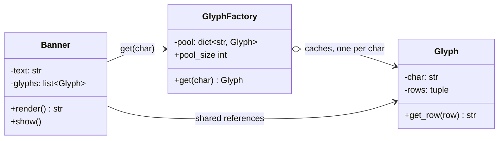

# Flyweight Pattern

> **Category:** Structural · **Difficulty:** Intermediate · **Dependencies:** none (Python 3.9+ standard library only)

The **Flyweight** pattern supports huge numbers of fine-grained objects by **sharing** them. It splits an object's state into an **intrinsic** part (context-free, immutable, safe to share — stored in the flyweight) and an **extrinsic** part (context-dependent — supplied by the client at use time), then routes all creation through a caching factory so that each distinct intrinsic state exists exactly once.

This directory is a complete, runnable tutorial. You can read it top-to-bottom in about 15 minutes, run the demo, run the tests, and then do the exercises at the end.

---

## Table of contents

1. [The problem it solves](#1-the-problem-it-solves)
2. [Real-world analogy](#2-real-world-analogy)
3. [Structure](#3-structure)
4. [Code walkthrough](#4-code-walkthrough)
5. [Run the demo](#5-run-the-demo)
6. [Run the tests](#6-run-the-tests)
7. [Real-world use cases](#7-real-world-use-cases)
8. [When to use it (and when not to)](#8-when-to-use-it-and-when-not-to)
9. [Related patterns](#9-related-patterns)
10. [Exercises](#10-exercises)
11. [References](#11-references)

---

## 1. The problem it solves

Suppose you render text as big ASCII-art characters, and each glyph object is heavy (pretend it's a loaded texture or a parsed font file). The naive version creates one object per character *occurrence*:

```python
class Banner:
    def __init__(self, text: str) -> None:
        # a 10,000-char banner -> 10,000 heavy Glyph objects...
        self.glyphs = [Glyph(char) for char in text]   # new object every time!
```

Three problems, and they all scale with your data:

1. **Memory blow-up.** A 10,000-character banner built from a 3-character alphabet allocates 10,000 copies of what is really just 3 distinct shapes. The waste factor is `document size / alphabet size` — it gets *worse* the bigger your input.
2. **Construction cost, repeated.** If loading a glyph is expensive (disk, parsing, GPU upload), you pay that cost per occurrence instead of per distinct character.
3. **No single source of truth.** With 10,000 independent copies of the shape for `'1'`, updating the font means finding and rebuilding every copy — nothing says they're "the same" glyph.

The Flyweight pattern fixes all three with one move: `Glyph('1')` is created **once**, cached in a factory, and every `'1'` in every banner holds a *reference* to that single instance. Object count now scales with the **alphabet**, not the **document**. What still varies per occurrence — position, order, row being drawn — is *extrinsic* state, and the client passes it in at call time.

## 2. Real-world analogy

Think of **movable type printing**. A print shop does not carve a fresh letter block for every `'e'` on the page — it keeps **one metal block per letter shape** in a type case and places the *same* block wherever that letter is needed. The block itself knows only its shape (intrinsic); *where* it sits on the page is decided by the compositor arranging the frame (extrinsic). One case of type prints a whole library.

In this example:

| Analogy | Code |
| --- | --- |
| A metal letter block (one per shape) | `Glyph` (the flyweight; intrinsic state = the ASCII shape) |
| The type case the blocks live in | `GlyphFactory._pool` (the cache) |
| "Fetch the block for 'e'" | `factory.get("1")` (get-or-create) |
| The compositor's arrangement of blocks | `Banner._glyphs` (references, in text order — extrinsic) |
| Pressing row after row of the page | `banner.render()` passing the row index into shared glyphs |
| "Never file down a block mid-print-run" | Flyweights are immutable — shared state is read-only |

## 3. Structure

The shareable machinery lives in one sub-package; the client holding extrinsic state sits beside it:

```
flyweight/
├── glyphs/           # SHARED side: the flyweights and their gatekeeper
│   ├── glyph.py             # Glyph        — intrinsic state (the shape), immutable
│   └── glyph_factory.py     # GlyphFactory — get-or-create cache: one Glyph per char
├── banner.py         # Banner — the client; holds extrinsic state (text order)
├── main.py           # demo client (renders banners, then PROVES the sharing)
└── tests/            # executable specification of the pattern's guarantees
```



The critical arrow is `Banner --> Glyph : shared references`: many banners, many positions, but each distinct character maps to **one** `Glyph` object living in the factory's pool.

## 4. Code walkthrough

### Step 1 — the flyweight ([glyphs/glyph.py](glyphs/glyph.py))

```python
class Glyph:
    def __init__(self, char: str) -> None:
        self._char = char
        self._rows = _FONT[char]   # intrinsic state: the shape itself
        Glyph.instances_created += 1
```

A glyph stores **only** what depends on the character: its shape. No position, no owning banner, no usage count — if a field would differ between two occurrences of `'1'`, it doesn't belong here. The `instances_created` class counter exists so demo and tests can *measure* sharing instead of asserting it.

### Step 2 — extrinsic state is passed in, not stored ([glyphs/glyph.py](glyphs/glyph.py))

```python
def get_row(self, row: int) -> str:
    return self._rows[row]
```

`row` is the textbook GoF signature move: extrinsic state arrives **as an argument** at use time. The same shared glyph can be rendering row 0 for one banner and row 4 for another, simultaneously, because it keeps no per-use context.

### Step 3 — the factory enforces sharing ([glyphs/glyph_factory.py](glyphs/glyph_factory.py))

```python
def get(self, char: str) -> Glyph:
    if char not in self._pool:
        self._pool[char] = Glyph(char)
    return self._pool[char]
```

Sharing can't be enforced by the flyweight class alone — anyone can call `Glyph("1")` twice. The factory is the choke point: go through `get()` and two glyphs for the same character cannot exist. This get-or-create-and-cache step *is* the pattern's engine room.

### Step 4 — the client holds the extrinsic state ([banner.py](banner.py))

```python
self._glyphs: list[Glyph] = [factory.get(char) for char in text]
```

A banner's own state is just the *sequence of references* — the same `Glyph` object may appear in this list many times. A 10,000-character banner grows this list, not the object pool.

### Step 5 — the demo proves it ([main.py](main.py))

```python
print(f"Glyph objects created by the factory:    {factory.pool_size}")
print(f"banner1's first '1' is banner2's last '1': {banner1.glyphs[0] is banner2.glyphs[4]}")
```

Two banners, 13 characters, **3** objects — and an `is` check showing two banners literally hold the same instance.

> 💡 The one rule sharing imposes: **shared objects must be immutable.** A glyph has no setters and exposes its shape as a `tuple`. If one banner could "recolour" its `'1'`, every other banner's output would change behind its back. Any urge to mutate a flyweight is a sign that field is really extrinsic state.

## 5. Run the demo

From the **repository root**:

```bash
python -m flyweight.main
```

Expected output:

```text
Banner 1: "1212123" (7 characters)
  #    ###    #    ###    #    ###  ####
 ##   #   #  ##   #   #  ##   #   #     #
  #      #    #      #    #      #   ###
  #     #     #     #     #     #       #
 ###  #####  ###  #####  ###  ##### ####

Banner 2: "332211" (6 characters)
####  ####   ###   ###    #     #
    #     # #   # #   #  ##    ##
 ###   ###     #     #    #     #
    #     #   #     #     #     #
####  ####  ##### #####  ###   ###

--- proof of sharing ---
Characters rendered across both banners: 13
Glyph objects created by the factory:    3
Glyph objects created in this process:   3
banner1's first '1' is banner2's last '1': True
```

## 6. Run the tests

```bash
python -m unittest discover -s flyweight -t .
```

The tests in [tests/](tests/) are written as an executable specification — each one states a guarantee the pattern provides (e.g. *"same character ⇒ same object"*, *"object count scales with the alphabet, not the document"*, *"flyweights hold only intrinsic state"*). Reading them is a good comprehension check.

## 7. Real-world use cases

You already benefit from this pattern daily, often without noticing:

| Domain | Client asks for… | What gets shared |
| --- | --- | --- |
| **Python itself** | "the int 7", "the string `'id'`" | Small-int caching and string interning (`sys.intern`) — CPython flyweights ordinary values |
| **Text rendering** | "draw this character" | Glyph objects in font engines — one per (char, face, size), reused across every document (GoF's own motivating example) |
| **Games** | "10,000 trees for this forest" | One `TreeType` (mesh + texture) per species; each placed tree is just coordinates + a reference |
| **GUI toolkits** | "a bold-red style" | Shared style/brush/pen objects looked up by attribute set (e.g. Qt's implicitly shared classes) |
| **Data science** | "a column of 1M category labels" | pandas `Categorical`/PyArrow dictionary encoding: unique values stored once, rows hold small codes |
| **String-heavy parsing** | "the attribute name `class`, again" | Tokenizer/DOM string interning so a million duplicate names cost one object |
| **Enums / sentinels** | "the PENDING status" | `enum.Enum` members are singletons per value — compared with `is`, like flyweights |
| **Caching factories** | "the parsed form of this pattern" | `re.compile` caches compiled regexes; `functools.lru_cache` turns any factory into a flyweight factory |

The common thread: **many contexts, few distinct values.** When the ratio of occurrences to distinct values is large, sharing wins big.

## 8. When to use it (and when not to)

**Use it when:**

- Your program handles a *very large number* of objects whose memory cost actually hurts (measure first!).
- Most object state can be made intrinsic — context-free and immutable — with the rest cheaply supplied by callers.
- The distinct-value space is small relative to the occurrence count (alphabet ≪ document).
- Object identity is not part of your domain logic (clients must not care that "their" glyph is also everyone else's).

**Don't use it when:**

- Object counts are modest. The pattern buys memory with complexity — splitting state and threading extrinsic data through every call is real cognitive cost, unjustified for a thousand objects.
- Objects must be mutable per occurrence. If every occurrence needs its own evolving state, there is nothing left to share.
- The extrinsic state you'd have to pass around outweighs what you saved — computing or carrying context per call can cost more than the duplicated objects did.
- In Python specifically, check the built-in options first: `functools.lru_cache` on a factory function gives you a flyweight factory in one line; `__slots__` shrinks per-instance cost without any sharing; interning and `enum.Enum` cover strings and sentinels. Reach for the explicit pattern when you need a *scoped, inspectable pool* (like `GlyphFactory` here) rather than a global cache.

**Trade-off to be aware of:** shared mutable state is the classic footgun — the pattern only stays safe while flyweights remain immutable, and that invariant is enforced by discipline (and tests), not by the language.

## 9. Related patterns

- **Factory Method** — the flyweight factory is a creation pattern in service of a structural one; compare `GlyphFactory.get` with the creation funnel in [`../factory_method/`](../factory_method/). The difference: this factory may *decline to create* and hand back an existing object.
- **Singleton** — a flyweight pool is like "Singleton per key": one instance per distinct intrinsic state instead of one per class.
- **Proxy** — also puts an intermediary in front of an object, but to control *access* (laziness, permissions) rather than to share instances. See [`../proxy/`](../proxy/).
- **Composite** — flyweights often appear as shared *leaf* nodes in Composite trees (GoF pairs them explicitly); the catch is that shared leaves can't store parent pointers — that's extrinsic state.
- **Decorator** — the opposite memory profile: Decorator adds a wrapper object per embellishment; Flyweight removes objects by sharing. See [`../decorator/`](../decorator/).

## 10. Exercises

Try these to confirm your understanding (each should require **no changes** to `banner.py` — if you find yourself editing it for the first two, revisit section 3):

1. **Extend the alphabet:** add glyphs for `'0'` and `'4'` to the font in `glyphs/glyph.py`, then render `"2044-01-31"`. How many objects does the factory report? Predict before you run.
2. **Break it on purpose:** bypass the factory — build a banner-like list with `[Glyph(c) for c in "111111"]` — and print `Glyph.instances_created`. Now explain in one sentence why the *factory*, not the `Glyph` class, is what makes this pattern work.
3. **Pythonic variant:** reimplement the factory as a module-level function with `@functools.lru_cache`. Which features of `GlyphFactory` do you lose (per-pool isolation? `pool_size`? explicit lifetime)?
4. **Measure it:** using `sys.getsizeof` (glyph object + its tuple of row strings), estimate the memory used by a 100,000-character banner with sharing versus the naive one-object-per-occurrence version from section 1. Write the waste factor as a formula.

## 11. References

- Gamma, Helm, Johnson, Vlissides — *Design Patterns: Elements of Reusable Object-Oriented Software* (GoF), Flyweight chapter (the glyph example is theirs, too).
- Hiroshi Yuki — *An Introduction to Design Patterns Learned in the Java Language* (this example's BigChar/BigString banner scenario originates there).
- [Refactoring.Guru — Flyweight](https://refactoring.guru/design-patterns/flyweight)
- [Python `functools.lru_cache`](https://docs.python.org/3/library/functools.html#functools.lru_cache) and [`sys.intern`](https://docs.python.org/3/library/sys.html#sys.intern) documentation.
