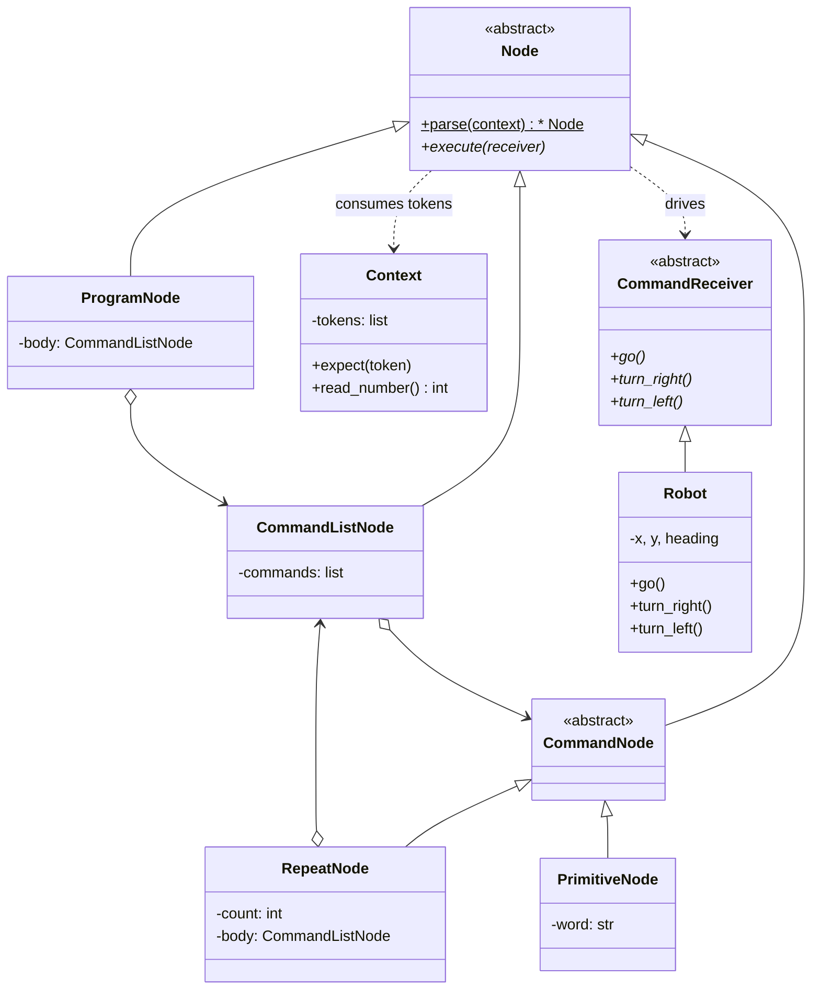

# Interpreter Pattern

> **Category:** Behavioral · **Difficulty:** Intermediate · **Dependencies:** none (Python 3.9+ standard library only)

The **Interpreter** pattern defines a grammar for a small language and represents each grammar rule as a class. Sentences in the language are parsed into a tree of those objects, and *interpreting a sentence means asking the tree to execute itself*. Program-as-data: change the text, change the behaviour — no Python edited anywhere.

This directory is a complete, runnable tutorial built around a mini robot-command language (`program repeat 4 go right end end`). You can read it top-to-bottom in about 20 minutes, run the demo, run the tests, and then do the exercises at the end.

---

## Table of contents

1. [The problem it solves](#1-the-problem-it-solves)
2. [Real-world analogy](#2-real-world-analogy)
3. [Structure](#3-structure)
4. [Code walkthrough](#4-code-walkthrough)
5. [Run the demo](#5-run-the-demo)
6. [Run the tests](#6-run-the-tests)
7. [Real-world use cases](#7-real-world-use-cases)
8. [When to use it (and when not to)](#8-when-to-use-it-and-when-not-to)
9. [Related patterns](#9-related-patterns)
10. [Exercises](#10-exercises)
11. [References](#11-references)

---

## 1. The problem it solves

Suppose users of your robot toy should be able to describe movement sequences. Your first attempt reads tokens and acts on the spot:

```python
def run(text, robot):
    for token in text.split():
        if token == "go":
            robot.go()
        elif token == "right":
            robot.turn_right()
        elif token == "repeat":
            ...  # uh oh. repeat WHAT, HOW far, and what about nesting?
```

This flat loop looks harmless until the language grows even slightly:

1. **No structure.** The moment you add `repeat 4 ... end` — let alone *nested* repeats — a token-by-token loop collapses. You need to know where a block starts and ends, which means you need a *tree*, not a stream.
2. **Grammar lives nowhere.** What is legal? "`repeat` must be followed by a number, then commands, then `end`" is enforced (or not) by scattered `if`s. Malformed input fails halfway through execution, with the robot already half-way across the room.
3. **Every new rule bloats one function.** Add `while`, add procedures, add a new primitive — the same `run()` grows forever, and no part of it can be tested in isolation.

The Interpreter pattern fixes all three by writing the grammar down as BNF and then mapping **one rule to one class**. Each class knows how to parse itself from the token stream and how to execute itself. Structure, validation and behaviour all live exactly where the grammar says they should.

## 2. Real-world analogy

Think of **cooking from a recipe**. A recipe is written in a tiny, rigid language: numbered steps, and composite instructions like *"repeat 3 times: fold, then rest 10 minutes"*. You (the cook) first *read* the recipe into a mental plan — noticing which steps are inside the "repeat" — and then *execute* the plan, driving your hands, whisk and oven. The recipe card doesn't cook, and your hands don't read: parsing and doing are separate, connected by the structured plan in your head.

In this example:

| Analogy | Code |
| --- | --- |
| The recipe card (text) | the program string, e.g. `"program repeat 4 go right end end"` |
| The rules of recipe-writing | the grammar (BNF in [`language/nodes.py`](language/nodes.py)) |
| Your mental plan, step nesting included | the syntax tree of `Node` objects |
| Reading the card into the plan | `parse()` (recursive descent) |
| Actually cooking | `execute(receiver)` walking the tree |
| Your hands / the kitchen | `Robot` (the `CommandReceiver`) |

## 3. Structure

Two packages with a strict one-way dependency, mirroring the layout used across this repository:

```
interpreter/
├── language/             # ABSTRACT side: the language itself
│   ├── context.py        #   Context     — the token stream + cursor
│   ├── errors.py         #   ParseError  — grammar violations
│   ├── nodes.py          #   Node classes — ONE CLASS PER GRAMMAR RULE + parse()
│   └── receiver.py       #   CommandReceiver — what a program may ask for
├── robot/                # CONCRETE side: depends on language/, never vice versa
│   └── robot.py          #   Robot — a grid-walking CommandReceiver
├── main.py               # demo client
└── tests/                # executable specification of the pattern's guarantees
```

The grammar, and the class each rule becomes:

```text
<program>           ::= "program" <command list>            -> ProgramNode
<command list>      ::= <command>* "end"                    -> CommandListNode
<command>           ::= <repeat command> | <primitive command> -> CommandNode
<repeat command>    ::= "repeat" <number> <command list>    -> RepeatNode
<primitive command> ::= "go" | "right" | "left"             -> PrimitiveNode
```



Notice `RepeatNode o--> CommandListNode`: the composition loop in the class diagram mirrors the recursion in the grammar. That is why nested repeats need **zero** extra code.

## 4. Code walkthrough

### Step 1 — the token stream ([language/context.py](language/context.py))

```python
class Context:
    def expect(self, token: str) -> None:      # consume a fixed keyword
        if self.current_token != token:
            raise ParseError(...)
        self.advance()
    def read_number(self) -> int: ...          # consume an integer
```

The GoF **Context**: a cursor over the whitespace-separated tokens, knowing nothing about the grammar. Node classes pull tokens from it and advance the cursor as they parse.

### Step 2 — the abstract Node ([language/nodes.py](language/nodes.py))

```python
class Node(ABC):
    @classmethod
    @abstractmethod
    def parse(cls, context: Context) -> "Node": ...
    @abstractmethod
    def execute(self, receiver: CommandReceiver) -> None: ...
```

Every grammar rule's class can do two things: **build itself** from tokens, and **interpret itself** against a receiver. Together, the `parse` classmethods form a recursive-descent parser; together, the `execute` methods form the evaluator. Same tree, two walks.

### Step 3 — one class per rule ([language/nodes.py](language/nodes.py))

The nonterminal rule `<repeat command> ::= "repeat" <number> <command list>` transcribes almost mechanically:

```python
class RepeatNode(CommandNode):
    @classmethod
    def parse(cls, context: Context) -> "RepeatNode":
        context.expect("repeat")               # "repeat"
        count = context.read_number()          # <number>
        return cls(count, CommandListNode.parse(context))  # <command list>

    def execute(self, receiver: CommandReceiver) -> None:
        for _ in range(self._count):
            self._body.execute(receiver)
```

Read `parse` against the BNF line — it *is* the BNF line. `PrimitiveNode` (a **TerminalExpression**) bottoms out the recursion by performing one concrete action; `CommandNode` (an alternative rule) merely peeks one token to decide which sub-rule applies. Malformed input raises `ParseError` **before anything executes** — the robot never moves on a bad program.

### Step 4 — the receiver interface ([language/receiver.py](language/receiver.py))

```python
class CommandReceiver(ABC):
    @abstractmethod
    def go(self) -> None: ...
    @abstractmethod
    def turn_right(self) -> None: ...
    @abstractmethod
    def turn_left(self) -> None: ...
```

The language package defines *what a program can ask for*, not *who does it*. The same syntax tree can drive a grid robot, a screen turtle, or the test suite's recording double — the evaluator is receiver-agnostic.

### Step 5 — the concrete receiver and the client ([robot/robot.py](robot/robot.py), [main.py](main.py))

```python
tree = parse("program repeat 4 go right end end")   # text -> object tree
robot = Robot()
tree.execute(robot)                                  # tree drives receiver
```

The client's whole job: hand text to `parse()`, hand the resulting tree a receiver. The `Robot` logs every action, so the demo shows the interpreted program leaving a visible trace across the grid.

> 💡 The tree's `repr` (e.g. `[program [[repeat 4 [go, right]]]]`) shows the *structure* the parser recovered from the flat text — printing it is the cheapest possible parser debugger.

## 5. Run the demo

From the **repository root**:

```bash
python -m interpreter.main
```

Expected output:

```text
--- Program 1: walk a square ---
source : program repeat 4 go right end end
parsed : [program [[repeat 4 [go, right]]]]
  go    -> moved north to (0, 1)
  right -> now facing east
  go    -> moved east to (1, 1)
  right -> now facing south
  go    -> moved south to (1, 0)
  right -> now facing west
  go    -> moved west to (0, 0)
  right -> now facing north
final  : position (0, 0), facing north

--- Program 2: nested repeats ---
source : program repeat 2 repeat 2 go end right end end
parsed : [program [[repeat 2 [[repeat 2 [go]], right]]]]
  go    -> moved north to (0, 1)
  go    -> moved north to (0, 2)
  right -> now facing east
  go    -> moved east to (1, 2)
  go    -> moved east to (2, 2)
  right -> now facing south
final  : position (2, 2), facing south
```

Program 1 is the classic: `repeat 4 go right` traces a square and delivers the robot back home, facing north. Program 2 nests a repeat inside a repeat — and the only thing that changed is the *string*.

## 6. Run the tests

```bash
python -m unittest discover -s interpreter -t .
```

The tests in [tests/](tests/) are written as an executable specification — each one states a guarantee the pattern provides (e.g. *"grammar violations fail at parse time, before anything runs"*, *"nested repeats multiply"*). Reading them is a good comprehension check.

## 7. Real-world use cases

You already use this pattern daily, often without noticing:

| Domain | Client asks for… | The interpreted language provides |
| --- | --- | --- |
| **Python itself** | "run this source" | The stdlib `ast` module exposes CPython's syntax tree — one class per grammar rule (`ast.For`, `ast.BinOp`…), exactly this pattern industrial-strength |
| **Regular expressions** | "match this pattern" | `re.compile()` parses a pattern mini-language into an executable matcher object |
| **Databases** | "run this query" | SQL text → parse tree → query plan; every RDBMS front-end is an interpreter |
| **Templating** | "render with this data" | Jinja2/Django templates: `...` parsed into node trees, then rendered |
| **Configuration & rules** | "apply the firing rules" | Alerting/firewall/feature-flag rule expressions (`cpu > 80 and env == "prod"`) |
| **String formatting** | "format this value" | `format()` mini-language (`{:>10.2f}`) — a tiny grammar interpreted by the stdlib |
| **Build & automation** | "make this target" | Makefiles, CI YAML with `when:` expressions — declarative sentences interpreted by an engine |
| **Games & robotics** | "run the player's script" | In-game scripting (turtle graphics, Lua-like DSLs), robot teach pendants — this tutorial's domain |

The common thread: **users express intent as text in a small language**, and the system needs to validate it, hold its structure, and act on it — repeatedly and safely.

## 8. When to use it (and when not to)

**Use it when:**

- Requests arrive as *sentences* — configuration, rules, queries, scripts — rather than as method calls.
- The grammar is **small and stable**. A dozen rules, each a class, stays readable; a hundred does not.
- Non-programmers (or programs) must author behaviour at runtime, and you must validate it before running it.
- You want the structure explicit: one rule ↔ one class makes "where do I add the `while` loop?" a one-word answer.

**Don't use it when:**

- The "language" is really just key-value configuration — `json`, `tomllib` or `configparser` already parse it.
- The grammar is large or evolving fast — hand-rolled node classes become a maintenance treadmill; use a parser generator (ANTLR, Lark, PLY) and keep only the evaluation side.
- In Python specifically, consider the built-in escape hatches first: `ast.literal_eval` for literal data, the `operator` module + a `dict` for tiny expression evaluators, or — *only for fully trusted input* — restricted `eval`. A 10-line dispatch table beats a 5-class grammar when sentences never nest.
- Performance is critical: interpreting a tree of Python objects is the slowest way to run anything. Real systems compile the tree to something faster (bytecode, SQL plans, regex programs) — the pattern still shapes the *front end*.

**Trade-off to be aware of:** the pattern is verbose per rule but transparent per rule. You are trading up-front class-writing for the ability to point at any line of the grammar and the exact class that owns it.

## 9. Related patterns

- **Composite** — the syntax tree *is* a Composite: `RepeatNode` contains a `CommandListNode` which contains commands, and clients treat leaf and branch uniformly through `Node`.
- **Iterator** — see [`../iterator/`](../iterator/); `Context` is a hand-rolled iterator over tokens (compare its `current_token`/`advance` with `has_next`/`next`).
- **Command** — see [`../command/`](../command/); each parsed node resembles a command object, and interpreters often *compile to* Command lists instead of walking the tree each run.
- **Visitor** — when you need many operations over the same tree (execute, pretty-print, optimise), move them out of the node classes into visitors — `ast.NodeVisitor` in the stdlib is exactly that.
- **Factory Method** — see [`../factory_method/`](../factory_method/); `CommandNode.parse` choosing between `RepeatNode` and `PrimitiveNode` is a small factory decision.

## 10. Exercises

Try these to confirm your understanding (the first two should require **no changes** to existing node classes other than the one you touch):

1. **New primitive:** add `back` (move one step backwards without turning) to `<primitive command>`, to `PrimitiveNode._VALID`, and to `CommandReceiver`/`Robot`. Run `program repeat 2 go back end end` — where does the robot end up?
2. **New receiver:** implement an `AsciiCanvas(CommandReceiver)` that draws the robot's path with `*` characters and print it after execution. Note that `language/` needs zero changes.
3. **New nonterminal:** add `<block command> ::= "block" <command list>` that just executes its body once (a no-op grouping). Write the class by transcribing the BNF like `RepeatNode` does, and extend `CommandNode.parse` to dispatch on `"block"`.
4. **Pretty-printer:** add a `to_source()` method to every node that regenerates canonical program text from the tree, and verify `parse(tree.to_source())` produces an equal repr. You have just written the second "walk" from Step 2.

## 11. References

- Gamma, Helm, Johnson, Vlissides — *Design Patterns: Elements of Reusable Object-Oriented Software* (GoF), Interpreter chapter.
- Hiroshi Yuki — *An Introduction to Design Patterns Learned in the Java Language* (this example's mini robot language — `program repeat 4 go right end end` — originates there).
- [Refactoring.Guru — Interpreter is discussed under behavioral patterns](https://refactoring.guru/design-patterns/behavioral-patterns) (the site treats it as a special case of Composite over a grammar).
- [Python `ast` module documentation](https://docs.python.org/3/library/ast.html) — the stdlib's production-grade example of one-class-per-grammar-rule.
