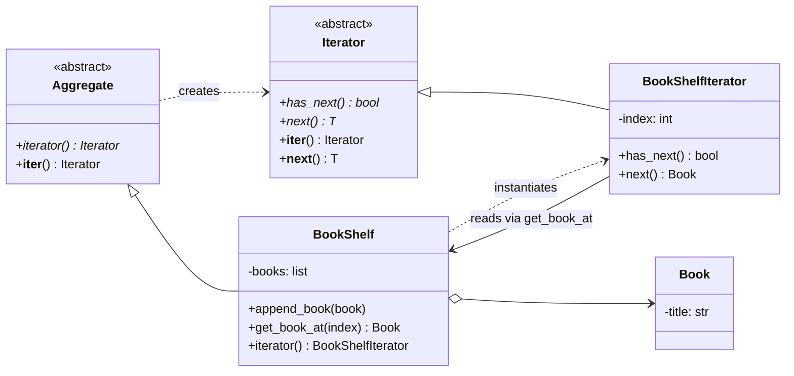

# Iterator Pattern

> **Category:** Behavioral · **Difficulty:** Beginner-friendly · **Dependencies:** none (Python 3.9+ standard library only)

The **Iterator** pattern provides a way to visit the elements of a collection one by one **without exposing how the collection stores them**. The traversal logic moves out of the collection and into a small cursor object — the iterator — so the same collection can support several traversals at once, and clients never touch its internals.

Iterator is special in this repository for one reason: **Python absorbed it into the language.** Every `for` loop you have ever written runs this pattern. This directory first builds the explicit GoF machinery (the classic BookShelf example), then shows precisely how it maps onto `__iter__`/`__next__`, generators, and the `for` statement. You can read it top-to-bottom in about 15 minutes, run the demo, run the tests, and then do the exercises at the end.

---

## Table of contents

1. [The problem it solves](#1-the-problem-it-solves)
2. [Real-world analogy](#2-real-world-analogy)
3. [Structure](#3-structure)
4. [Code walkthrough](#4-code-walkthrough)
5. [Run the demo](#5-run-the-demo)
6. [Run the tests](#6-run-the-tests)
7. [Real-world use cases](#7-real-world-use-cases)
8. [When to use it (and when not to)](#8-when-to-use-it-and-when-not-to)
9. [Related patterns](#9-related-patterns)
10. [Exercises](#10-exercises)
11. [References](#11-references)

---

## 1. The problem it solves

Suppose client code walks a bookshelf by reaching into it:

```python
for i in range(shelf._count):          # client knows the shelf uses an array…
    book = shelf._books[i]             # …and grabs the private storage directly
    print(book.title)
```

This looks harmless, but three problems creep in as the program grows:

1. **The storage format leaks.** Every loop like this hard-codes "books live in an indexable array". Switch the shelf to a linked list, a dict, a database cursor — and every loop in the codebase breaks.
2. **Traversal state has no home.** Where does `i` live if you need to pause a scan, or run two scans over the same shelf simultaneously (say, comparing each book with every other)? Stuffing a "current position" *into the shelf* means one traversal at a time, forever.
3. **Every collection walks differently.** Arrays use indices, linked lists use node hops, trees need a stack. Without a common protocol, client code must know each collection's walking technique — the opposite of reuse.

The Iterator pattern fixes all three with one interface — *"is there a next element?"* / *"give it to me"* — implemented by a small cursor object that the collection hands out on request. Clients depend on the cursor protocol; collections keep their storage private; each cursor carries its own position.

## 2. Real-world analogy

Think of a **bookmark in a library ledger**. The librarian won't hand you the ledger itself (you might smudge it, and someone else may be reading it too). Instead, everyone examining the ledger gets their own bookmark. Your bookmark remembers *your* place; the person next to you has theirs at a different page; neither of you knows or cares whether the ledger is one volume or twelve. When your bookmark reaches the back cover, you're done.

In this example:

| Analogy | Code |
| --- | --- |
| The ledger (contents fixed, internals private) | `BookShelf` (the aggregate) |
| A bookmark, one per reader | `BookShelfIterator` (one cursor per traversal) |
| "Am I at the back cover yet?" | `has_next()` |
| "Read this entry, move the bookmark" | `next()` |
| The librarian issuing bookmarks | `BookShelf.iterator()` (a factory method for cursors) |
| A house rule: every ledger issues bookmarks | `Aggregate` (the abstract interface) |

## 3. Structure

Two packages with a strict one-way dependency, mirroring the layout used across this repository:

```
iterator/
├── framework/                  # ABSTRACT side: knows nothing about books
│   ├── aggregate.py            #   Aggregate — "collections hand out iterators"
│   └── iterator.py             #   Iterator  — has_next/next + Python-protocol bridge
├── bookshelf/                  # CONCRETE side: depends on framework/, never vice versa
│   ├── book.py                 #   Book              — the element (deliberately boring)
│   ├── book_shelf.py           #   BookShelf         — a ConcreteAggregate
│   └── book_shelf_iterator.py  #   BookShelfIterator — a ConcreteIterator (one cursor)
├── main.py                     # demo client: GoF style AND Pythonic style
└── tests/                      # executable specification of the pattern's guarantees
```



The four-corner shape (abstract aggregate/iterator on top, concrete pair below) is the GoF diagram verbatim — and it is deliberately the same shape as [`../factory_method/`](../factory_method/): `iterator()` *is* a factory method whose product is a cursor.

## 4. Code walkthrough

### Step 1 — the abstract Iterator ([framework/iterator.py](framework/iterator.py))

```python
class Iterator(ABC, Generic[T]):
    @abstractmethod
    def has_next(self) -> bool: ...
    @abstractmethod
    def next(self) -> T: ...

    # Bridge to Python's iterator protocol — written once, inherited by all.
    def __iter__(self) -> "Iterator[T]":
        return self
    def __next__(self) -> T:
        if not self.has_next():
            raise StopIteration
        return self.next()
```

The top half is GoF's interface. The bottom half is the tutorial's punchline: GoF's `(has_next, next)` pair and Python's `__next__`-until-`StopIteration` are **the same idea with different spellings** — where GoF asks a question first, Python tries and signals the end with an exception. Four lines of adapter, defined once, make every GoF-style iterator a native Python iterator.

### Step 2 — the abstract Aggregate ([framework/aggregate.py](framework/aggregate.py))

```python
class Aggregate(ABC, Generic[T]):
    @abstractmethod
    def iterator(self) -> Iterator[T]: ...

    def __iter__(self) -> Iterator[T]:
        return self.iterator()          # for-loops get the same cursor
```

One promise: *"ask me for an iterator and you can visit my elements"* — nothing about storage. `__iter__` just delegates, so `for book in shelf:` and `shelf.iterator()` hand out identical cursors.

### Step 3 — the concrete pair ([bookshelf/book_shelf.py](bookshelf/book_shelf.py), [bookshelf/book_shelf_iterator.py](bookshelf/book_shelf_iterator.py))

```python
class BookShelfIterator(Iterator[Book]):
    def __init__(self, book_shelf: BookShelf) -> None:
        self._book_shelf = book_shelf
        self._index = 0                       # THE cursor state lives here

    def has_next(self) -> bool:
        return self._index < len(self._book_shelf)

    def next(self) -> Book:
        book = self._book_shelf.get_book_at(self._index)
        self._index += 1
        return book
```

Everything the pattern promises hangs on one design decision visible here: **the position (`_index`) lives in the iterator, not in the shelf.** That is why `shelf.iterator()` can be called twice and produce two independent cursors, and why the shelf itself is never "consumed" by iteration.

### Step 4 — the client ([main.py](main.py))

```python
iterator = shelf.iterator()           # GoF dialect
while iterator.has_next():
    print(iterator.next().title)

for book in shelf:                    # Python dialect — same cursor underneath
    print(book.title)
```

Same shelf, same iterator class, two dialects. The `for` statement is doing exactly what the `while` loop spells out: call `__iter__`, call `__next__` repeatedly, stop on `StopIteration`.

> 💡 **The fully Pythonic endgame:** in production Python you would write `BookShelf.__iter__` as a generator — `yield from self._books` — and delete `BookShelfIterator` entirely. A generator function *is* an iterator factory: each call creates an independent cursor whose "position" is the paused stack frame. The pattern doesn't disappear; the language writes the cursor class for you.

## 5. Run the demo

From the **repository root**:

```bash
python -m iterator.main
```

Expected output:

```text
--- GoF style: explicit iterator object ---
Around the World in 80 Days
Bible
Cinderella
Daddy-Long-Legs

--- Pythonic style: the same iterator drives a for loop ---
Around the World in 80 Days
Bible
Cinderella
Daddy-Long-Legs

--- Pythonic style: comprehensions, len-free and index-free ---
Shelf holds 4 books with initials ['A', 'B', 'C', 'D']
```

Both traversals print identical lists — because they *are* identical machinery. The comprehension at the end shows what the client never needed: an index variable or knowledge of the shelf's storage.

## 6. Run the tests

```bash
python -m unittest discover -s iterator -t .
```

The tests in [tests/](tests/) are written as an executable specification — each one states a guarantee the pattern provides (e.g. *"multiple iterators are independent cursors"*, *"the GoF iterator is also a Python iterator"*). Reading them is a good comprehension check.

## 7. Real-world use cases

You already use this pattern constantly — in Python, quite literally in every loop:

| Domain | Client asks for… | The iterator provides |
| --- | --- | --- |
| **The `for` statement** | "each element" | `iter(x)` → repeated `next()` → `StopIteration`; the pattern compiled into the language |
| **Files** | "each line" | File objects are their own iterators — lines stream lazily, the file's buffering stays hidden |
| **Databases** | "each result row" | `sqlite3` cursors and ORM query sets iterate rows without loading the whole result set |
| **itertools** | "each combination / chunk / window" | `itertools.chain`, `islice`, `product`… — an entire stdlib module of composable iterators |
| **Filesystems** | "each entry" | `os.scandir()` / `pathlib.Path.iterdir()` yield entries one syscall batch at a time |
| **Dictionaries & views** | "each key / item" | `dict.items()` returns a view whose iterator walks the hash table you never see |
| **Generators** | "a custom sequence, lazily" | `yield` turns a function into an iterator factory — infinite sequences included |
| **Web pagination / APIs** | "each result across pages" | Client-library "paginators" (e.g. cloud SDKs) hide page-fetching behind a plain iterator |

The common thread: the client wants **"each element, in order"** and does not want to care about storage layout, buffering, laziness, or where the cursor state lives.

## 8. When to use it (and when not to)

**Use it when:**

- You are designing a **collection or stream** others will consume: expose iteration, hide storage.
- Multiple simultaneous, independent traversals over the same data must be possible.
- Elements arrive **lazily** or are expensive/infinite — an iterator can produce them on demand where a list cannot.
- You want one traversal protocol across wildly different structures (list, tree, file, network page).

**Don't use it when:**

- You genuinely need random access, slicing, or `len()`-style queries — that's a *sequence* contract, not an iterator contract; expose `__getitem__` instead.
- The collection is a plain internal `list` used in one place — just loop over it; wrapping it in cursor classes is ceremony.
- **In Python, never build the GoF classes by hand for ordinary cases.** The language gives you three escalating tools: (1) delegate — `def __iter__(self): return iter(self._books)`; (2) a generator method — `yield` each element, custom order and filtering included; (3) a full iterator class only when the cursor needs extra API (peeking, checkpointing, bidirectional movement). This tutorial builds level 3 explicitly *so you can see what levels 1–2 generate for you*.

**Trade-offs to be aware of:** iterators are single-direction and single-use (a fresh traversal needs a fresh iterator — the tests pin this), and mutating a collection mid-iteration is undefined or an error in most implementations (Python dicts raise `RuntimeError`). For small fixed data, materialising a `list(...)` is often simpler than clever laziness.

## 9. Related patterns

- **Factory Method** — see [`../factory_method/`](../factory_method/); `Aggregate.iterator()` is a factory method whose product is a cursor. The two class diagrams are the same shape.
- **Interpreter** — see [`../interpreter/`](../interpreter/); its `Context` is a hand-rolled iterator over tokens (`current_token`/`advance` ≈ `has_next`/`next`).
- **Command** — see [`../command/`](../command/); command histories are replayed by iterating over stored commands.
- **Composite** — iterators are the standard way to walk a Composite tree without exposing its node structure (Python's `os.walk` is the famous flat-iterator-over-a-tree).
- **Memento** — an iterator's position is a tiny memento: some designs let you capture and restore it to resume a traversal.

## 10. Exercises

Try these to confirm your understanding (the first two should require **no changes** to `framework/` — if you find yourself editing it, revisit section 3):

1. **New traversal order:** add a `ReverseBookShelfIterator` and a `reverse_iterator()` method on `BookShelf`. The `for` loop `for b in shelf` must keep working unchanged.
2. **A different aggregate:** implement `BookBag(Aggregate[Book])` that stores books in a `dict` keyed by title but iterates them in *alphabetical* order. Clients written against `Aggregate` must not notice the storage change.
3. **Generator refactor:** replace `BookShelf.iterator()`'s hand-written cursor with a generator method and make the whole test suite pass with at most one test modified. Which test was it, and what does that tell you about generators?
4. **Break it on purpose:** append a book to the shelf *while* a `for` loop over it is running. Explain the behaviour you observe by pointing at `BookShelfIterator.has_next()` — then compare with what a Python `dict` does in the same situation.

## 11. References

- Gamma, Helm, Johnson, Vlissides — *Design Patterns: Elements of Reusable Object-Oriented Software* (GoF), Iterator chapter.
- Hiroshi Yuki — *An Introduction to Design Patterns Learned in the Java Language* (this example's Book/BookShelf scenario originates there — it is the book's opening chapter).
- [Refactoring.Guru — Iterator](https://refactoring.guru/design-patterns/iterator)
- [Python docs — Iterator Types](https://docs.python.org/3/library/stdtypes.html#iterator-types) and the [`itertools` module](https://docs.python.org/3/library/itertools.html)
