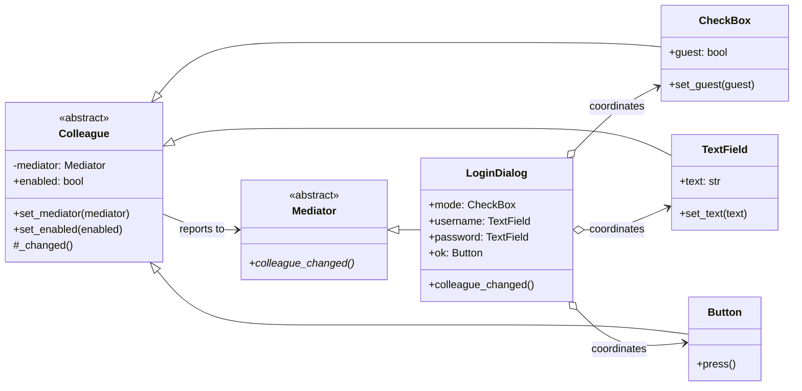

# Mediator Pattern

> **Category:** Behavioral · **Difficulty:** Intermediate · **Dependencies:** none (Python 3.9+ standard library only)

The **Mediator** pattern takes a group of objects that would otherwise talk to each other directly and reroutes all of their communication through a single coordinator. Each object (a *colleague*) reports its own changes to the mediator; the mediator alone decides how everyone else must react. Many-to-many chatter becomes a star: *n* relationships instead of *n × (n − 1)*.

This directory is a complete, runnable tutorial built around the classic example from Hiroshi Yuki's book: a login dialog whose widgets enable and disable each other — except that here, no widget ever touches another widget. You can read it top-to-bottom in about 15 minutes, run the demo, run the tests, and then do the exercises at the end.

---

## Table of contents

1. [The problem it solves](#1-the-problem-it-solves)
2. [Real-world analogy](#2-real-world-analogy)
3. [Structure](#3-structure)
4. [Code walkthrough](#4-code-walkthrough)
5. [Run the demo](#5-run-the-demo)
6. [Run the tests](#6-run-the-tests)
7. [Real-world use cases](#7-real-world-use-cases)
8. [When to use it (and when not to)](#8-when-to-use-it-and-when-not-to)
9. [Related patterns](#9-related-patterns)
10. [Exercises](#10-exercises)
11. [References](#11-references)

---

## 1. The problem it solves

Consider a login form: a Guest/Member checkbox, username and password fields, an OK button. The rules: guests skip credentials; the password field unlocks only once a username exists; OK unlocks only when both are filled. The naive implementation puts each rule wherever the triggering event lands:

```python
class UsernameField(TextField):
    def on_text_changed(self) -> None:
        # this widget now hard-codes knowledge of TWO other widgets
        if self.text:
            self.dialog.password.set_enabled(True)
            if self.dialog.password.text:
                self.dialog.ok.set_enabled(True)
        else:
            self.dialog.password.set_enabled(False)
            self.dialog.ok.set_enabled(False)
```

Three problems creep in as the dialog grows:

1. **Mesh coupling.** Every widget ends up referencing several others. With 5 widgets that is up to 20 directed relationships; adding a sixth widget means auditing all of them. Nothing here is reusable — `UsernameField` is welded to *this* dialog.
2. **Scattered, duplicated rules.** The "OK needs both fields" rule appears in the username handler, the password handler *and* the checkbox handler — three copies that will eventually diverge.
3. **Event-ordering bugs.** Each handler patches only the consequences *it* knows about. Clear the username after everything was enabled, and unless that handler also remembers to re-lock OK, the dialog ends up in an inconsistent state.

The Mediator pattern fixes all three by making widgets dumb ("something about me changed") and concentrating every rule in one method — `LoginDialog.colleague_changed()` — that re-derives the whole dialog state from current facts.

## 2. Real-world analogy

Think of an **airport control tower**. Planes never negotiate runway access with each other — pilot-to-pilot coordination among dozens of aircraft would be a mesh of misunderstandings. Instead, every pilot talks only to the tower ("I'm ready to land"), and the tower, which sees the whole field, tells each plane what to do. Add a new plane to the sky and nothing changes for the other pilots.

In this example:

| Analogy | Code |
| --- | --- |
| The control tower | `LoginDialog` (concrete Mediator) |
| A pilot radioing "position changed" | `Colleague._changed()` → `colleague_changed()` |
| Tower instruction "hold" / "cleared" | `mediator → widget.set_enabled(...)` |
| A plane (knows the tower, not other planes) | `CheckBox`, `TextField`, `Button` |
| Aviation radio protocol | abstract `Mediator` / `Colleague` classes |

## 3. Structure

Two packages with a strict one-way dependency — the abstract roles know nothing about login forms:

```
mediator/
├── framework/            # ABSTRACT side: knows nothing about dialogs
│   ├── mediator.py       #   Mediator  — receives colleague_changed()
│   └── colleague.py      #   Colleague — knows ONLY its mediator
├── logindialog/          # CONCRETE side: depends on framework/, never vice versa
│   ├── widgets.py        #   CheckBox / TextField / Button — ConcreteColleagues
│   └── login_dialog.py   #   LoginDialog — ConcreteMediator, owns ALL the rules
├── main.py               # demo client (a scripted user session)
└── tests/                # executable specification of the pattern's guarantees
```



Note the arrows: colleagues point **only** at the abstract `Mediator`. All concrete cross-widget knowledge lives in `LoginDialog` — remove it and the widgets are still valid, reusable classes.

## 4. Code walkthrough

### Step 1 — the abstract Mediator ([framework/mediator.py](framework/mediator.py))

```python
class Mediator(ABC):
    @abstractmethod
    def colleague_changed(self) -> None: ...
```

One method, no payload. A colleague says *"something about me changed"* — never what should happen next. Deciding consequences is exclusively the mediator's job.

### Step 2 — the abstract Colleague ([framework/colleague.py](framework/colleague.py))

```python
class Colleague(ABC):
    def _changed(self) -> None:
        if self._mediator is not None:
            self._mediator.colleague_changed()
```

The base class stores exactly one cross-object reference (`self._mediator`) and provides `_changed()`, the single upward channel. It also owns the `enabled` flag with `set_enabled()` — the downward channel the mediator uses.

### Step 3 — the concrete widgets ([logindialog/widgets.py](logindialog/widgets.py))

```python
class TextField(Colleague):
    def set_text(self, text: str) -> None:
        if not self.enabled:
            print(f"[{self.name}] input ignored (field is disabled)")
            return
        if text != self._text:
            self._text = text
            print(f"[{self.name}] text -> {text!r}")
            self._changed()          # report upward — that's ALL
```

Each widget manages its own state and calls `_changed()`. Search the file for `username` or `OK` — those words don't appear. A `TextField` has no idea what dialog it lives in.

### Step 4 — the concrete Mediator ([logindialog/login_dialog.py](logindialog/login_dialog.py))

```python
def colleague_changed(self) -> None:
    if self.mode.guest:
        self.username.set_enabled(False)
        self.password.set_enabled(False)
        self.ok.set_enabled(True)
    else:
        self.username.set_enabled(True)
        has_username = bool(self.username.text)
        has_password = bool(self.password.text)
        self.password.set_enabled(has_username)
        self.ok.set_enabled(has_username and has_password)
    self.cancel.set_enabled(True)
```

Every rule of the form, in one readable method. Crucially, it **re-derives the whole state from current facts** on every call rather than patching per-event consequences — which is why clearing the username correctly re-locks the password and OK without any special case.

> 💡 `set_enabled` only prints (and matters) when the value actually flips, so re-deriving everything each time is cheap *and* idempotent — a common trick in real GUI code too.

### Step 5 — the client ([main.py](main.py))

```python
dialog = LoginDialog()
dialog.mode.set_guest(False)
dialog.username.set_text("alice")
```

The client plays the user: it pokes individual widgets and never coordinates anything itself. Every `enabled/disabled` line in the output below was decided by the mediator.

## 5. Run the demo

From the **repository root**:

```bash
python -m mediator.main
```

Expected output:

```text
== Opening the login dialog (guest mode by default) ==
[username] disabled
[password] disabled

== A guest tries to type a username ==
[username] input ignored (field is disabled)

== Switching to Member login ==
[mode] Member login selected
[username] enabled
[OK] disabled

== Typing the username ==
[username] text -> 'alice'
[password] enabled

== Typing the password ==
[password] text -> 'correct horse battery staple'
[OK] enabled

== Pressing OK ==
[OK] pressed!

== Switching back to Guest login ==
[mode] Guest login selected
[username] disabled
[password] disabled
[password] input ignored (field is disabled)
```

## 6. Run the tests

```bash
python -m unittest discover -s mediator -t .
```

The tests in [tests/](tests/) are written as an executable specification — each one states a guarantee the pattern provides (e.g. *"widgets hold no references to other widgets"*, *"any change re-derives the whole dialog state"*). Reading them is a good comprehension check.

## 7. Real-world use cases

You already use this pattern daily, often without noticing:

| Domain | Colleagues chat about… | What the mediator centralises |
| --- | --- | --- |
| **GUI dialogs** | field validity, button states | The form/dialog controller — exactly this example (Qt's dialogs, `wxPython` validators) |
| **Air traffic control** | runway and airspace slots | The tower assigns clearances; planes never negotiate peer-to-peer |
| **Chat rooms / Slack channels** | messages between users | The room/server routes and fans out; users hold no peer connections (the canonical GoF `ChatRoom`) |
| **MVC / MVVM** | model changes vs. view updates | The Controller / ViewModel mediates so views and models stay mutually ignorant |
| **Message brokers** | events between services | RabbitMQ / Kafka topics decouple producers from consumers (Mediator at architecture scale) |
| **Game engines** | collisions, scoring, spawning | A match/scene manager coordinates entities that never reference each other |
| **CQRS command buses** | "handle this command" | A dispatcher maps commands to handlers so callers don't know handlers exist |
| **asyncio event loop** | ready sockets, timers, tasks | The loop mediates between awaiting coroutines — none of them knows about the others |

The common thread: many parts must stay **mutually consistent**, and you want the consistency rules in **one inspectable place**.

## 8. When to use it (and when not to)

**Use it when:**

- A set of objects communicates in complex but well-defined ways, and the tangle of references makes them hard to reuse or test individually.
- You keep finding the same business rule duplicated across several event handlers.
- You want to change interaction rules (or add a participant) without touching the participants themselves.
- Behaviour distributed among several classes should be customisable *as a unit* — swap the mediator, keep the colleagues.

**Don't use it when:**

- Only two objects interact, or the interplay is trivial. A mediator for a label and a button is ceremony without benefit.
- In Python specifically, lighter tools often suffice: a plain **coordinating function** that reads widget state and sets flags, or an **event/signal system** (`blinker`, Django signals — that's Observer territory) when reactions are independent rather than mutually constraining. Reach for a mediator when reactions must be *derived together* from shared facts, as in this dialog.

**Trade-off to be aware of:** the mediator concentrates complexity instead of removing it. A god-object mediator that knows too much is the pattern's classic failure mode — keep `colleague_changed()` a pure derivation of state, and split mediators per dialog/screen rather than building one to rule them all.

## 9. Related patterns

- **Observer** — the pattern's usual transport: colleagues could notify the mediator via subscriptions instead of a direct call. Compare the star-with-a-brain here against the broadcast-without-an-opinion in [`../observer/`](../observer/).
- **Facade** — also fronts a subsystem, but communication is one-way (client → facade). A mediator's colleagues talk *back* to it; the protocol is cooperative, not just simplifying.
- **State** — a mediator with modes (our guest/member flag) can grow if-chains; promoting each mode to a State object keeps it clean. See [`../state/`](../state/).
- **Factory Method** — mediators often construct their colleagues, as `LoginDialog.__init__` does; a creation-heavy mediator can delegate that to factories. See [`../factory_method/`](../factory_method/).

## 10. Exercises

Try these to confirm your understanding (each should require **no changes** to `framework/` — if you find yourself editing it, revisit section 3):

1. **New widget:** add a "Remember me" `CheckBox` that is only enabled in member mode. Which files change? (Answer: `login_dialog.py` and `main.py` — not `widgets.py`.)
2. **New rule:** require passwords of at least 8 characters before OK unlocks. Confirm the rule lands in exactly one line of one method.
3. **Second mediator:** build a `SignupDialog` reusing the *same* widget classes with different rules (e.g. two password fields that must match). This is the reusability payoff — measure how much code you did *not* write.
4. **Break it on purpose:** make `TextField.set_text` call `self._mediator.colleague_changed()` twice. Why is the output unchanged? What property of `colleague_changed()` makes double notification harmless — and why is that property worth preserving?

## 11. References

- Gamma, Helm, Johnson, Vlissides — *Design Patterns: Elements of Reusable Object-Oriented Software* (GoF), Mediator chapter.
- Hiroshi Yuki — *An Introduction to Design Patterns Learned in the Java Language* (this example's login-dialog scenario originates there).
- [Refactoring.Guru — Mediator](https://refactoring.guru/design-patterns/mediator)
- [Python `abc` module documentation](https://docs.python.org/3/library/abc.html)
