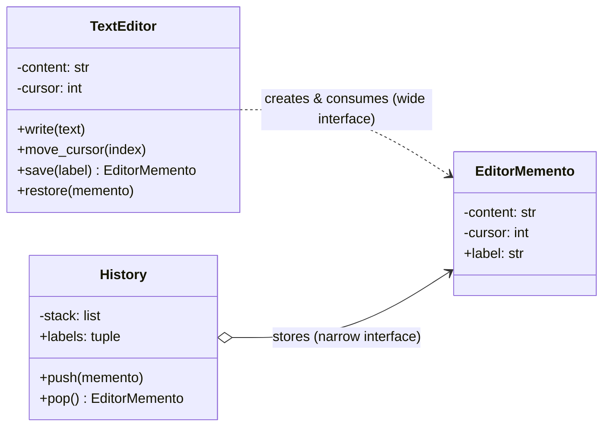

# Memento Pattern

> **Category:** Behavioral · **Difficulty:** Intermediate · **Dependencies:** none (Python 3.9+ standard library only)

The **Memento** pattern lets you capture an object's internal state in a snapshot and restore it later — *without* exposing that state to anyone else. The object being saved (the *Originator*) produces an opaque token (the *Memento*); some other object (the *Caretaker*) stores the tokens and hands them back on demand, never looking inside. The result is undo/rollback that doesn't punch holes in encapsulation.

This directory is a complete, runnable tutorial built around a tiny text editor with an undo history. You can read it top-to-bottom in about 15 minutes, run the demo, run the tests, and then do the exercises at the end.

---

## Table of contents

1. [The problem it solves](#1-the-problem-it-solves)
2. [Real-world analogy](#2-real-world-analogy)
3. [Structure](#3-structure)
4. [Code walkthrough](#4-code-walkthrough)
5. [Run the demo](#5-run-the-demo)
6. [Run the tests](#6-run-the-tests)
7. [Real-world use cases](#7-real-world-use-cases)
8. [When to use it (and when not to)](#8-when-to-use-it-and-when-not-to)
9. [Related patterns](#9-related-patterns)
10. [Exercises](#10-exercises)
11. [References](#11-references)

---

## 1. The problem it solves

You are adding undo to a text editor. The obvious approach: before each risky operation, copy whatever fields matter into a dict and stash it somewhere.

```python
# somewhere far away from the editor class...
snapshot = {"content": editor.content, "cursor": editor.cursor}
undo_stack.append(snapshot)
...
editor.content = snapshot["content"]     # and now we need SETTERS, too
editor.cursor = snapshot["cursor"]
```

Three problems creep in as the program grows:

1. **Encapsulation is gone.** To snapshot from outside, every relevant field needs a public getter — and to restore, a public *setter*. The editor's internals are now API, and any code anywhere can put the editor into a half-restored, inconsistent state.
2. **Outsiders own the state list.** The undo code must know *which* fields constitute "the state". Add a `selection` field to the editor and every snapshot site silently starts saving incomplete state. The compiler won't tell you; your users will.
3. **Snapshots are readable and forgeable.** Anything holding the dict can inspect it, log it, or edit it before "restoring". Your history is only as trustworthy as every line of code that ever touches it.

The Memento pattern fixes all three by making snapshots the originator's private business: `editor.save()` returns an **opaque** object only `editor.restore()` can meaningfully use, and the caretaker just moves those objects around.

## 2. Real-world analogy

Think of a **safe-deposit box** at a bank. You (the originator) put your valuables in the box and lock it with your key. The bank (the caretaker) stores the box, tracks which box is whose and hands it back when asked — but the bank cannot open it and has no idea what's inside. The bank's records show only the box number (the narrow interface); the contents are readable only by the key holder (the wide interface).

In this example:

| Analogy | Code |
| --- | --- |
| Your valuables | the editor's state (`_content`, `_cursor`) |
| The locked box | `EditorMemento` |
| The box number on the bank's ledger | `EditorMemento.label` (narrow interface) |
| Your key that opens the box | `TextEditor.restore()` reading `_content`/`_cursor` (wide interface) |
| The bank vault and its ledger | `History` (caretaker) |

## 3. Structure

Two packages that share a memento type but read different amounts of it:

```
memento/
├── editor/            # ORIGINATOR side: the only code allowed inside a snapshot
│   ├── memento.py     #   EditorMemento — opaque snapshot (narrow: label only)
│   └── text_editor.py #   TextEditor   — owns state; save() / restore()
├── history/           # CARETAKER side: stores snapshots, never opens them
│   └── history.py     #   History — LIFO undo stack, uses only .label
├── main.py            # demo client (write → save → edit → undo → undo)
└── tests/             # executable specification of the pattern's guarantees
```



The key is the difference between the two arrows into `EditorMemento`: the originator reads everything; the caretaker reads only `label`. `history/` never imports `TextEditor` at all.

## 4. Code walkthrough

### Step 1 — the opaque Memento ([editor/memento.py](editor/memento.py))

```python
class EditorMemento:
    __slots__ = ("_content", "_cursor", "_label")

    @property
    def label(self) -> str: ...          # the ENTIRE public surface

    def __repr__(self) -> str:
        return f"<EditorMemento {self._label!r}>"   # no state leaked
```

GoF calls for a **narrow interface** (what caretakers see: `label`) and a **wide interface** (what the originator sees: `_content`, `_cursor`). Java enforces the split with package-private access; **Python cannot enforce it**, so this class approximates it: underscore names signal "hands off", there are no public accessors for the state, `repr()` shows only the label, and `__slots__` stops anyone from bolting extra attributes onto a snapshot. Encapsulation by convention, hardened where the stdlib allows.

### Step 2 — the Originator ([editor/text_editor.py](editor/text_editor.py))

```python
def save(self, label: str) -> EditorMemento:
    return EditorMemento(self._content, self._cursor, label)

def restore(self, memento: EditorMemento) -> None:
    self._content = memento._content    # wide interface: originator only
    self._cursor = memento._cursor
```

Only the editor knows which fields constitute "the state", so only it builds and consumes snapshots. Grow the editor with a `selection` field tomorrow: you extend these two methods and *every caretaker keeps working unchanged*, because no caretaker ever knew what was inside.

> 💡 `restore()` touching `memento._content` looks like a privacy violation — it is the *sanctioned* one. The wide interface is exactly this: originator-and-memento acting as one unit. Keep that access confined to this file.

### Step 3 — the Caretaker ([history/history.py](history/history.py))

```python
class History:
    def push(self, memento: EditorMemento) -> None:
        self._stack.append(memento)

    def pop(self) -> EditorMemento:
        if not self._stack:
            raise IndexError("nothing to undo")
        return self._stack.pop()
```

The caretaker decides *when* to keep snapshots and *which one* comes back (LIFO here), and owns history policy like "nothing to undo". What it never does is look inside — the only memento member it touches is `label`, for display.

### Step 4 — the client ([main.py](main.py))

```python
history.push(editor.save("draft 1"))   # snapshot before risky edits
...
editor.restore(history.pop())          # caretaker supplies, originator consumes
```

Undo is one line: fetch the latest token from the caretaker, hand it to the originator. Neither the client nor the history ever reads editor state.

## 5. Run the demo

From the **repository root**:

```bash
python -m memento.main
```

Expected output (the `|` marks the cursor position — note it is restored, too):

```text
== Writing the first draft ==
  editor: "Hello|" (cursor at 5)
  saved snapshot 'draft 1'

== Writing more, then saving again ==
  editor: "Hello, world|" (cursor at 12)
  saved snapshot 'draft 2'

== An edit in the middle (cursor moves, too) ==
  editor: "Hello there|, world" (cursor at 11)

== Undo (history: ('draft 1', 'draft 2')) ==
  editor: "Hello, world|" (cursor at 12)

== Undo again (history: ('draft 1',)) ==
  editor: "Hello|" (cursor at 5)

History is now empty: 0 snapshots left.
```

## 6. Run the tests

```bash
python -m unittest discover -s memento -t .
```

The tests in [tests/](tests/) are written as an executable specification — each one states a guarantee the pattern provides (e.g. *"a memento exposes only a narrow interface"*, *"editing after save does not change the snapshot"*). Reading them is a good comprehension check.

## 7. Real-world use cases

You already use this pattern daily, often without noticing:

| Domain | Snapshot of… | What the pattern provides |
| --- | --- | --- |
| **Text editors / IDEs** | document + cursor + selection | The undo stack — this example, at production scale |
| **Databases** | rows touched by a transaction | Rollback: `BEGIN` takes the memento, `ROLLBACK` restores it |
| **Games** | player, inventory, world seed | Save slots and checkpoint/retry (Hiroshi Yuki's gamer example) |
| **Version control** | the working tree | `git stash` — an opaque token you can `pop` later without knowing its format |
| **GUI frameworks** | widget/document state | `QUndoStack` in Qt; NSUndoManager on macOS |
| **Virtual machines / containers** | full machine state | VM snapshots: restore to before the risky upgrade |
| **Python object serialization** | an object's `__dict__` | `pickle`/`copyreg` use `__getstate__`/`__setstate__` — originator-defined snapshots, verbatim |
| **Web form wizards** | half-completed multi-step input | "Resume where you left off" tokens stored server-side |

The common thread: someone needs to **return to an earlier state**, and the object's internals must not become public API to make that possible.

## 8. When to use it (and when not to)

**Use it when:**

- You need undo, rollback, or checkpoint/retry over an object with non-trivial internal state.
- Snapshots must not turn the object's fields into public API (no getter/setter explosion).
- The state's composition may evolve — the originator can extend `save`/`restore` without breaking any caretaker.
- You want history *policy* (depth limits, redo, persistence) decoupled from the object itself.

**Don't use it when:**

- The state is one primitive value — keep a list of old values and move on.
- State is huge and snapshots are frequent: full copies get expensive. Consider incremental diffs, copy-on-write structures, or the Command pattern's *inverse operations* (`unexecute`) instead.
- In Python specifically, `copy.deepcopy(obj)` or `pickle.dumps(obj)` can serve as a poor man's memento with zero classes — fine for internal tools. You lose the narrow interface (a deep copy exposes everything) and pay for copying *all* state, but for small objects the trade is often worth it. Reach for the explicit pattern when opacity and a curated state subset matter.

**Trade-off to be aware of:** mementos hide their cost. A caretaker happily hoards thousands of snapshots it cannot inspect, so memory policy (cap the stack, drop old entries) must be an explicit caretaker responsibility.

## 9. Related patterns

- **Command** — the classic pairing: each command stores a memento taken *before* execution, making commands undoable without inverse logic.
- **State** — represents an object's *mode* as an object; Memento represents a *moment* of its data. The two answer different questions ("how do I behave?" vs. "what did I contain?"). See [`../state/`](../state/).
- **Iterator** — GoF notes a memento can capture an iteration's progress so the caller can resume it later.
- **Factory Method** — `save()` is, in miniature, a creation method the originator controls, like the factories in [`../factory_method/`](../factory_method/): outsiders never call the product's constructor directly.

## 10. Exercises

Try these to confirm your understanding (each should require **no changes** to `editor/` for 1–2 — if you find yourself editing it, re-read section 4, step 3):

1. **Redo:** extend `History` with a redo stack: `pop()` for undo pushes the memento onto a redo list; a new `redo()` hands it back. Which class needed changing — and which, tellingly, did not?
2. **Bounded history:** make `History` keep at most N snapshots, discarding the oldest. Confirm no editor code changes.
3. **Grow the state:** add a `selection: tuple[int, int]` field to `TextEditor`, and extend `save`/`restore` to include it. Run the tests: which ones still pass untouched, and why is that the pattern's whole point?
4. **Break it on purpose:** write a caretaker that "restores" by doing `editor._content = memento._content` itself, then add a field as in exercise 3. Watch it silently restore half the state — the bug the pattern exists to prevent.

## 11. References

- Gamma, Helm, Johnson, Vlissides — *Design Patterns: Elements of Reusable Object-Oriented Software* (GoF), Memento chapter (source of the narrow/wide interface terminology).
- Hiroshi Yuki — *An Introduction to Design Patterns Learned in the Java Language* (its Memento chapter saves a game character's money and fruit — same shape as our editor).
- [Refactoring.Guru — Memento](https://refactoring.guru/design-patterns/memento)
- [Python data model — `__slots__`](https://docs.python.org/3/reference/datamodel.html#slots) and [`pickle` — `__getstate__`/`__setstate__`](https://docs.python.org/3/library/pickle.html#pickle-state)
