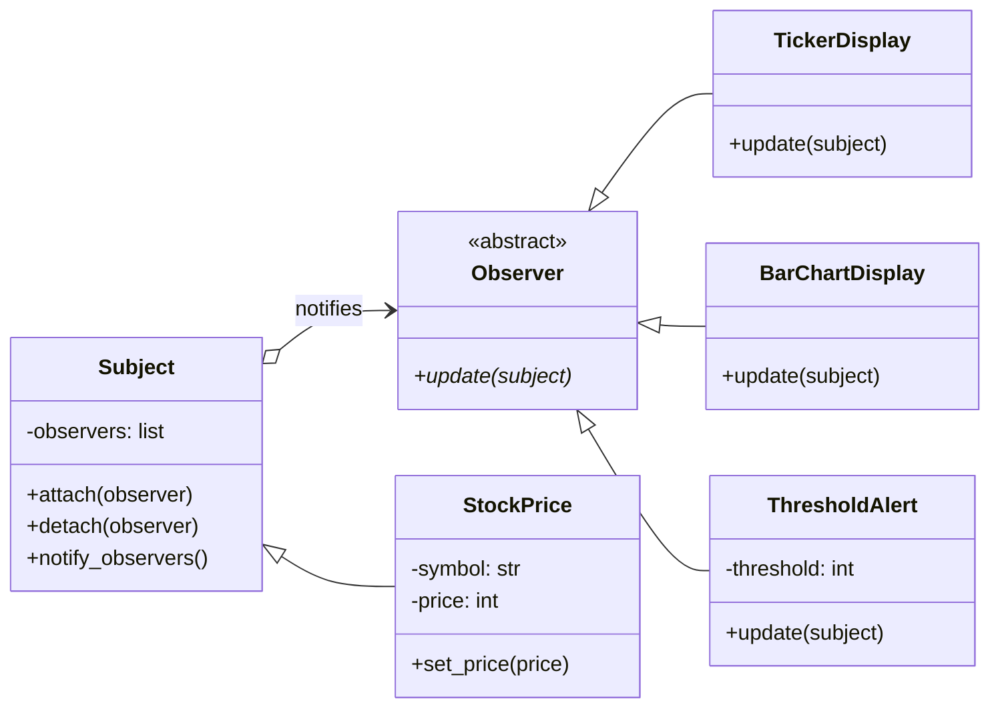

# Observer Pattern

> **Category:** Behavioral · **Difficulty:** Beginner-friendly · **Dependencies:** none (Python 3.9+ standard library only)

The **Observer** pattern defines a one-to-many dependency between objects: when one object (the *Subject*) changes state, all of its registered dependents (the *Observers*) are notified automatically. The subject never knows *who* is listening or *what* they do with the news — subscribers come and go at runtime.

This directory is a complete, runnable tutorial built around a stock-price feed with three kinds of subscribers: a digit ticker, a bar-chart display, and a one-shot alert that unsubscribes itself. The price sequence is scripted, so every run produces identical output. You can read it top-to-bottom in about 15 minutes, run the demo, run the tests, and then do the exercises at the end.

---

## Table of contents

1. [The problem it solves](#1-the-problem-it-solves)
2. [Real-world analogy](#2-real-world-analogy)
3. [Structure](#3-structure)
4. [Code walkthrough](#4-code-walkthrough)
5. [Run the demo](#5-run-the-demo)
6. [Run the tests](#6-run-the-tests)
7. [Real-world use cases](#7-real-world-use-cases)
8. [When to use it (and when not to)](#8-when-to-use-it-and-when-not-to)
9. [Related patterns](#9-related-patterns)
10. [Exercises](#10-exercises)
11. [References](#11-references)

---

## 1. The problem it solves

Suppose a price feed must update a ticker display, redraw a chart, and maybe fire an alert. The naive version calls everyone by name:

```python
class StockPrice:
    def set_price(self, price: int) -> None:
        self._price = price
        self.ticker.show(price)                  # hard-wired dependent #1
        self.chart.redraw(price)                 # hard-wired dependent #2
        if price >= 110:
            self.alert.fire(price)               # and its business rule, too
```

Three problems creep in as the program grows:

1. **The subject knows everybody.** The feed — a piece of domain data — imports and calls UI classes. Want a logger, too? Edit `StockPrice`. Want to reuse the feed in a headless service? You can't; it drags the whole UI with it.
2. **The audience is frozen at compile time.** There is no way to add or remove a dependent while running — yet real subscribers are dynamic: windows close, alerts fire once, dashboards open mid-session.
3. **Foreign logic accumulates in the subject.** The alert's threshold rule has already leaked into `set_price`. Every new reaction adds its `if` to the pile, and the feed slowly becomes the application.

The Observer pattern fixes all three with one inversion: the subject keeps an anonymous list of subscribers behind a tiny interface and simply announces *"I changed"*. Who reacts, how, and for how long becomes the subscribers' business.

## 2. Real-world analogy

Think of a **magazine subscription**. The publisher prints an issue and mails it to whoever is on the subscriber list — it neither knows nor cares whether you read it, clip it, or bin it. You subscribe and unsubscribe whenever you like, without the publisher changing how it operates. What the publisher never does is walk to each reader's house and personally act out the articles.

In this example:

| Analogy | Code |
| --- | --- |
| The publisher | `StockPrice` (concrete Subject) |
| The subscriber list | `Subject._observers` |
| "New issue is out" | `notify_observers()` → `update(subject)` |
| Readers doing their own thing with it | `TickerDisplay`, `BarChartDisplay`, `ThresholdAlert` |
| Subscribing / cancelling anytime | `attach()` / `detach()` (even mid-delivery) |

## 3. Structure

Two packages with a strict one-way dependency — the machinery knows nothing about stocks:

```
observer/
├── framework/            # ABSTRACT side: publish/subscribe machinery
│   ├── observer.py       #   Observer — the subscriber interface: update(subject)
│   └── subject.py        #   Subject  — attach / detach / notify_observers
├── stock/                # CONCRETE side: depends on framework/, never vice versa
│   ├── stock_price.py    #   StockPrice — holds state, announces changes
│   └── displays.py       #   TickerDisplay / BarChartDisplay / ThresholdAlert
├── main.py               # demo client (scripted, deterministic price ticks)
└── tests/                # executable specification of the pattern's guarantees
```



The load-bearing arrow is `Subject o--> Observer`: the subject holds subscribers **only as the abstract type**. You can add ten new observer classes without touching a single line of `framework/` or `stock_price.py` — the Open/Closed Principle again.

## 4. Code walkthrough

### Step 1 — the Observer interface ([framework/observer.py](framework/observer.py))

```python
class Observer(ABC):
    @abstractmethod
    def update(self, subject: Subject) -> None: ...
```

One method. Note the parameter: `update` receives **the subject itself**, and the observer *pulls* the state it cares about (`subject.price`). This is the **pull style**. The alternative — **push style** — passes the changed data as arguments (`update(symbol, new_price)`): less re-reading, but the subject must guess what every observer needs. Pull is the more reusable default; push wins when payloads are known and hot. (Django signals and Qt push; this example and Java's classic `Observable` pull.)

### Step 2 — the Subject base class ([framework/subject.py](framework/subject.py))

```python
def notify_observers(self) -> None:
    for observer in list(self._observers):   # iterate a SNAPSHOT
        observer.update(self)
```

`attach`/`detach`/`notify_observers` are complete, reusable behaviour, so `Subject` is a concrete base class rather than an ABC. Two deliberate details: `attach` ignores duplicates (double-subscribing must not mean double notifications), and the loop runs over a **copy** of the list so an observer can detach itself *during* a broadcast without the iteration silently skipping anyone.

### Step 3 — the concrete Subject ([stock/stock_price.py](stock/stock_price.py))

```python
def set_price(self, price: int) -> None:
    self._price = price
    self.notify_observers()
```

The feed's entire job: hold state, announce changes. No printing, no thresholds, no knowledge of any display — every reaction has moved out to the observers.

### Step 4 — three concrete Observers ([stock/displays.py](stock/displays.py))

```python
class ThresholdAlert(Observer):
    def update(self, subject: StockPrice) -> None:
        if subject.price >= self._threshold:
            print(f"[Alert ] {subject.symbol} reached {subject.price} ...")
            subject.detach(self)          # one-shot: remove MYSELF mid-broadcast
```

`TickerDisplay` prints digits, `BarChartDisplay` prints bars — same notification, independent presentations, mutually unaware. `ThresholdAlert` shows the pattern's dynamism: it fires once and unsubscribes from *inside* `update`, which is safe precisely because of the snapshot iteration in step 2.

> 💡 Concrete observers annotate `update` with `StockPrice`, not `Subject` — pull-style observers legitimately know their subject's read API. The decoupling the pattern promises is one-directional: the *subject* must never know concrete observers.

### Step 5 — the client ([main.py](main.py))

```python
feed.attach(ticker)
feed.attach(alert)
feed.set_price(102)
feed.attach(chart)      # audiences change mid-run
```

The client composes an audience and replays a scripted price sequence. Every line of demo output is an observer reacting; the feed itself prints nothing.

## 5. Run the demo

From the **repository root**:

```bash
python -m observer.main
```

Expected output:

```text
== Subscribing the ticker and a one-shot alert (threshold 110) ==

-- tick: 102 --
[Ticker] ACME: 102

== Subscribing the bar chart mid-run ==

-- tick: 107 --
[Ticker] ACME: 107
[Chart ] ########## (107)

-- tick: 112 (crosses the alert threshold) --
[Ticker] ACME: 112
[Alert ] ACME reached 112 (>= 110) — notifying the trader, then unsubscribing.
[Chart ] ########### (112)

-- tick: 96 (the alert is gone — it unsubscribed itself) --
[Ticker] ACME: 96
[Chart ] ######### (96)

== Unsubscribing the ticker ==

-- tick: 105 --
[Chart ] ########## (105)
```

## 6. Run the tests

```bash
python -m unittest discover -s observer -t .
```

The tests in [tests/](tests/) are written as an executable specification — each one states a guarantee the pattern provides (e.g. *"an observer may detach itself during notification"*, *"attach is idempotent"*). Reading them is a good comprehension check.

## 7. Real-world use cases

You already use this pattern daily, often without noticing:

| Domain | The subject announces… | Observers that react |
| --- | --- | --- |
| **GUI event systems** | "button clicked", "text changed" | Event handlers/listeners — Qt signals & slots, JavaScript `addEventListener` |
| **Django signals** | `post_save`, `request_finished` | Receiver functions doing cache invalidation, audit logging |
| **MVC architectures** | "the model changed" | Every open view re-renders; views never poll the model |
| **Reactive programming** | each value in a stream | RxPY / ReactiveX subscribers; `asyncio` callbacks via `add_done_callback` |
| **Message queues / pub-sub** | a message on a topic | Kafka/Redis/MQTT consumers — Observer stretched across processes |
| **Spreadsheets** | "cell A1 changed" | Dependent formulas and charts recalculate |
| **Model training** | "epoch finished" | Keras/PyTorch-Lightning callbacks: checkpointing, early stopping, progress bars |
| **File watching** | "file modified" | `watchdog` handlers triggering rebuilds and live reloads |

The common thread: a piece of state is interesting to an **open-ended, changing set of parties**, and the state's owner must not be edited every time that set grows.

## 8. When to use it (and when not to)

**Use it when:**

- A change in one object requires reactions in others, and you don't know (or want to know) how many, or which, at compile time.
- Subscribers must come and go at runtime — windows open and close, alerts fire once.
- The subject should be reusable without its dependents (domain model without UI, library without app).
- You want new reactions to be *additions* (new observer class) rather than *edits* (another `if` in the subject).

**Don't use it when:**

- There is exactly one, permanent dependent — a direct call is clearer and easier to trace.
- Update chains matter: observer A's reaction triggers another notify that observer B reacts to… Cascades of notifications are the pattern's classic failure mode (hard to debug, occasionally cyclic). If reactions must be *coordinated*, you want a [Mediator](../mediator/) with one brain, not a crowd of independent listeners.
- In Python specifically, lighter tools often suffice: a plain **list of callbacks** (`on_change: list[Callable]`) gives you 80% of the pattern in three lines; libraries like `blinker` or framework-native signals (Django, Qt) are battle-tested implementations — prefer them over hand-rolling in application code. Reach for the explicit classes when observers carry state (thresholds, buffers) or when teaching the mechanics, as here.

**Trade-offs to be aware of:** notification order is an implementation detail subscribers must not rely on (here it happens to be subscription order — the tests pin it down precisely *because* people rely on it accidentally); and forgotten subscriptions are a real leak — an observer nobody detaches is kept alive by the subject's list forever (Python's `weakref` module is the standard remedy).

## 9. Related patterns

- **Mediator** — Observer broadcasts without an opinion; a Mediator receives the same "I changed" reports but *decides* how everyone else must react. Compare with [`../mediator/`](../mediator/), where widgets report to one brain.
- **Memento** — a subject can hand observers a memento describing its state instead of itself, limiting what they can read. See [`../memento/`](../memento/).
- **State** — subjects often notify on every transition; observers watching a [state machine](../state/) get "entered Night mode" events for free.
- **Singleton** — global event buses are usually singletons; convenient, but they make the "who is subscribed?!" debugging problem global, too.

## 10. Exercises

Try these to confirm your understanding (each should require **no changes** to `framework/` or `stock_price.py` — if you find yourself editing them, revisit section 3):

1. **New observer:** write a `MovingAverageDisplay` that keeps the last 3 prices it has seen and prints their average. Attach it in `main.py`. Which existing files changed? (Target answer: only `main.py`.)
2. **Push style:** add a `PriceChange` dataclass (`symbol`, `old`, `new`) and a parallel `push_update(change)` protocol. Port `TickerDisplay` to it. What did the subject gain and what did it lose?
3. **One observer, many subjects:** create two `StockPrice` feeds and attach the *same* `BarChartDisplay` to both. Why does pull style make this trivial? Prefix the bars with `subject.symbol` to tell them apart.
4. **Break it on purpose:** change `notify_observers` to iterate `self._observers` directly (no `list(...)` copy) and run the tests. Which test fails, and — reading the demo output for tick 112 — which *innocent* observer would silently lose its notification in production?

## 11. References

- Gamma, Helm, Johnson, Vlissides — *Design Patterns: Elements of Reusable Object-Oriented Software* (GoF), Observer chapter (source of the push/pull discussion).
- Hiroshi Yuki — *An Introduction to Design Patterns Learned in the Java Language* (its Observer chapter watches a number generator with digit and graph displays — the direct ancestor of this example).
- [Refactoring.Guru — Observer](https://refactoring.guru/design-patterns/observer)
- [Python `abc` module documentation](https://docs.python.org/3/library/abc.html) and [`weakref`](https://docs.python.org/3/library/weakref.html) (for leak-free subscriber lists)
