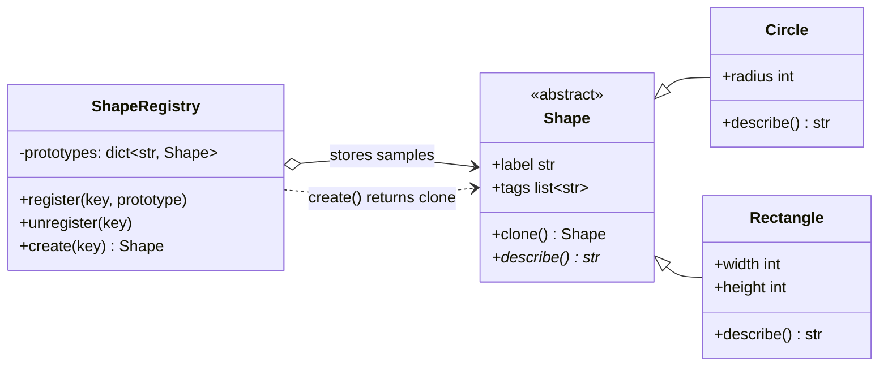

# Prototype Pattern

> **Category:** Creational · **Difficulty:** Beginner-friendly · **Dependencies:** none (Python 3.9+ standard library only)

The **Prototype** pattern creates new objects by **cloning a pre-configured sample** instead of calling a constructor. A registry of prototypes turns "what kinds of object exist" into runtime data: adding a new kind means *registering* another sample, not writing another class or another `if` branch.

This directory is a complete, runnable tutorial. You can read it top-to-bottom in about 15 minutes, run the demo, run the tests, and then do the exercises at the end.

---

## Table of contents

1. [The problem it solves](#1-the-problem-it-solves)
2. [Real-world analogy](#2-real-world-analogy)
3. [Structure](#3-structure)
4. [Code walkthrough](#4-code-walkthrough)
5. [Run the demo](#5-run-the-demo)
6. [Run the tests](#6-run-the-tests)
7. [Real-world use cases](#7-real-world-use-cases)
8. [When to use it (and when not to)](#8-when-to-use-it-and-when-not-to)
9. [Related patterns](#9-related-patterns)
10. [Exercises](#10-exercises)
11. [References](#11-references)

---

## 1. The problem it solves

Suppose you are writing a diagram editor, and users can stamp out shapes from a palette:

```python
def create_shape(kind: str) -> Shape:
    if kind == "alert-badge":
        return Circle("alert badge", radius=12, tags=["alert", "red"])
    elif kind == "banner":
        return Rectangle("hero banner", 300, 80, tags=["header"])
    elif kind == "urgent-badge":
        return Circle("alert badge", radius=12, tags=["alert", "red", "urgent"])
    # ...one more elif per palette entry, forever
```

This looks workable, but three problems creep in as the program grows:

1. **The palette is frozen in code.** Every new palette entry — even one that only differs by a tag — needs another `elif` and a redeploy. Users can't define their own stamps; plugins can't add any.
2. **Configuration is re-derived from scratch.** Each branch rebuilds the full recipe of a shape. When a shape's configuration is expensive to compute (parsed from a file, fetched from a database, the result of a long setup), reconstructing it per creation is wasteful — you already *have* a perfectly configured instance.
3. **Copying by hand is a trap.** The tempting shortcut, `new = copy.copy(sample)`, silently **shares mutable state**: the copy and the sample end up holding the *same* `tags` list, and customising one corrupts the other. This bug ships quietly and surfaces far from its cause.

The Prototype pattern fixes all three: each shape knows how to `clone()` itself (deeply), and a **registry** maps names to pre-configured sample objects. Creating becomes `registry.create("alert-badge")` — no conditionals, no reconstruction, no shared state — and *registering a customised clone* mints a new kind of object at runtime.

## 2. Real-world analogy

Think of a **rubber stamp**. Carving a stamp (designing and configuring the object) is slow, skilled work — but once it exists, producing the next impression is a single press. You keep a drawer of carved stamps (the registry), pick one by name, and stamp. If you want a variant, you press a stamp and add a handwritten note — and if that variant proves popular, you have a new stamp carved from it and add it to the drawer.

In this example:

| Analogy | Code |
| --- | --- |
| A carved rubber stamp | a prototype (`Circle("alert badge", 12, ["alert", "red"])`) |
| Pressing the stamp | `clone()` (via `copy.deepcopy`) |
| The drawer of stamps, labelled | `ShapeRegistry` |
| Picking a stamp by its label | `registry.create("alert-badge")` |
| Impression ≠ the stamp itself | a clone is a new, independent object |
| Adding a new stamp to the drawer | `registry.register("urgent-badge", tweaked_clone)` |

## 3. Structure

A flat package — the pattern here has three roles, one file each:

```
prototype/
├── shape.py      # Prototype  — Shape ABC with clone() (deepcopy) + describe()
├── shapes.py     # ConcretePrototype — Circle, Rectangle (inherit clone unchanged)
├── registry.py   # Prototype manager — ShapeRegistry: register / create-by-key
├── main.py       # demo client (incl. the shallow-copy pitfall, live)
└── tests/        # executable specification of the pattern's guarantees
```



`registry.py` imports only the abstract `Shape` — it neither knows nor cares which concrete classes get registered. Client code (after setup) mentions no concrete class at all: everything is created through `registry.create(key)`.

## 4. Code walkthrough

### Step 1 — the cloning contract ([shape.py](shape.py))

```python
class Shape(ABC):
    @final
    def clone(self) -> "Shape":
        return copy.deepcopy(self)

    @abstractmethod
    def describe(self) -> str: ...
```

`clone()` is implemented **once**, on the base class, with `copy.deepcopy`. Deep copy means a clone shares *no* mutable state with its prototype — every nested list, dict or object is copied too. Subclasses inherit correct cloning for free, whatever attributes they add. It is marked `@final` (checked by type checkers such as mypy/pyright): a subclass needing special copying should implement `__deepcopy__` — the `copy` module's own hook — rather than weaken the "clones are always deep" guarantee by overriding `clone()`.

> 💡 `copy.deepcopy` walks the whole object graph, which can be slow for big objects and wrong for things that must not be duplicated (open files, sockets, locks). Python's hook for that is `__deepcopy__` — exercise 4 makes you implement one.

### Step 2 — concrete prototypes ([shapes.py](shapes.py))

```python
class Circle(Shape):
    def __init__(self, label: str, radius: int, tags: Sequence[str]) -> None:
        super().__init__(label, tags)
        self.radius = radius
```

`Circle` and `Rectangle` are ordinary classes — nothing pattern-specific beyond implementing `describe()`. That is typical: the Prototype pattern lives mostly in the *base class* and the *registry*, not in the concrete products.

### Step 3 — the registry ([registry.py](registry.py))

```python
def create(self, key: str) -> Shape:
    try:
        prototype = self._prototypes[key]
    except KeyError:
        ...  # re-raised with the available keys listed
    return prototype.clone()
```

Two invariants: `create()` returns a **clone, never the stored sample** (otherwise every "created" object would be one shared instance, and customising it would corrupt the catalogue), and unknown keys **fail fast** with a message listing what *is* available.

### Step 4 — the client ([main.py](main.py))

```python
registry.register("alert-badge", Circle("alert badge", 12, ["alert", "red"]))
...
badge_b = registry.create("alert-badge")   # no class names from here on
badge_b.tags.append("urgent")              # customise ONE clone, safely
```

After the two `register` calls (imagine them driven by a config file or plugin loader), the client never touches `Circle` or `Rectangle` again. The demo ends by committing the classic mistake on purpose — `copy.copy` — so you can watch the original get corrupted by a change made "only" to the copy.

## 5. Run the demo

From the **repository root**:

```bash
python -m prototype.main
```

Expected output:

```text
Registered prototypes: alert-badge, banner

Two clones of 'alert-badge', one customised after cloning:
  clone A   : Circle 'alert badge' (radius 12, tags: alert, red)
  clone B   : Circle 'alert badge' (radius 12, tags: alert, red, urgent)
  prototype : Circle 'alert badge' (radius 12, tags: alert, red)

A fresh banner: Rectangle 'hero banner' (300x80, tags: header)
Clones are new objects: banner is not a second banner -> True

Why clone() uses deepcopy — the shallow-copy pitfall:
  shallow copy shares the tags list: True
  we tagged only the copy, yet the original now reads:
    Circle 'shared-state demo' (radius 5, tags: clean, oops)
  a deep clone stays independent:
    original after tagging the deep clone: Circle 'shared-state demo' (radius 5, tags: clean, oops)
```

(The last line still shows `oops` — that damage was done by the shallow copy earlier and is permanent; the deep clone's `safe` tag, correctly, never appears on the original.)

## 6. Run the tests

```bash
python -m unittest discover -s prototype -t .
```

The tests in [tests/](tests/) are written as an executable specification — each one states a guarantee the pattern provides (e.g. *"mutating a clone never touches the prototype"*, *"a shallow copy would share nested state"*). Reading them is a good comprehension check.

## 7. Real-world use cases

You already use this pattern daily, often without noticing:

| Domain | Client asks for… | The prototype registry decides / provides |
| --- | --- | --- |
| **Graphics & diagram editors** | "another one of *that*" (copy/paste, stamp tools) | A deep clone of the selected object, styling and all |
| **Document templates** | "a new invoice" | A clone of the invoice template, ready to fill in — not a from-scratch rebuild |
| **Game development** | "spawn 50 goblins" | Clones of a fully tuned goblin sample (stats, AI config, loot table) — the *flyweight/prototype spawner* idiom |
| **Test fixtures** | "a valid order to mutate" | `copy.deepcopy(golden_order)` per test, so tests can't contaminate each other |
| **Default configurations** | "settings to start from" | A clone of the default config object; users tweak their copy (`dict.copy`/`deepcopy` idiom everywhere) |
| **Scientific computing** | "an array like that one" | `numpy.ndarray.copy()` — clone-with-independence as a first-class API |
| **Object-relational mapping** | "a detached copy of this row" | Cloning a mapped instance minus its identity/session state (custom `__deepcopy__`) |
| **Standard library** | "a copy that respects my class" | The `copy` module protocol itself — `__copy__` / `__deepcopy__` are Python's built-in Prototype hooks |

The common thread: an object's **configuration is valuable** (expensive, complex, or user-made), and the cheapest correct way to get another one is to copy an existing instance.

## 8. When to use it (and when not to)

**Use it when:**

- New objects are best described as **variations of existing ones** (copy/paste, templates, palettes, presets).
- Object setup is **expensive** (parsing, I/O, computation) and instances can be duplicated far more cheaply than rebuilt.
- The set of available "kinds" must be **extensible at runtime** — by config files, plugins, or the user — without new classes or new conditionals.
- You want creation code decoupled from concrete classes, but a factory-per-class ([`../factory_method/`](../factory_method/)) would explode: one prototype *instance* replaces each factory *class*.

**Don't use it when:**

- Construction is trivial — `Circle("badge", 12, [])` is clearer than registry indirection when there's nothing pre-configured worth copying.
- Objects hold **uncopyable resources** (sockets, file handles, locks, DB sessions). You *can* customise `__deepcopy__`, but if most of the object must be excluded from the copy, cloning is the wrong creation story.
- In Python specifically, lighter idioms often suffice: `dataclasses.replace(sample, radius=99)` gives you "copy with changes" for dataclasses in one line, and a `dict` of factory *functions* (`lambda: Circle(...)`) provides named creation without any cloning subtleties. Reach for the full pattern when you need *runtime-registered, pre-configured, independently mutable* samples — all three at once.

**Trade-off to be aware of:** deep copying an object with a large or cyclic object graph is slow, and classes with special state need hand-written `__deepcopy__` implementations — correctness of cloning becomes something you must now test (as [tests/](tests/) does).

## 9. Related patterns

- **Factory Method** — solves the same "don't hard-wire concrete classes" problem with subclassing; Prototype solves it with object copying and needs no creator hierarchy. See [`../factory_method/`](../factory_method/).
- **Abstract Factory** — a concrete factory can be *implemented* with prototypes: store one sample per product and clone it on each `create_*` call. See [`../abstract_factory/`](../abstract_factory/).
- **Builder** — assembles a complex object step by step; Prototype short-circuits assembly by copying a finished example. They combine well: build once, clone many. See [`../builder/`](../builder/).
- **Singleton** — the opposite intent: Singleton guarantees *one* shared instance, Prototype mass-produces *independent* ones. See [`../singleton/`](../singleton/).

## 10. Exercises

Try these to confirm your understanding (the first two should require **no changes** to `shape.py` or `registry.py` — if you find yourself editing them, revisit section 3):

1. **New prototype kind:** add a `Text` shape (label, content, font size, tags) in a new module, register one under `"caption"`, and create a few clones. Which files did you touch — and which did you *not*?
2. **Palette from data:** write a function that populates a `ShapeRegistry` from a `dict` loaded from JSON (kind, parameters, tags). You have just made the palette user-editable without a redeploy.
3. **Break it on purpose:** change `Shape.clone` to use `copy.copy` and run the test suite. Which tests fail, and — before rerunning — predict *which assertion line* in each will trip.
4. **Custom `__deepcopy__`:** give a shape an `audit_log: list[str]` attribute that must **not** be inherited by clones (each clone starts with an empty log). Implement `__deepcopy__` so `clone()` still deep-copies everything else, and write a test proving both halves.

## 11. References

- Gamma, Helm, Johnson, Vlissides — *Design Patterns: Elements of Reusable Object-Oriented Software* (GoF), Prototype chapter.
- Hiroshi Yuki — *An Introduction to Design Patterns Learned in the Java Language*, Prototype chapter.
- [Refactoring.Guru — Prototype](https://refactoring.guru/design-patterns/prototype)
- [Python `copy` module documentation](https://docs.python.org/3/library/copy.html) — including the `__copy__` / `__deepcopy__` protocol.
- [Python `abc` module documentation](https://docs.python.org/3/library/abc.html)
