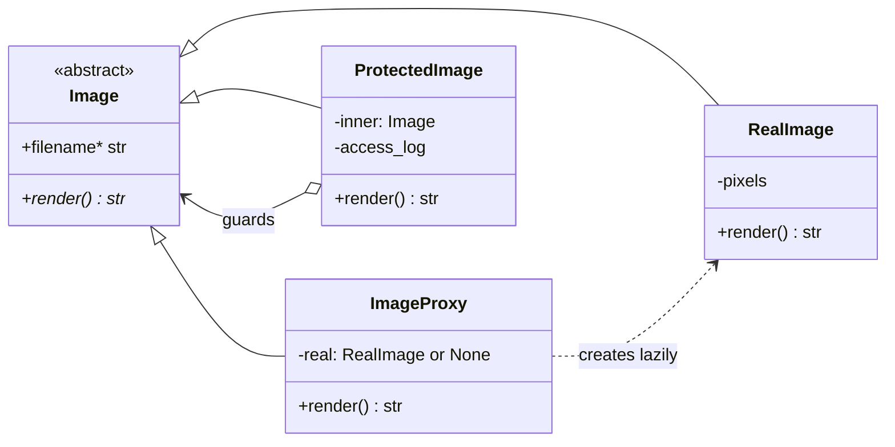

# Proxy Pattern

> **Category:** Structural · **Difficulty:** Beginner-friendly · **Dependencies:** none (Python 3.9+ standard library only)

The **Proxy** pattern provides a stand-in for another object in order to **control access to it**. The proxy implements the *same interface* as the real object, so clients can't tell the difference — but behind that interface the proxy decides *when* the real object gets created (virtual proxy), *who* may reach it (protection proxy), or *what bookkeeping* happens around each call (logging, caching, remoting).

This directory is a complete, runnable tutorial. You can read it top-to-bottom in about 15 minutes, run the demo, run the tests, and then do the exercises at the end.

---

## Table of contents

1. [The problem it solves](#1-the-problem-it-solves)
2. [Real-world analogy](#2-real-world-analogy)
3. [Structure](#3-structure)
4. [Code walkthrough](#4-code-walkthrough)
5. [Run the demo](#5-run-the-demo)
6. [Run the tests](#6-run-the-tests)
7. [Real-world use cases](#7-real-world-use-cases)
8. [When to use it (and when not to)](#8-when-to-use-it-and-when-not-to)
9. [Related patterns](#9-related-patterns)
10. [Exercises](#10-exercises)
11. [References](#11-references)

---

## 1. The problem it solves

Suppose loading an image is expensive — megabytes read from disk, decoded, maybe fetched over a network. The naive gallery loads everything up front:

```python
class Gallery:
    def __init__(self, filenames: list[str]) -> None:
        # loads EVERY image at startup, even ones never scrolled to
        self.images = [RealImage(name) for name in filenames]
```

Three problems follow:

1. **You pay for what you don't use.** A gallery of 500 images loads 500 files at startup so the user can look at 3 of them. Startup crawls; memory balloons.
2. **The client inherits the bookkeeping.** The "obvious" fix — `if image is None: image = RealImage(name)` sprinkled at every use site — pushes lazy-loading logic into every client, where it will be duplicated, and eventually one copy will forget the check.
3. **No place to put access policy.** Requirements like "only admins may open this file" or "log every access" have nowhere to live except inside `RealImage` itself — polluting a class whose job is pixels, not permissions.

The Proxy pattern fixes all three by inserting a stand-in that shares the real object's interface. `ImageProxy` defers the expensive load to the first real use (and clients can't tell); `ProtectedImage` checks permissions and writes an audit log *before* anything reaches the real object. The real subject stays pure, the clients stay ignorant, and the policy has exactly one home.

## 2. Real-world analogy

Think of a **personal assistant to a busy executive**. The assistant has the same "interface" as the boss — you send meeting requests, questions, documents to the same address and get answers back. Routine matters the assistant handles alone, without disturbing the executive at all. Only when a request genuinely requires the boss does the assistant put it through — and some callers are politely refused ("I'm afraid she's not available to you"), with every contact noted in the visitor log. From the outside, you dealt with "the office of the executive" the whole time.

In this example:

| Analogy | Code |
| --- | --- |
| "The office of the executive" (one address for all) | `Image` (the Subject interface) |
| The executive herself | `RealImage` (expensive to involve) |
| The assistant handling routine questions alone | `ImageProxy.filename` — answered without loading |
| "Let me get her for you" (only when truly needed) | `ImageProxy.render()` creating `RealImage` on first use |
| The assistant turning some callers away | `ProtectedImage` raising `PermissionError` |
| The visitor log at the front desk | `ProtectedImage.access_log` |

## 3. Structure

A flat package: one Subject interface, one real implementation, two proxies that wrap it:

```
proxy/
├── subject.py            # Image          — the Subject: interface shared by all
├── real_image.py         # RealImage      — the RealSubject: pays the loading cost
├── image_proxy.py        # ImageProxy     — virtual proxy: creates RealImage lazily
├── protected_image.py    # ProtectedImage — protection proxy: permissions + audit log
├── main.py               # demo client
└── tests/                # executable specification of the pattern's guarantees
```



Note the two different arrows out of the proxies: `ImageProxy` points at the *concrete* `RealImage` (a virtual proxy must know what to construct), while `ProtectedImage` wraps the *abstract* `Image` — which is why it can guard a real image, a lazy proxy, or even another guard.

## 4. Code walkthrough

### Step 1 — the shared Subject ([subject.py](subject.py))

```python
class Image(ABC):
    @property
    @abstractmethod
    def filename(self) -> str: ...
    @abstractmethod
    def render(self) -> str: ...
```

One interface for the real object and every stand-in. This is the load-bearing decision: a proxy with the *same* interface can be slid between client and subject without touching client code.

### Step 2 — the expensive RealSubject ([real_image.py](real_image.py))

```python
class RealImage(Image):
    def __init__(self, filename: str) -> None:
        print(f"    (disk) loading {filename} ... done")   # the expensive part
        RealImage.loads += 1
```

All the cost sits in the constructor — which is exactly what motivates the virtual proxy: *creating* a `RealImage` is never free. The `loads` counter lets the demo and tests prove when loading did (and did not) happen.

### Step 3 — the virtual proxy ([image_proxy.py](image_proxy.py))

```python
class ImageProxy(Image):
    def __init__(self, filename: str) -> None:
        self._filename = filename
        self._real: Optional[RealImage] = None   # nothing loaded!

    def render(self) -> str:
        if self._real is None:
            self._real = RealImage(self._filename)   # pay the cost now
        return self._real.render()
```

Construction stores a string, nothing more. The heavy object is created on the *first* `render()` and cached thereafter. Note `filename` is answered by the proxy itself — a good proxy handles what it can alone and delegates only what truly needs the real subject.

### Step 4 — the protection proxy ([protected_image.py](protected_image.py))

```python
def render(self) -> str:
    if self._role not in self._allowed_roles:
        self._access_log.append(f"DENIED  {self._viewer} ({self._role})")
        raise PermissionError(...)
    self._access_log.append(f"granted {self._viewer} ({self._role})")
    return self._inner.render()
```

Same interface, different policy: this proxy controls *who* gets through, and audits every attempt. Because it wraps the abstract `Image`, it composes with `ImageProxy` — deny a request and the expensive image is never even loaded. Permissions and auditing get a home **without `RealImage` learning about either**.

### Step 5 — the client ([main.py](main.py))

```python
gallery: list[Image] = [ImageProxy("cat.png"), ImageProxy("dog.png"), ImageProxy("whale.png")]
print(gallery[0].render())   # only cat.png ever loads
```

The client is typed against `Image` throughout. Swap a `RealImage` for a proxy (or stack two proxies) and zero client lines change — GoF calls the pattern's intent "a surrogate or placeholder … to control access", and control is exactly what changed while the client wasn't looking.

> 💡 In Python, "same interface" can even be achieved without a shared base class — `__getattr__`-based delegation or duck typing gives you *dynamic* proxies (this is how `unittest.mock.Mock` and many ORM lazy objects work). The explicit ABC used here trades that magic for readability and type-checker support.

## 5. Run the demo

From the **repository root**:

```bash
python -m proxy.main
```

Expected output:

```text
--- 1. RealImage: construction alone pays the loading cost ---
    (disk) loading holiday.png ... done
+---------------+
|  holiday.png  |
+---------------+

--- 2. ImageProxy: construction is free ---
Created a gallery of 3 proxies - no loading happened yet.
Filenames (still no loading): ['cat.png', 'dog.png', 'whale.png']

First render of cat.png - NOW it loads:
    (disk) loading cat.png ... done
+-----------+
|  cat.png  |
+-----------+
Second render of cat.png - already loaded, no disk line:
+-----------+
|  cat.png  |
+-----------+
dog.png and whale.png were never rendered, so never loaded.

--- 3. ProtectedImage: a protection proxy on top of a virtual one ---
mallory is denied BEFORE any loading; alice's render loads it:
PermissionError: mallory (guest) may not view salaries.png
  access log: ['DENIED  mallory (guest)']
    (disk) loading salaries.png ... done
+----------------+
|  salaries.png  |
+----------------+
  access log: ['granted alice (admin)']
```

Follow the `(disk) loading` lines: eager for `RealImage`, deferred to first use for the proxy, and absent entirely for mallory's denied attempt.

## 6. Run the tests

```bash
python -m unittest discover -s proxy -t .
```

The tests in [tests/](tests/) are written as an executable specification — each one states a guarantee the pattern provides (e.g. *"creating a proxy loads nothing"*, *"first render loads exactly once"*, *"denied access never touches the resource"*). Laziness is asserted with a load *counter*, not by inspection — a technique worth stealing for your own proxies.

## 7. Real-world use cases

You already use this pattern daily, often without noticing:

| Domain | Client asks for… | What the proxy controls |
| --- | --- | --- |
| **ORMs** | `order.customer.name` | Lazy loading: related rows are fetched on first attribute access (SQLAlchemy lazy relationships, Django deferred fields) |
| **Remote calls (RPC)** | "call this method" | A local stub marshals the call over the network to the real object (gRPC stubs, `xmlrpc.client.ServerProxy` in the stdlib — a proxy by name) |
| **Lazy values** | "the config, when needed" | `functools.cached_property` / Django's `SimpleLazyObject` defer expensive computation until first touch |
| **Test doubles** | "the payment service" | `unittest.mock.Mock` intercepts every attribute access — a dynamic proxy recording interactions |
| **Web infrastructure** | `GET /report.pdf` | Reverse proxies/CDNs (nginx, Cloudflare) answer from cache, rate-limit, or authenticate before the origin server is touched |
| **Security layers** | "open this document" | Protection proxies checking roles and writing audit logs before delegating |
| **Weak references** | "the cached object, if alive" | `weakref.proxy` forwards to the referent without keeping it alive (stdlib, proxy by name again) |
| **Virtual memory / OS** | "byte 4096 of this file" | `mmap` pages data in on first access — a virtual proxy below your program |

The common thread: the client believes it is talking to the real thing; the stand-in decides **whether, when and how** the real thing is actually involved.

## 8. When to use it (and when not to)

**Use it when:**

- An object is expensive to create or hold, and often not used — virtual proxy (this example's `ImageProxy`).
- Access must be checked, audited, rate-limited or logged, and you don't want that policy inside the real class — protection proxy.
- The real object lives elsewhere (another process, machine, or lifetime) and you need a local representative — remote proxy.
- You need to add these controls to an *existing* class without modifying it or its clients.

**Don't use it when:**

- The object is cheap. Lazy machinery around a 200-byte object is pure overhead — and lazy initialisation *moves* failures (missing file, bad permissions) from startup, where they're obvious, to first use, where they surprise.
- You control the class and the "policy" is really its own behaviour — put it in the class instead of wrapping it.
- You want to add *visible new responsibilities* — that's Decorator's job; a proxy should manage access, not extend the interface's meaning.
- In Python specifically, before writing a proxy class consider: `functools.cached_property` for lazy attributes, a plain closure/`lambda` for deferred construction, or `__getattr__` delegation for a five-line dynamic proxy. Reach for the explicit pattern when the policy deserves its own tested, typed class — as `ProtectedImage` does here.

**Trade-off to be aware of:** proxies add a hop of indirection to every call, and "transparent" laziness can make performance and error behaviour surprising (the innocent-looking `render()` that suddenly does disk I/O). Keep the proxy honest: same results, documented policy.

## 9. Related patterns

- **Decorator** — the same wrap-and-delegate skeleton, different intent: a decorator *adds responsibilities* the client is meant to notice; a proxy *controls access* and tries to be unnoticeable. See [`../decorator/`](../decorator/).
- **Adapter** — changes an object's interface; a proxy deliberately keeps the interface identical.
- **Facade** — simplifies access to *many* objects with a *new* interface; a proxy fronts *one* object with the *same* interface. See [`../facade/`](../facade/).
- **Flyweight** — a caching factory can hand out proxies cheaply while sharing the heavy real subjects behind them. See [`../flyweight/`](../flyweight/).
- **Factory Method** — a natural place to decide "real or proxy?" so clients never make that choice themselves. See [`../factory_method/`](../factory_method/).

## 10. Exercises

Try these to confirm your understanding (each should require **no changes** to `real_image.py` — if you find yourself editing it, the policy is leaking into the subject):

1. **Caching proxy:** write a `CachedImage(inner: Image)` that stores the result of the first `render()` and serves it from memory afterwards. Prove with the `loads` counter that stacking it on a fresh `ImageProxy` still loads exactly once.
2. **Counting proxy:** write a `MeteredImage(inner: Image)` that counts `render()` calls, and use it to answer: how many times does `main.py` render `cat.png`?
3. **Stack all three:** compose `ProtectedImage(MeteredImage(ImageProxy("x.png")), ...)`. Does the order of protection vs. metering matter? Try both orders and explain the difference in what gets counted.
4. **Dynamic proxy:** re-implement `ImageProxy` without subclassing `Image`, using `__getattr__` to forward everything to a lazily created `RealImage`. What did you gain, and what did the type checker lose?

## 11. References

- Gamma, Helm, Johnson, Vlissides — *Design Patterns: Elements of Reusable Object-Oriented Software* (GoF), Proxy chapter.
- Hiroshi Yuki — *An Introduction to Design Patterns Learned in the Java Language* (its lazy `PrinterProxy` example inspired this one's shape).
- [Refactoring.Guru — Proxy](https://refactoring.guru/design-patterns/proxy)
- [Python `weakref.proxy`](https://docs.python.org/3/library/weakref.html#weakref.proxy), [`xmlrpc.client.ServerProxy`](https://docs.python.org/3/library/xmlrpc.client.html) and [`functools.cached_property`](https://docs.python.org/3/library/functools.html#functools.cached_property) — three stdlib proxies.
