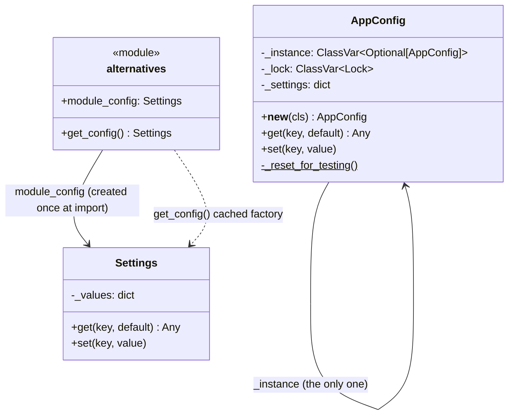

# Singleton Pattern

> **Category:** Creational · **Difficulty:** Beginner-friendly (with a thread-safety twist) · **Dependencies:** none (Python 3.9+ standard library only)

The **Singleton** pattern ensures a class has **at most one instance** and provides a global access point to it. This tutorial implements the classic `__new__`-guarded, thread-safe version — and then shows the two lighter idioms Python offers (a module-level instance and a `functools.cache` factory), because in Python the classic class is usually the *third*-best option.

This directory is a complete, runnable tutorial. You can read it top-to-bottom in about 15 minutes, run the demo, run the tests, and then do the exercises at the end.

---

## Table of contents

1. [The problem it solves](#1-the-problem-it-solves)
2. [Real-world analogy](#2-real-world-analogy)
3. [Structure](#3-structure)
4. [Code walkthrough](#4-code-walkthrough)
5. [Run the demo](#5-run-the-demo)
6. [Run the tests](#6-run-the-tests)
7. [Real-world use cases](#7-real-world-use-cases)
8. [When to use it (and when not to)](#8-when-to-use-it-and-when-not-to)
9. [Related patterns](#9-related-patterns)
10. [Exercises](#10-exercises)
11. [References](#11-references)

---

## 1. The problem it solves

Suppose several parts of your application need the same configuration object:

```python
# parser.py
config = AppConfig()          # loads settings

# exporter.py
config = AppConfig()          # loads settings AGAIN — a different object

# cli.py
config = AppConfig()
config.set("debug", True)     # ...which of the three objects did this change?
```

This looks harmless, but three problems creep in as the program grows:

1. **Divergent copies.** Each module holds its *own* `AppConfig`. The CLI flips `debug` on, and the exporter — reading a different instance — never sees it. "Shared" settings quietly aren't.
2. **Wasted, repeated setup.** If construction is expensive (read files, open connections, warm caches), doing it once per importing module multiplies the cost for zero benefit.
3. **Naive fixes have races.** The folklore fix — `if _instance is None: _instance = AppConfig()` — has a **check-then-create race**: two threads can both see `None` and both construct, and now half your threads hold instance A and half hold instance B. The failure is intermittent and miserable to debug.

The Singleton pattern fixes all three by making the *class itself* enforce uniqueness: `AppConfig()` becomes an access point rather than a constructor, always returning the one shared, fully-initialised instance — with a lock closing the race.

## 2. Real-world analogy

Think of a country's **central bank**. A country has exactly one; you don't construct a new central bank when you need monetary policy — you address *the* central bank. Everyone who talks to it talks to the same institution, so a decision it makes (a rate change) is instantly true for everyone. And crucially, "there is only one" is enforced by the constitution, not by everyone politely agreeing not to found another.

In this example:

| Analogy | Code |
| --- | --- |
| The central bank (one per country) | the single `AppConfig` instance |
| "Address the central bank" | calling `AppConfig()` — an access point, not a constructor |
| The constitution forbidding a second one | the guard in `__new__` |
| Two founders racing to incorporate first | the two-thread race; the `Lock` decides it safely |
| A rate change binds everyone at once | `config_a.set("debug", True)` is visible via `config_b` |

## 3. Structure

A flat package — one file per idea:

```
singleton/
├── app_config.py     # the classic Singleton: __new__ guard + Lock + no __init__
├── alternatives.py   # the Pythonic ways: module-level instance, functools.cache
├── main.py           # demo client (incl. a 32-thread construction race)
└── tests/            # executable specification of the pattern's guarantees
```



Note the contrast: `AppConfig` carries its singleton machinery *inside the class*, while `Settings` is a completely ordinary class whose "singleton-ness" lives in *how the module exposes it*. That difference is the heart of section 8.

## 4. Code walkthrough

### Step 1 — the guard in `__new__` ([app_config.py](app_config.py))

```python
def __new__(cls) -> "AppConfig":
    if cls._instance is None:              # fast path: no locking once created
        with cls._lock:
            if cls._instance is None:      # double-checked locking
                instance = super().__new__(cls)
                instance._settings = {"app_name": "PatternsDemo", "debug": False}
                cls._instance = instance
    return cls._instance
```

`__new__` is Python's hook for instance *creation* (before `__init__` ever runs), so it is the right interception point. The **double-checked locking** idiom: check without the lock (so the 99.999% of calls after the first pay nothing), then re-check *inside* the lock, because another thread may have created the instance while we waited to acquire it.

### Step 2 — why there is no `__init__`

Python calls `__init__` on whatever `__new__` returns — **every single time** the class is called. A Singleton that does `self._settings = {...}` in `__init__` therefore wipes its own state on every `AppConfig()` call. That is the pattern's classic Python bug, and it's why state is initialised exactly once, inside the locked section of `__new__`. The test `test_reconstruction_does_not_reset_state` pins this down.

### Step 3 — the testing escape hatch

```python
@classmethod
def _reset_for_testing(cls) -> None:
    with cls._lock:
        cls._instance = None
```

A Singleton is global state, and global state leaks between tests. An explicit, ugly-on-purpose reset hook is the least-bad way to live with that — and its very necessity is a preview of section 8's warnings.

### Step 4 — the Pythonic alternatives ([alternatives.py](alternatives.py))

```python
module_config: Settings = Settings()      # alternative 1: module-level instance

@functools.cache
def get_config() -> Settings:             # alternative 2: cached factory
    return Settings()
```

Alternative 1 leans on the import system: a module is imported once, cached in `sys.modules`, and every importer gets the same module object — so `module_config` is created exactly once per process. Alternative 2 memoises a factory: lazy (nothing is built until first use), one line, and resettable via `get_config.cache_clear()`. In both cases `Settings` stays a **plain class**, trivially constructible in tests.

### Step 5 — the client ([main.py](main.py))

```python
config_a = AppConfig()
config_b = AppConfig()
# config_a is config_b -> True; a write via one is visible via the other
```

The demo also stages a genuine 32-thread construction race (`race_to_construct`) — all threads released by a `Barrier` at once — and counts distinct instances. With the lock in place, the answer is always 1.

> 💡 Delete the `with cls._lock:` line pair and rerun the demo a few times — on a loaded machine you can watch the count exceed 1. That's the race the lock closes (exercise 3 makes this rigorous).

## 5. Run the demo

From the **repository root**:

```bash
python -m singleton.main
```

Expected output:

```text
=== 1. Classic Singleton: every call returns the same object ===
config_a is config_b: True
config_b.get('debug'): True  (state is shared)

=== 2. Thread safety: 32 threads race to construct AppConfig() ===
distinct instances created: 1

=== 3. Pythonic alternative: a module-level instance ===
module_config is alternatives.module_config: True

=== 4. Pythonic alternative: a functools.cache factory ===
get_config() is get_config(): True

One process, one instance - however you ask for it.
```

## 6. Run the tests

```bash
python -m unittest discover -s singleton -t .
```

The tests in [tests/](tests/) are written as an executable specification — each one states a guarantee the pattern provides (e.g. *"concurrent construction yields exactly one instance"*, *"reconstruction does not reset state"*). Reading them is a good comprehension check.

## 7. Real-world use cases

You already use this pattern daily, often without noticing:

| Domain | Client asks for… | What the singleton guarantees |
| --- | --- | --- |
| **Logging** | `logging.getLogger("app")` | The stdlib returns the *same* logger object for the same name, process-wide — a registry of named singletons |
| **App configuration** | "the settings" | One source of truth; a flag flipped anywhere is seen everywhere (e.g. Django's `django.conf.settings` lazy singleton) |
| **Connection pooling** | "a database/HTTP session" | One shared pool instead of a pool per module (`requests.Session` used as an app-wide instance) |
| **Random number generation** | `random.random()` | The stdlib's module-level functions delegate to one hidden shared `Random` instance |
| **Interpreter internals** | `None`, `True`, small ints | CPython itself interns these as singletons — `is` comparisons work *because* of it |
| **GUI frameworks** | "the application object" | Qt's `QApplication` enforces at most one per process, by design |
| **Caches / registries** | "the plugin registry" | One catalogue that all registrations and lookups agree on |
| **Hardware / OS handles** | "the GPU context", "stdout" | `sys.stdout` is a module-level singleton wrapping a resource that genuinely exists once |

The common thread: the underlying **resource or authority genuinely exists once per process**, and pretending otherwise (multiple instances) would be a bug, not a feature.

## 8. When to use it (and when not to)

**Use it when:**

- The instance models something that **truly exists once** — a hardware device, the process's stdout, an OS-level resource, an application object.
- Uniqueness must be **enforced**, not just conventioned — a second instance would be a correctness bug (double connection pool, double cache).
- Access must be **thread-safe from the first call**, which is exactly what the locked `__new__` provides.

**Don't use it when:**

- You reach for it as a **convenient global variable**. This is the most-criticised pattern in the GoF catalogue for a reason: hidden dependencies (any function may secretly read/write it), test pollution (state leaks between tests — notice we *had* to add `_reset_for_testing`), and concurrency hazards on the shared state itself.
- The real need is "pass this object around" — prefer **dependency injection**: construct one instance at your entry point and hand it to the objects that need it. Same single instance, but the dependency is visible in signatures, and tests can inject a fresh or fake one with no reset hooks.

**Pythonic alternatives and trade-offs** (both implemented in [alternatives.py](alternatives.py)):

| Approach | Pros | Cons |
| --- | --- | --- |
| Classic `__new__` guard | Uniqueness is *enforced*; lazy; subclass-able | Most code; needs lock + no-`__init__` care; hardest to test |
| Module-level instance | Zero machinery; idiomatic; import system does the work | Created *eagerly* at import; uniqueness is convention (anyone can call `Settings()`) |
| `functools.cache` factory | One line; lazy; `cache_clear()` for tests | Uniqueness is convention; the "singleton" is per-factory, not per-class |

In most Python code, the module-level instance is the right default; the cached factory adds laziness; the classic class is for when uniqueness must be *impossible to bypass*.

## 9. Related patterns

- **Factory Method** — concrete factories are natural singletons: they usually carry no per-instance state worth duplicating. See [`../factory_method/`](../factory_method/).
- **Abstract Factory** — an application typically holds exactly one active factory (one theme at a time); that one is often a singleton. See [`../abstract_factory/`](../abstract_factory/).
- **Prototype** — the opposite intent: Prototype mass-produces *independent* instances, Singleton forbids more than one. See [`../prototype/`](../prototype/).
- **Facade** — facades are frequently exposed as a single shared instance, since one entry point per subsystem is the whole idea.

## 10. Exercises

Try these to confirm your understanding:

1. **Named singletons:** turn `AppConfig` into a *multiton*: `AppConfig.for_name("db")` and `AppConfig.for_name("api")` each return their own single instance (same name ⇒ same object). The stdlib's `logging.getLogger` is your reference behaviour.
2. **Injection refactor:** write a tiny `report(config: AppConfig) -> str` function that *receives* the config instead of calling `AppConfig()` inside. Write a test for it using a plain `Settings` object — notice that no reset hook is needed. This is the dependency-injection alternative from section 8, in miniature.
3. **Break it on purpose:** remove the `with cls._lock:` block (keep the `None` checks) and re-run `test_concurrent_construction_yields_exactly_one_instance` in a loop (`python -m unittest ... -v` inside `for i in $(seq 50)`). How often does it fail on your machine — and why *doesn't* it fail every time?
4. **Eager vs lazy:** add a `print("building Settings")` to `Settings.__init__` and observe when it fires for `module_config` vs `get_config()`. Which would you want if construction opened a database connection, and the process might be a short-lived script that never touches settings?

## 11. References

- Gamma, Helm, Johnson, Vlissides — *Design Patterns: Elements of Reusable Object-Oriented Software* (GoF), Singleton chapter.
- Hiroshi Yuki — *An Introduction to Design Patterns Learned in the Java Language*, Singleton chapter.
- [Refactoring.Guru — Singleton](https://refactoring.guru/design-patterns/singleton)
- [Python data model — `__new__`](https://docs.python.org/3/reference/datamodel.html#object.__new__)
- [Python `threading` documentation](https://docs.python.org/3/library/threading.html) — `Lock` and `Barrier`.
- [Python `functools.cache` documentation](https://docs.python.org/3/library/functools.html#functools.cache)
- [The import system — `sys.modules` caching](https://docs.python.org/3/reference/import.html#the-module-cache) — why a module-level instance is created only once.
