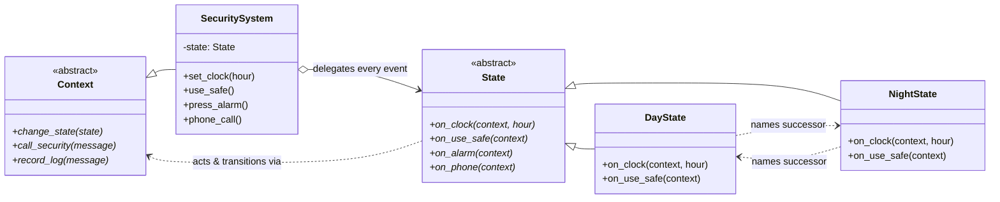

# State Pattern

> **Category:** Behavioral · **Difficulty:** Intermediate · **Dependencies:** none (Python 3.9+ standard library only)

The **State** pattern lets an object change its behaviour when its internal state changes — the object appears to change its class. Each mode of the system becomes its own class implementing a common interface; the *Context* holds one of them and blindly delegates every event to it. The if-else ladders that normally check "which mode am I in?" on every event vanish, and — the pattern's signature move — **the transition rules move into the state classes themselves**.

This directory is a complete, runnable tutorial built around the classic example from Hiroshi Yuki's book: a building security system whose reaction to the *same* events (opening the safe, a phone call, the alarm bell) flips between day mode and night mode as the clock ticks. You can read it top-to-bottom in about 15 minutes, run the demo, run the tests, and then do the exercises at the end.

---

## Table of contents

1. [The problem it solves](#1-the-problem-it-solves)
2. [Real-world analogy](#2-real-world-analogy)
3. [Structure](#3-structure)
4. [Code walkthrough](#4-code-walkthrough)
5. [Run the demo](#5-run-the-demo)
6. [Run the tests](#6-run-the-tests)
7. [Real-world use cases](#7-real-world-use-cases)
8. [When to use it (and when not to)](#8-when-to-use-it-and-when-not-to)
9. [Related patterns](#9-related-patterns)
10. [Exercises](#10-exercises)
11. [References](#11-references)

---

## 1. The problem it solves

A security system behaves differently by day and by night. The naive version keeps a flag and checks it in every handler:

```python
class SecuritySystem:
    def use_safe(self) -> None:
        if self.is_day:                       # ladder #1
            self.record_log("safe opened (routine)")
        else:
            self.call_security("EMERGENCY: safe opened at night!")

    def phone_call(self) -> None:
        if self.is_day:                       # ladder #2 (same test again)
            self.record_log("call handled by reception")
        else:
            self.record_log("recorded by answering machine")

    def set_clock(self, hour: int) -> None:
        if self.is_day and not 9 <= hour < 17:    # ladder #3: transitions
            self.is_day = False
        elif not self.is_day and 9 <= hour < 17:
            self.is_day = True
```

Three problems creep in as the program grows:

1. **The same condition, everywhere.** Every event handler re-tests the mode. Add a third mode (weekend? holiday? lockdown?) and *every* ladder in *every* handler must be found and extended — `elif` by `elif`. Miss one, and the safe logs politely during a lockdown.
2. **One mode's behaviour is smeared across the file.** "What does night mode do?" has no single answer you can read — it's one branch in each of a dozen methods. The GoF's insight: those scattered branches *are* a class struggling to exist.
3. **Transitions tangle with behaviour.** `set_clock` hand-maintains a flag with compound boolean logic. With 3+ states and several trigger events, that method decays into the classic unmaintainable state-flag swamp.

The State pattern fixes all three: each mode becomes a class (`DayState`, `NightState`) implementing one handler per event; the context holds *the current state object* and delegates blindly; and each state itself requests the switch when its exit condition is met. Adding a mode becomes **adding a file**, not editing ladders.

## 2. Real-world analogy

Think of a **hospital switchboard**. Dial the same number at 11:00 and at 3:00 — same event, different behaviour: by day, reception answers and books your appointment; at night, an answering service takes over, and anything urgent is routed straight to the on-call doctor. The caller changes nothing; the hospital has swapped *who is on duty*, and the shift change happens by the staff's own schedule, not because a caller flipped a switch.

In this example:

| Analogy | Code |
| --- | --- |
| The hospital's phone number (stable interface) | `SecuritySystem.use_safe() / phone_call() / press_alarm()` |
| Whoever is currently on duty | the `State` object held in `SecuritySystem._state` |
| Day shift / night shift staff | `DayState` / `NightState` |
| The duty roster ("night shift starts at 17:00") | each state's `on_clock` — transitions live with the staff |
| The shift handover | `context.change_state(NightState())` |

## 3. Structure

Two packages: the states own all mode-dependent knowledge; the context owns none of it:

```
state/
├── states/                 # the STATE side: behaviour AND transitions per mode
│   ├── state.py            #   State    — one abstract handler per event
│   ├── day_state.py        #   DayState   — routine reactions; exits at 17:00
│   ├── night_state.py      #   NightState — escalated reactions; exits at 09:00
│   └── context.py          #   Context  — the callbacks a state may invoke
├── securitysystem/         # the CONTEXT side: delegates, never decides
│   └── security_system.py  #   SecuritySystem — holds current state, no if-else
├── main.py                 # demo client (one scripted, deterministic day)
└── tests/                  # executable specification of the pattern's guarantees
```



Two arrows carry the whole design: the context delegates *down* to the abstract `State`, and states act *back up* through the abstract `Context`. Neither side knows the other's concrete class — which is why states are testable with a stub and the context never changes when modes are added.

## 4. Code walkthrough

### Step 1 — the State interface ([states/state.py](states/state.py))

```python
class State(ABC):
    @abstractmethod
    def on_clock(self, context: Context, hour: int) -> None: ...
    @abstractmethod
    def on_use_safe(self, context: Context) -> None: ...
    @abstractmethod
    def on_alarm(self, context: Context) -> None: ...
    @abstractmethod
    def on_phone(self, context: Context) -> None: ...
```

Every event the system can experience, as an abstract method. Because all four are `@abstractmethod`, a new mode that forgets to define, say, `on_alarm` **cannot even be instantiated** — the behaviour table stays complete by construction.

### Step 2 — the Context interface ([states/context.py](states/context.py))

```python
class Context(ABC):
    @abstractmethod
    def change_state(self, state: State) -> None: ...
    @abstractmethod
    def call_security(self, message: str) -> None: ...
    @abstractmethod
    def record_log(self, message: str) -> None: ...
```

States need to *do* things — escalate, log, and above all switch states. They ask for those through this three-method interface instead of depending on the concrete `SecuritySystem`, so states remain host-independent and unit-testable.

### Step 3 — the concrete states ([states/day_state.py](states/day_state.py), [states/night_state.py](states/night_state.py))

```python
class DayState(State):
    def on_clock(self, context: Context, hour: int) -> None:
        if not OPENING_HOUR <= hour < CLOSING_HOUR:
            from .night_state import NightState
            context.change_state(NightState())    # MY exit condition, MY call

    def on_use_safe(self, context: Context) -> None:
        context.record_log("safe opened (routine daytime use)")
```

Compare `on_use_safe` here with `NightState`'s version (`call_security("EMERGENCY: ...")`): same event, different class, different behaviour — and not a conditional in sight. The **key teaching point** is `on_clock`: the transition rule "day ends outside 09–17" belongs to `DayState`, because that's where day-specific knowledge lives. Both states are singletons via `__new__` (they carry no per-context data), so `system.state is DayState()` works and transitions allocate nothing.

> 💡 The inside-the-method import is deliberate: any two-state machine whose states name their successors has a reference cycle, and deferring one import is the standard stdlib-only way to break it at module-load time.

### Step 4 — the concrete Context ([securitysystem/security_system.py](securitysystem/security_system.py))

```python
def use_safe(self) -> None:
    self._state.on_use_safe(self)

def change_state(self, state: State) -> None:
    print(f"[State] {self._state} -> {state}")
    self._state = state
```

Every event handler is a one-line blind delegation — grep the file: no `if day`, no `isinstance`, no mode flag. The only state decision the context ever makes is choosing the *initial* state in `__init__` (and a test keeps it that way). `change_state` is a service the states call, plus the one natural home for cross-cutting transition logging.

### Step 5 — the client ([main.py](main.py))

```python
system.set_clock(17)   # a state decides this means Day -> Night
system.use_safe()      # same call as this morning; different outcome
```

The client fires identical events at different hours. It never mentions `DayState` or `NightState` — modes are an implementation detail behind the panel's stable interface.

## 5. Run the demo

From the **repository root**:

```bash
python -m state.main
```

Expected output:

```text
System starts in Day mode.

== Morning: business as usual ==
[Clock] 09:00
[ log ] safe opened (routine daytime use)
[ log ] phone call handled by reception

== Afternoon: a drill ==
[Clock] 14:00
[CALL!] security company: emergency bell pressed during the day!

== Evening: the office closes ==
[Clock] 17:00
[State] Day -> Night
[ log ] night call recorded by the answering machine

== Late night: an intruder tries the safe ==
[Clock] 23:00
[CALL!] security company: EMERGENCY: safe opened at night!

== Next morning: the office reopens ==
[Clock] 09:00
[State] Night -> Day
[ log ] safe opened (routine daytime use)
```

Note the two `[State]` lines: both transitions were requested by a state object reacting to the clock — the client and the context decided nothing.

## 6. Run the tests

```bash
python -m unittest discover -s state -t .
```

The tests in [tests/](tests/) are written as an executable specification — each one states a guarantee the pattern provides (e.g. *"the same event behaves differently per state"*, *"the context contains no mode conditionals"*). Reading them is a good comprehension check.

## 7. Real-world use cases

You already use this pattern daily, often without noticing:

| Domain | The same event… | …handled by the current state |
| --- | --- | --- |
| **TCP connections** | `send()` arrives | `Established` transmits; `Closed` raises; `Listen` handshakes — the GoF's own `TCPState` example |
| **Document workflows** | "publish" clicked | `Draft` sends to moderation; `Moderation` publishes (if you're an admin); `Published` does nothing |
| **Vending machines** | coin inserted | `NoCoin` accepts and unlocks; `HasCoin` returns the extra coin |
| **Media players** | play/pause pressed | `Playing`, `Paused` and `Stopped` each rebind what every button means |
| **Game AI** | "player spotted" | `Patrol` switches to `Chase`; `Flee` keeps running — FSMs are game AI's bread and butter |
| **Order fulfilment** | "cancel order" | `Pending` refunds instantly; `Shipped` starts a return; `Delivered` refuses |
| **UI tools** | mouse drag | The editor's active *tool* (brush, eraser, selection) is a state object; `python-statemachine` and Django FSM model exactly this shape |
| **Network sessions** | data received | `asyncio.Protocol` implementations grow per-phase handler objects (handshake / streaming / draining) |

The common thread: an object's **reaction to a fixed set of events depends on which phase of its life it is in**, and the phases have their own transition rules.

## 8. When to use it (and when not to)

**Use it when:**

- An object's behaviour depends on its mode, and several methods branch on that mode — the ladders are the smell.
- The modes have real transition rules of their own (timeouts, thresholds, protocol steps) that deserve a readable home.
- You expect the set of modes to grow. Adding a `LockdownState` file beats editing every handler in the context.
- Different modes' behaviour must be independently testable — a state class plus a stub context is a trivially isolated unit.

**Don't use it when:**

- There are two states, one conditional, and no growth in sight — a boolean flag is honest and shorter.
- The "states" have no behaviour, only a label (an order's `status` string shown in a UI). Then you want an `enum.Enum`, not classes.
- In Python specifically, consider the lighter idioms first: a `match`/`elif` over an `Enum` is fine for small, stable machines; swapping **bound methods** (`self.handle = self._handle_night`) gives per-state dispatch without classes; and for data-driven machines a **transition-table dict** `{(state, event): (action, next_state)}` — or a library like `transitions` / `python-statemachine` — beats hand-written classes. Reach for the full GoF shape when states carry distinct behaviour *and* their own transition logic, as here.

**Trade-off to be aware of:** the logic that used to sit in one (ugly) method is now distributed across one class per mode. For readers, "what does night mode do?" gets easier; "what is the whole state graph?" gets harder — mitigate with a diagram in the docs (like the mermaid graph above) or by generating one from the code.

## 9. Related patterns

- **Strategy** — structurally the twin (context delegates to a swappable object), but intent differs: a Strategy is chosen by the *client* and rarely changes; a State is switched by the *machine itself* as events occur. If `change_state` disappeared, this would be Strategy.
- **Singleton** — stateless concrete states are natural singletons, as here; GoF makes the same note.
- **Memento** — snapshots *data* to travel back in time, while State swaps *behaviour* modes; an undoable machine can combine both. See [`../memento/`](../memento/).
- **Mediator** — a mediator with modes (our login dialog's guest/member flag in [`../mediator/`](../mediator/)) is one growth step away from promoting those modes to State objects.
- **Factory Method** — contexts that must create fresh (non-singleton) state instances can delegate that to factories. See [`../factory_method/`](../factory_method/).

## 10. Exercises

Try these to confirm your understanding (1–3 should require **no changes** to `securitysystem/` — if you find yourself editing it, revisit section 4, step 4):

1. **New event:** add `on_door(context)` — by day the door just opens (log); by night it triggers the alarm. Notice how `@abstractmethod` walks you to every place that must change.
2. **Guard behaviour:** make `NightState.on_alarm` also record a log entry *after* calling security. Which tests still pass? Why did nothing else notice?
3. **New mode:** add an `AfterHoursState` for 17:00–21:59 (phone goes to the answering machine, but the safe only logs a warning), with night starting at 22:00. Count the files you touched — and the ones you didn't.
4. **Break it on purpose:** move the transition logic out of the states and into `SecuritySystem.set_clock` as if-else on `isinstance(self._state, ...)`. Now do exercise 3 again and feel the difference — that pain is what the pattern removes.

## 11. References

- Gamma, Helm, Johnson, Vlissides — *Design Patterns: Elements of Reusable Object-Oriented Software* (GoF), State chapter (the `TCPConnection` example).
- Hiroshi Yuki — *An Introduction to Design Patterns Learned in the Java Language* (this example's day/night security system originates there).
- [Refactoring.Guru — State](https://refactoring.guru/design-patterns/state)
- [Python `abc` module documentation](https://docs.python.org/3/library/abc.html) and [`enum`](https://docs.python.org/3/library/enum.html) (the lightweight alternative for label-only states)
