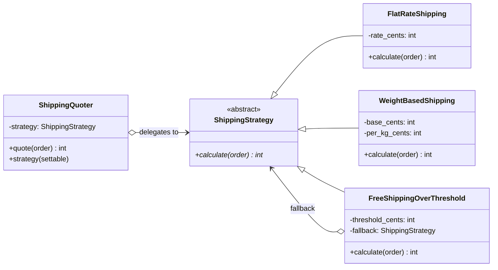

# Strategy Pattern

> **Category:** Behavioral · **Difficulty:** Beginner-friendly · **Dependencies:** none (Python 3.9+ standard library only)

The **Strategy** pattern defines a family of algorithms, encapsulates each one behind a common interface, and makes them **interchangeable at runtime**. The code that *needs* an algorithm (the Context) is decoupled from the code that *implements* it — so new algorithms can be added, and the active one swapped, without touching the context.

This directory is a complete, runnable tutorial. You can read it top-to-bottom in about 15 minutes, run the demo, run the tests, and then do the exercises at the end.

---

## Table of contents

1. [The problem it solves](#1-the-problem-it-solves)
2. [Real-world analogy](#2-real-world-analogy)
3. [Structure](#3-structure)
4. [Code walkthrough](#4-code-walkthrough)
5. [Run the demo](#5-run-the-demo)
6. [Run the tests](#6-run-the-tests)
7. [Real-world use cases](#7-real-world-use-cases)
8. [When to use it (and when not to)](#8-when-to-use-it-and-when-not-to)
9. [Related patterns](#9-related-patterns)
10. [Exercises](#10-exercises)
11. [References](#11-references)

---

## 1. The problem it solves

Suppose your checkout code computes shipping costs:

```python
def shipping_cost(order, method):
    if method == "flat":
        return 599
    elif method == "weight":
        return 300 + round(150 * order.weight_kg)
    elif method == "promo":
        if order.subtotal_cents >= 5000:
            return 0
        return 300 + round(150 * order.weight_kg)   # duplicated!
    ...
```

This `if/elif` ladder looks harmless, but three problems creep in as the program grows:

1. **Every new rule edits the same function.** Marketing wants a weekend promotion? You reopen (and risk breaking) code that already worked. The function becomes a merge-conflict magnet.
2. **Algorithms can't be tested or reused in isolation.** The weight formula is welded to the dispatch logic — you can't hand *just that formula* to another part of the system, and notice how the promo branch already duplicates it.
3. **The choice is frozen into control flow.** Selecting an algorithm from config, a user's dropdown, or an A/B test means threading magic strings through your code.

The Strategy pattern fixes all three by making **each algorithm a self-contained object** with a common interface, and giving the context a single replaceable reference to "the current algorithm".

## 2. Real-world analogy

Think of a **navigation app**. You enter a destination, then pick *driving*, *walking*, or *cycling*. The app's job — take a start and an end, show a route — never changes. What changes is the **routing algorithm** plugged in behind the "Go" button. The app doesn't contain one giant `if mode == ...`; each routing engine is a separate module that answers the same question, and you can switch between them mid-trip.

In this example:

| Analogy | Code |
| --- | --- |
| The navigation app | `ShippingQuoter` (Context) |
| "Given A and B, produce a route" contract | `ShippingStrategy.calculate(order)` (Strategy interface) |
| Driving / walking / cycling engines | `FlatRateShipping`, `WeightBasedShipping`, `FreeShippingOverThreshold` |
| The destination you typed in | `Order` (the data every algorithm reads) |
| Tapping a different transport mode | `quoter.strategy = ...` (runtime swap) |

## 3. Structure

Two packages with a strict one-way dependency — this separation is the whole point of the pattern:

```
strategy/
├── shipping/         # ABSTRACT side: knows nothing about concrete pricing rules
│   ├── order.py      #   Order            — immutable input data
│   ├── strategy.py   #   ShippingStrategy — the algorithm interface (calculate)
│   └── quoter.py     #   ShippingQuoter   — Context; delegates, allows swapping
├── carriers/         # CONCRETE side: depends on shipping/, never vice versa
│   ├── flat_rate.py            # FlatRateShipping          — fixed price
│   ├── weight_based.py         # WeightBasedShipping       — base + per-kg
│   └── free_over_threshold.py  # FreeShippingOverThreshold — promo wrapping a fallback
├── main.py           # demo client
└── tests/            # executable specification of the pattern's guarantees
```



`shipping/` never imports from `carriers/`. You can add ten new pricing rules without touching a single line of `shipping/` — that is the **Open/Closed Principle** in action: *open for extension, closed for modification*.

## 4. Code walkthrough

### Step 1 — the shared data ([shipping/order.py](shipping/order.py))

```python
@dataclass(frozen=True)
class Order:
    weight_kg: float
    subtotal_cents: int
```

Every algorithm reads the same immutable value object. Money is integer cents, so results are exact and the demo output is reproducible to the digit.

### Step 2 — the Strategy interface ([shipping/strategy.py](shipping/strategy.py))

```python
class ShippingStrategy(ABC):
    @abstractmethod
    def calculate(self, order: Order) -> int: ...
```

One method. That's the entire contract. The narrower the interface, the easier strategies are to write, test, and swap — and `@abstractmethod` means a half-written strategy can't even be instantiated.

### Step 3 — the Context ([shipping/quoter.py](shipping/quoter.py))

```python
class ShippingQuoter:
    def quote(self, order: Order) -> int:
        return self._strategy.calculate(order)   # pure delegation
```

The context contains **zero pricing logic**. It decides *when* to calculate; the strategy decides *how*. The `strategy` property has a setter, so the algorithm can be replaced mid-flight — that's the "swap at runtime" half of the pattern's promise.

### Step 4 — the concrete strategies ([carriers/](carriers/))

```python
class WeightBasedShipping(ShippingStrategy):
    def calculate(self, order: Order) -> int:
        return self._base_cents + round(self._per_kg_cents * order.weight_kg)
```

Each file holds exactly one complete formula: configuration knobs in `__init__`, computation in `calculate`. [`free_over_threshold.py`](carriers/free_over_threshold.py) goes one step further — it **wraps another strategy** as its fallback, showing that strategies are ordinary composable objects.

### Step 5 — the client ([main.py](main.py))

```python
quoter = ShippingQuoter(strategies[0])
for strategy in strategies:
    quoter.strategy = strategy        # the runtime swap
    cost = quoter.quote(order)
```

One quoter object prices the same orders three different ways. The only place concrete class names appear is the list literal that builds the strategies.

> 💡 Because strategies share one interface, generic code falls out for free: `min(strategies, key=lambda s: s.calculate(order))` finds the customer's cheapest option without knowing a single formula.

## 5. Run the demo

From the **repository root**:

```bash
python -m strategy.main
```

Expected output:

```text
Order: 1.5 kg, subtotal $30.00
  FlatRateShipping             $5.99
  WeightBasedShipping          $5.25
  FreeShippingOverThreshold    $5.25

Order: 4.0 kg, subtotal $80.00
  FlatRateShipping             $5.99
  WeightBasedShipping          $9.00
  FreeShippingOverThreshold    $0.00

Cheapest option for the 4.0 kg order: FreeShippingOverThreshold ($0.00)
```

## 6. Run the tests

```bash
python -m unittest discover -s strategy -t .
```

The tests in [tests/](tests/) are written as an executable specification — each one states a guarantee the pattern provides (e.g. *"the strategy can be swapped at runtime"*, *"an incomplete strategy cannot even be instantiated"*). Reading them is a good comprehension check.

## 7. Real-world use cases

You already use this pattern daily, often without noticing:

| Domain | Client asks for… | Strategy provides the interchangeable algorithm |
| --- | --- | --- |
| **Sorting** | "sort these, my way" | `sorted(items, key=...)` — the `key` callable *is* a strategy (see section 8) |
| **Compression** | "compress this stream" | zlib / gzip / bz2 / lzma codecs behind one read/write interface |
| **Payment** | "charge the customer" | `StripeCharger`, `PayPalCharger`, `InvoiceCharger` picked per market |
| **Authentication** | "verify these credentials" | Password / OAuth / SSO / LDAP backends (Django's `AUTHENTICATION_BACKENDS`) |
| **Route planning** | "a route from A to B" | Fastest / shortest / avoid-tolls engines in navigation software |
| **Machine learning** | "fit this model" | scikit-learn estimators sharing `fit`/`predict` — swap `LinearRegression` for `RandomForestRegressor` |
| **Game AI** | "the enemy's next move" | Aggressive / defensive / random behaviour objects swapped by difficulty |
| **Retry policies** | "when do we try again?" | Fixed / exponential-backoff / jittered wait strategies (e.g. the `tenacity` library's `wait=` argument) |

The common thread: the caller owns **when** the work happens and hands over **how** as a pluggable object (or callable).

## 8. When to use it (and when not to)

**Use it when:**

- You have (or foresee) several variants of one behaviour and the choice must be made — or changed — at runtime: config, user preference, A/B tests, feature flags.
- An `if/elif` ladder over "which algorithm" keeps growing, and each branch is a self-contained computation.
- You want each algorithm testable in isolation, with its own configuration knobs.
- Different deployments/customers need different rules without forking the calling code.

**Don't use it when:**

- There is one algorithm and no realistic prospect of a second. A direct method call is clearer.
- The variants differ by *one value*, not by *logic* — a parameter beats a class hierarchy.

**The Pythonic variant: functions are already strategies.** Because Python has first-class functions, the full class apparatus is often unnecessary. The standard library's `sorted` is the canonical example — its `key` parameter is a strategy slot:

```python
sorted(orders, key=lambda o: o.subtotal_cents)     # one strategy
sorted(orders, key=lambda o: o.weight_kg)          # another, swapped freely
```

Our whole example could shrink to callables:

```python
ShippingStrategy = Callable[[Order], int]          # a type alias, not a class

def flat_rate(order: Order) -> int:
    return 599

quoter = ShippingQuoter(flat_rate)                  # pass the function itself
```

**Trade-off:** plain functions are lighter and perfectly Pythonic when a strategy is *stateless and unconfigured*. Reach for classes when strategies carry configuration (`per_kg_cents=150`), state, several related methods, or need composition like our threshold promo — a class with `__call__` is a nice middle ground. Either way, the *pattern* (context + swappable algorithm behind one contract) is identical; only the packaging changes.

## 9. Related patterns

- **Template Method** — the inheritance-based sibling: it varies *steps inside* a fixed algorithm via subclassing, while Strategy swaps the *whole* algorithm via composition. See [`../template_method/`](../template_method/).
- **State** — structurally almost identical (context delegating to a swappable object), but the object represents *what the context currently is*, and states typically trigger their own transitions.
- **Command** — also reifies behaviour as an object, but a command bundles *one invocation* (often with undo); a strategy is a *policy* consulted many times.
- **Decorator** — our `FreeShippingOverThreshold` wrapping a fallback is a taste of it: changing behaviour by layering objects that share an interface.
- **Factory Method** — often supplies the strategy: a factory reads config and decides *which* concrete strategy the context receives. See [`../factory_method/`](../factory_method/).

## 10. Exercises

Try these to confirm your understanding (each should require **no changes** to `shipping/` — if you find yourself editing it, revisit section 3):

1. **New strategy:** add `DistanceBasedShipping(per_km_cents)` — you will need to extend `Order` with a `distance_km` field; notice which packages that touches and why.
2. **Composition practice:** build `CheapestOf(strategies: list[ShippingStrategy])`, a strategy that returns the minimum of its children's quotes. Verify it nests: `CheapestOf([promo, CheapestOf([flat, weight])])`.
3. **Function-as-strategy:** change `ShippingQuoter` to accept any `Callable[[Order], int]`. Confirm the class-based strategies still work unmodified (hint: `strategy.calculate` is itself such a callable — bound methods are functions too).
4. **Config-driven choice:** write a `dict[str, ShippingStrategy]` and pick the active strategy from a command-line argument. Notice the quoter and the strategies never change — only the wiring does.

## 11. References

- Gamma, Helm, Johnson, Vlissides — *Design Patterns: Elements of Reusable Object-Oriented Software* (GoF), Strategy chapter.
- Hiroshi Yuki — *An Introduction to Design Patterns Learned in the Java Language*, Strategy chapter (the rock-paper-scissors players).
- [Refactoring.Guru — Strategy](https://refactoring.guru/design-patterns/strategy)
- [Python `sorted` and the `key` parameter](https://docs.python.org/3/howto/sorting.html) — the standard library's built-in strategy slot.
- [Python `abc` module documentation](https://docs.python.org/3/library/abc.html)
