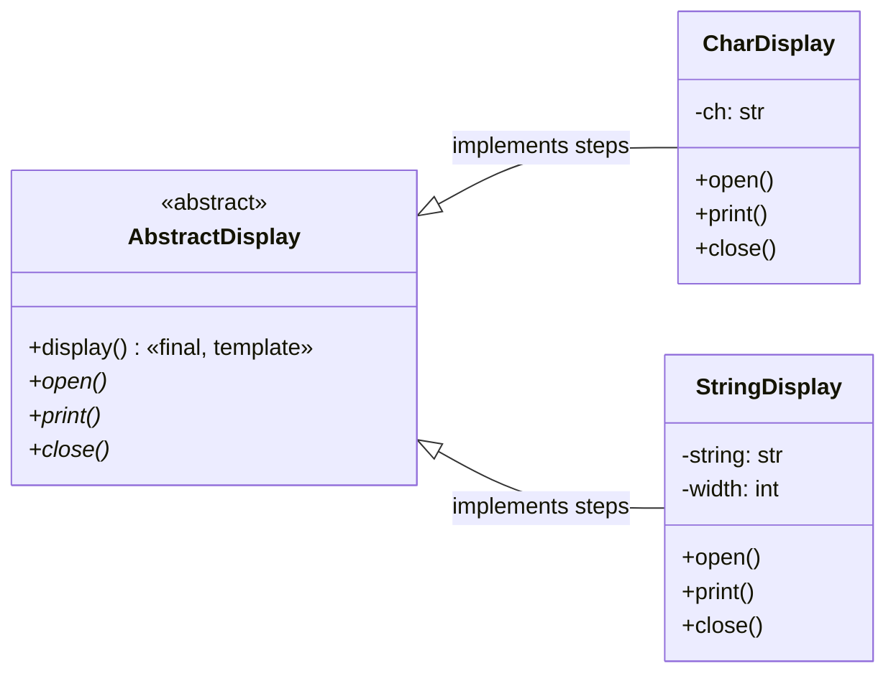

# Template Method Pattern

> **Category:** Behavioral · **Difficulty:** Beginner-friendly · **Dependencies:** none (Python 3.9+ standard library only)

The **Template Method** pattern defines the **skeleton of an algorithm** in a base-class method, deferring individual steps to subclasses. Subclasses redefine *what each step does* without being able to change *which steps run, in what order, how many times*. One algorithm, written once, endlessly re-skinned.

This directory is a complete, runnable tutorial. You can read it top-to-bottom in about 15 minutes, run the demo, run the tests, and then do the exercises at the end.

---

## Table of contents

1. [The problem it solves](#1-the-problem-it-solves)
2. [Real-world analogy](#2-real-world-analogy)
3. [Structure](#3-structure)
4. [Code walkthrough](#4-code-walkthrough)
5. [Run the demo](#5-run-the-demo)
6. [Run the tests](#6-run-the-tests)
7. [Real-world use cases](#7-real-world-use-cases)
8. [When to use it (and when not to)](#8-when-to-use-it-and-when-not-to)
9. [Related patterns](#9-related-patterns)
10. [Exercises](#10-exercises)
11. [References](#11-references)

---

## 1. The problem it solves

Suppose you render things to the terminal in a fixed "banner" format — an opening, the body repeated five times, a closing:

```python
class CharBanner:
    def show(self):
        print("<<", end="")
        for _ in range(5):
            print(self.ch, end="")
        print(">>")

class StringBanner:
    def show(self):
        print("+" + "-" * self.width + "+")
        for _ in range(5):                      # the same loop, again
            print(f"|{self.text}|")
        print("+" + "-" * self.width + "+")
```

Each class re-implements the whole procedure. Three problems creep in as the program grows:

1. **The algorithm is duplicated.** "Open, body ×5, close" exists once per class. Change the repeat count to 3, or add a flush after `close`, and you must edit every class — and hope you found them all.
2. **The copies drift.** Sooner or later one class prints the body four times, or closes before the loop. Nothing in the code says the procedure is supposed to be identical everywhere.
3. **The invariant is unenforceable.** "Every banner must open before it prints" is a rule that lives in developers' heads. New subclasses can — and eventually will — violate it.

The Template Method pattern fixes all three by writing the procedure **once**, in a base-class method (`display()`), and reducing subclasses to filling in three well-named blanks: `open()`, `print()`, `close()`.

## 2. Real-world analogy

Think of a **document template** — the kind your company uses for offer letters. The layout is fixed: letterhead at the top, a body section, the legal footer. Whoever writes a specific letter only fills in the blanks; they cannot move the footer above the body or delete the letterhead, because the template owns the structure. A thousand different letters, one skeleton.

In this example:

| Analogy | Code |
| --- | --- |
| The fixed letter layout | `AbstractDisplay.display()` (the template method) |
| "Letterhead goes here" blank | `open()` (primitive operation, overridden) |
| "Body goes here" blank | `print()` (primitive operation, called 5 times) |
| "Footer goes here" blank | `close()` (primitive operation, overridden) |
| One concrete filled-in letter | `CharDisplay` / `StringDisplay` |
| "You can't move the footer" | `@final` on `display()` |

## 3. Structure

Two packages with a strict one-way dependency — the skeleton on one side, the fill-ins on the other:

```
template_method/
├── framework/                # ABSTRACT side: the algorithm, steps unspecified
│   └── abstract_display.py   #   AbstractDisplay — @final display() template
├── displays/                 # CONCRETE side: depends on framework/, never vice versa
│   ├── char_display.py       #   CharDisplay   — renders <<HHHHH>>
│   └── string_display.py     #   StringDisplay — renders a +---+ framed box
├── main.py                   # demo client
└── tests/                    # executable specification of the pattern's guarantees
```



`framework/` never imports from `displays/`. Control flows *downward* — the template calls the steps, never the other way around. This inversion has a name, the **Hollywood Principle**: *"don't call us, we'll call you"* — and it is the load-bearing idea behind every framework, from `unittest` to Django.

## 4. Code walkthrough

### Step 1 — the template method ([framework/abstract_display.py](framework/abstract_display.py))

```python
class AbstractDisplay(ABC):
    @final
    def display(self) -> None:
        self.open()
        for _ in range(5):
            self.print()
        self.close()
```

Ten lines that carry the whole pattern. `display()` fixes the **skeleton** — open once, body exactly five times, close once — and delegates each step to methods it does not define. It is marked `@final` so subclasses can change *what* happens in each step but never *skip, reorder, or re-count* the steps. "Every display opens before it prints" is now a guarantee, not a convention.

### Step 2 — the abstract steps (same file)

```python
    @abstractmethod
    def open(self) -> None: ...
    @abstractmethod
    def print(self) -> None: ...
    @abstractmethod
    def close(self) -> None: ...
```

Declaring the steps with `@abstractmethod` means a subclass that forgets one **cannot even be instantiated** — Python raises `TypeError` at construction time, not `AttributeError` halfway through `display()`.

### Step 3 — a minimal concrete class ([displays/char_display.py](displays/char_display.py))

```python
class CharDisplay(AbstractDisplay):
    def open(self) -> None:  print("<<", end="")
    def print(self) -> None: print(self._ch, end="")
    def close(self) -> None: print(">>")
```

Only the three blanks are filled in; the loop and its count are inherited. Calling `display()` yields `<<HHHHH>>`.

### Step 4 — a contrasting concrete class ([displays/string_display.py](displays/string_display.py))

```python
class StringDisplay(AbstractDisplay):
    def open(self) -> None:  self._print_line()   # +-----+
    def print(self) -> None: print(f"|{self._string}|")
    def close(self) -> None: self._print_line()   # +-----+
```

The same skeleton, a completely different rendering — a seven-line framed box. Note the private helper `_print_line()` shared by two steps: concrete classes organise their own code freely *below* the hook line.

### Step 5 — the client ([main.py](main.py))

```python
displays: list[AbstractDisplay] = [CharDisplay("H"), StringDisplay("Hello, world."), ...]
for display in displays:
    display.display()
```

The client makes one identical call per object and never learns which subclass it is holding. All variation is inside the steps.

> 💡 Meta-note: this repository's [Factory Method example](../factory_method/) contains a template method too — `Factory.create()` fixes "create → register → return" and defers both steps to subclasses. **Factory Method is Template Method applied to object creation.** Read the two side by side and the family resemblance is unmistakable.

## 5. Run the demo

From the **repository root**:

```bash
python -m template_method.main
```

Expected output:

```text
<<HHHHH>>

+-------------+
|Hello, world.|
|Hello, world.|
|Hello, world.|
|Hello, world.|
|Hello, world.|
+-------------+

+---------------+
|Template Method|
|Template Method|
|Template Method|
|Template Method|
|Template Method|
+---------------+

```

## 6. Run the tests

```bash
python -m unittest discover -s template_method -t .
```

The tests in [tests/](tests/) are written as an executable specification — each one states a guarantee the pattern provides (e.g. *"the step order and count are fixed for every subclass"*, *"an incomplete display cannot even be instantiated"*). Reading them is a good comprehension check.

## 7. Real-world use cases

You already use this pattern daily, often without noticing:

| Domain | Client asks for… | The template fixes the skeleton, you fill the steps |
| --- | --- | --- |
| **Testing** | "run my test" | `unittest.TestCase`: the runner's fixed lifecycle calls *your* `setUp()` → `test_*()` → `tearDown()` — a textbook template method |
| **Web frameworks** | "handle this request" | Django's class-based views: `View.dispatch()` owns the flow, you override `get()` / `post()` / `get_context_data()` |
| **HTTP servers** | "serve this connection" | `socketserver.BaseRequestHandler`: the framework calls `setup()` → `handle()` → `finish()`; you write `handle()` |
| **Parsers** | "parse this HTML" | `html.parser.HTMLParser.feed()` drives the scan and calls your `handle_starttag` / `handle_data` hooks |
| **Data pipelines** | "run the ETL job" | An abstract `run()` = extract → transform → load; each dataset subclass fills in the three stages |
| **Games** | "advance one frame" | A fixed game loop (input → update → render) with per-scene step overrides |
| **CI/CD** | "execute the pipeline" | Fixed stage order (checkout → build → test → deploy); each project customises the stage bodies |
| **Report generation** | "export the report" | One `generate()` = header → body → footer; PDF/HTML/CSV subclasses restyle each part |

The common thread: a framework owns **when** things happen; you supply **what** happens — Hollywood Principle, everywhere.

## 8. When to use it (and when not to)

**Use it when:**

- Several classes share an algorithm that differs only in a few well-defined steps — factor the skeleton up, push the differences down.
- The step order or count is an **invariant** you must protect ("always close after printing", "always tear down the fixture"), even against future subclasses.
- You are building a framework and want to hand users precise, named extension points instead of "override whatever you like".
- Duplicate procedures across sibling classes have already started to drift.

**Don't use it when:**

- The variation isn't step-shaped. If subclasses want a *different skeleton*, forcing them through one template produces contorted hooks. Use [Strategy](../strategy/) to swap whole algorithms instead.
- The algorithm needs to change **at runtime**. Inheritance is decided at class-definition time; a strategy object can be replaced mid-flight.
- There is exactly one variant. A plain method is simpler; add the abstraction when the second variant actually arrives.

**Pythonic alternatives and trade-offs:** Python's first-class functions offer a lighter template: a plain function taking callables for the variable steps —

```python
def display(open_fn, print_fn, close_fn):
    open_fn()
    for _ in range(5):
        print_fn()
    close_fn()
```

This works well for one or two stateless steps (compare `sorted(key=...)`). The class-based form earns its keep when the steps are numerous, share state (`self._width`), need default implementations ("hook methods" that subclasses *may* override), or when the fail-fast completeness check from `abc` matters. Also note Python's `@final` is advisory — enforced by type checkers like mypy, not by the interpreter — whereas Java's `final` is a hard stop; run a type checker if the invariant truly matters.

## 9. Related patterns

- **Factory Method** — Template Method applied to *creation*: [`../factory_method/`](../factory_method/)'s `Factory.create()` fixes the create → register procedure and defers both steps to subclasses. Same skeleton-and-hooks anatomy, specialised purpose.
- **Strategy** — the composition-based alternative: Strategy swaps the *entire* algorithm by injecting an object; Template Method varies *steps inside* one algorithm by subclassing. Runtime flexibility vs. structural guarantees. See [`../strategy/`](../strategy/).
- **Hook methods** — a variation within the pattern itself: steps with a default (possibly empty) body that subclasses *may* override, alongside the mandatory abstract ones (exercise 3 below).
- **Bridge** — also separates an abstraction from its varying parts, but by delegation across two hierarchies rather than inheritance within one.

## 10. Exercises

Try these to confirm your understanding (each should require **no changes** to `framework/` — if you find yourself editing it, revisit section 3):

1. **New display:** add an `HtmlDisplay(text)` whose output is `<ul>`, then five `<li>text</li>` lines, then `</ul>`. Write its tests first by copying [tests/](tests/).
2. **Feel the guarantee:** try to make a subclass print the body only three times *without* touching `framework/`. Notice your options (and their ugliness) — then check what mypy says if you simply override `display()` despite `@final`.
3. **Hook method:** extend a *copy* of `AbstractDisplay` with a non-abstract `separator()` step called between body lines, whose default does nothing. Which subclasses must change? (None — that's the point of hooks with defaults.)
4. **Spot it in the wild:** `unittest` ran this package's own tests. Find the template method in `unittest.TestCase` (hint: look at `run()` in CPython's `Lib/unittest/case.py`) and list which of its steps you have been overriding all along.

## 11. References

- Gamma, Helm, Johnson, Vlissides — *Design Patterns: Elements of Reusable Object-Oriented Software* (GoF), Template Method chapter.
- Hiroshi Yuki — *An Introduction to Design Patterns Learned in the Java Language* (this example's CharDisplay/StringDisplay scenario originates there).
- [Refactoring.Guru — Template Method](https://refactoring.guru/design-patterns/template-method)
- [Python `abc` module documentation](https://docs.python.org/3/library/abc.html)
- [Python `typing.final` documentation](https://docs.python.org/3/library/typing.html#typing.final)
