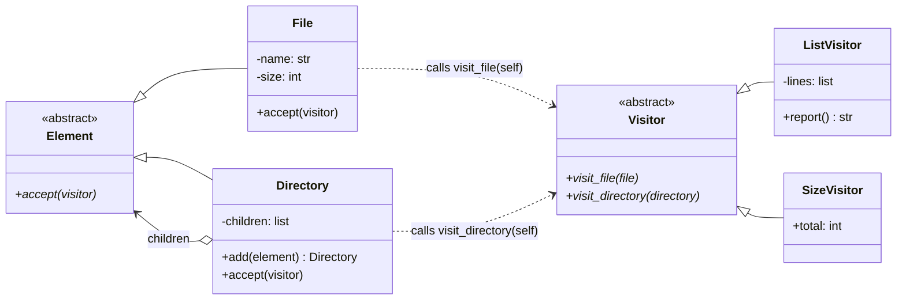

# Visitor Pattern

> **Category:** Behavioral · **Difficulty:** Intermediate · **Dependencies:** none (Python 3.9+ standard library only)

The **Visitor** pattern lets you add new operations to an object structure **without modifying the classes of the elements** it is made of. Each operation becomes its own "visitor" class, and elements cooperate through a tiny `accept(visitor)` method that performs **double dispatch** — selecting behaviour based on *both* the element's type and the visitor's type.

This directory is a complete, runnable tutorial. You can read it top-to-bottom in about 15 minutes, run the demo, run the tests, and then do the exercises at the end.

---

## Table of contents

1. [The problem it solves](#1-the-problem-it-solves)
2. [Real-world analogy](#2-real-world-analogy)
3. [Structure](#3-structure)
4. [Code walkthrough](#4-code-walkthrough)
5. [Run the demo](#5-run-the-demo)
6. [Run the tests](#6-run-the-tests)
7. [Real-world use cases](#7-real-world-use-cases)
8. [When to use it (and when not to)](#8-when-to-use-it-and-when-not-to)
9. [Related patterns](#9-related-patterns)
10. [Exercises](#10-exercises)
11. [References](#11-references)

---

## 1. The problem it solves

Suppose you model a file-system tree with `File` and `Directory` classes, and you need to list it, measure it, search it, export it…

```python
class File:
    def list_line(self, path): ...      # operation 1
    def total_size(self): ...           # operation 2
    def find(self, pattern): ...        # operation 3
    def to_xml(self): ...               # operation 4... and counting

class Directory:
    def list_line(self, path): ...      # the SAME four operations again
    ...
```

This "one method per operation per class" approach breaks down as the program grows:

1. **Every new operation edits every element class.** Want a `to_json()`? You reopen `File`, `Directory`, and any other element — classes that were finished, tested, possibly published in a library you don't control.
2. **Unrelated concerns pile up in the elements.** XML formatting, search logic and size arithmetic all end up inside `Directory`, which should only know how to *be a directory*. Operation-specific state (the current indentation, the running total) has nowhere clean to live.
3. **The `isinstance` escape hatch is worse.** Moving operations out into functions typically produces `if isinstance(e, File) ... elif isinstance(e, Directory) ...` chains — which silently do the wrong thing when a case is forgotten.

The Visitor pattern fixes all three: elements get one permanent method, `accept(visitor)`, and every operation becomes a class with one `visit_*` method per element type. New operation = new visitor class, **zero element changes** — and `abc` guarantees no visitor can forget an element type.

## 2. Real-world analogy

Think of a **building inspector**. A fire inspector, an electrical inspector and an insurance assessor all walk through the *same* building — but each looks at each room differently. The building doesn't contain fire-inspection logic in its walls; it merely *lets inspectors in* (that's `accept`). Each inspector knows what to do in a kitchen versus a server room (those are the `visit_*` methods), carries their own clipboard of findings (visitor state), and decides their own walking route (traversal). Hiring a new kind of inspector requires no renovation.

In this example:

| Analogy | Code |
| --- | --- |
| The building and its rooms | The tree of `Directory` / `File` elements |
| "Inspectors may enter" | `Element.accept(visitor)` |
| A kind of inspection | A `Visitor` subclass (`ListVisitor`, `SizeVisitor`) |
| "In a kitchen, check the extinguisher" | `visit_file(file)` / `visit_directory(directory)` |
| The inspector's clipboard | Visitor state (`_lines`, `_total`) |
| The inspector's walking route | Traversal code inside `visit_directory` |

## 3. Structure

Two class hierarchies that meet only through `accept`/`visit_*` — elements stay stable, operations stay open:

```
visitor/
├── filesystem/       # ELEMENT side: the stable object structure
│   ├── element.py    #   Element   — "anything visitable": accept(visitor)
│   ├── file.py       #   File      — leaf; dispatches to visit_file
│   └── directory.py  #   Directory — composite; dispatches to visit_directory
├── visitors/         # OPERATION side: grows freely, one class per operation
│   ├── visitor.py        # Visitor     — one visit_* per element type
│   ├── list_visitor.py   # ListVisitor — renders the tree as text
│   └── size_visitor.py   # SizeVisitor — totals file sizes
├── main.py           # demo client
└── tests/            # executable specification of the pattern's guarantees
```



The two packages check each other's excesses: `filesystem/` never gains operation code, `visitors/` never needs `isinstance`. Adding operations is free on the element side — that is the **Open/Closed Principle** applied to *operations* rather than *types*.

## 4. Code walkthrough

### Step 1 — the abstract Element ([filesystem/element.py](filesystem/element.py))

```python
class Element(ABC):
    @abstractmethod
    def accept(self, visitor: Visitor) -> None: ...
```

The structure's entire concession to the pattern: "anything in the tree can accept a visitor". Nothing else about operations lives here — ever.

### Step 2 — concrete elements and double dispatch ([filesystem/file.py](filesystem/file.py), [filesystem/directory.py](filesystem/directory.py))

```python
class File(Element):
    def accept(self, visitor: Visitor) -> None:
        visitor.visit_file(self)          # "I am a File."

class Directory(Element):
    def accept(self, visitor: Visitor) -> None:
        visitor.visit_directory(self)     # "I am a Directory."
```

This is **double dispatch** in two steps. Dispatch #1: calling `element.accept(v)` picks the right `accept` polymorphically — the caller doesn't know the element's type. Dispatch #2: that `accept` calls the `visit_*` method matching its own type — now the *visitor's* class determines what actually happens. Two runtime types, one method resolution each, zero `isinstance`.

Note what `Directory.accept` does **not** do: recurse. The tree exposes children via `__iter__`; each visitor chooses its own traversal.

### Step 3 — the abstract Visitor ([visitors/visitor.py](visitors/visitor.py))

```python
class Visitor(ABC):
    @abstractmethod
    def visit_file(self, file: File) -> None: ...
    @abstractmethod
    def visit_directory(self, directory: Directory) -> None: ...
```

One abstract method per element type. `@abstractmethod` turns "every operation must handle every element" from a convention into a rule — an incomplete visitor cannot even be instantiated.

### Step 4 — concrete visitors ([visitors/list_visitor.py](visitors/list_visitor.py), [visitors/size_visitor.py](visitors/size_visitor.py))

```python
class ListVisitor(Visitor):
    def visit_directory(self, directory: Directory) -> None:
        path = f"{self._current_path}/{directory.name}"
        self._lines.append(f"{path} (dir)")
        saved = self._current_path
        self._current_path = path
        for child in directory:
            child.accept(self)            # visitor-owned traversal
        self._current_path = saved
```

A complete operation in one class: formatting, traversal, and working state (`_current_path` — try keeping *that* tidy if listing logic were spread over the element classes). `SizeVisitor` is the payoff proof: a second operation, entirely different, added without touching `filesystem/` at all.

### Step 5 — the client ([main.py](main.py))

```python
lister = ListVisitor()
root.accept(lister)        # operation 1
sizer = SizeVisitor()
root.accept(sizer)         # operation 2 — same tree, same accept
```

The client aims operations at the structure. Same two lines no matter how many visitor types exist.

> 💡 Python's standard library ships this exact shape: subclass `ast.NodeVisitor`, define `visit_FunctionDef`, call `visitor.visit(tree)` — you are adding an operation to Python's syntax-tree classes without modifying them.

## 5. Run the demo

From the **repository root**:

```bash
python -m visitor.main
```

Expected output:

```text
Listing produced by ListVisitor:
/root (dir)
/root/bin (dir)
/root/bin/vi (10000 bytes)
/root/bin/latex (20000 bytes)
/root/tmp (dir)
/root/usr (dir)
/root/usr/alice (dir)
/root/usr/alice/diary.html (100 bytes)
/root/usr/alice/index.html (200 bytes)
/root/usr/bob (dir)
/root/usr/bob/game.doc (400 bytes)

Total size measured by SizeVisitor: 30700 bytes
  /root/bin: 30000 bytes
  /root/tmp: 0 bytes
  /root/usr: 700 bytes
```

## 6. Run the tests

```bash
python -m unittest discover -s visitor -t .
```

The tests in [tests/](tests/) are written as an executable specification — each one states a guarantee the pattern provides (e.g. *"a new operation requires no element changes"*, *"a visitor that forgets an element type cannot even be instantiated"*). Reading them is a good comprehension check.

## 7. Real-world use cases

You already use this pattern daily, often without noticing:

| Domain | Client asks for… | Visitor provides the pluggable operation |
| --- | --- | --- |
| **Compilers & linters** | "analyse this syntax tree" | Python's `ast.NodeVisitor` / `ast.NodeTransformer` — one `visit_ClassDef` per node type; flake8 & friends are stacks of visitors |
| **Code formatters** | "print this tree back as source" | Pretty-printer visitors over the same AST the type-checker visits |
| **Document processing** | "export this document" | HTML / PDF / plain-text renderers walking one paragraph-table-image tree (e.g. docutils writers for reStructuredText) |
| **Static file tools** | "report on this directory tree" | Size auditors, permission checkers, duplicate finders over one scan |
| **Expression evaluation** | "compute / simplify / differentiate" | Evaluator, simplifier and LaTeX-printer visitors over one expression tree (SymPy-style) |
| **Serialization** | "turn this object graph into bytes" | Per-type encoder dispatch (`json.JSONEncoder.default` is a degenerate single-method visitor) |
| **Game development** | "apply this effect to every entity" | Damage / rendering / save-game visitors over a scene graph |
| **Compilers (codegen)** | "emit code for this IR" | One backend visitor per target architecture over a fixed instruction tree |

The common thread: a **stable tree of heterogeneous node types** and an **ever-growing family of whole-structure operations**.

## 8. When to use it (and when not to)

**Use it when:**

- The element class hierarchy is **stable** (files/directories, AST node kinds, document parts) but operations over it keep multiplying.
- Operations are *whole-structure algorithms* with their own working state (paths, totals, output buffers) that would pollute the elements.
- You cannot modify the element classes at all (third-party library, generated code) yet must attach rich behaviour to them.
- You want the "handle every node type" obligation **compiler-checked** — with `abc`, forgetting a case is a `TypeError` at construction, not a silent skip.

**Don't use it when:**

- The **element types** change often. Every new element forces a new abstract `visit_*` and edits to *all* existing visitors — Visitor inverts the usual cost: cheap new operations, expensive new elements.
- The structure has one or two node types, or the operation is trivial — a plain recursive function is simpler and shorter.
- The operation belongs intrinsically to the element (a `File`'s own `size` property doesn't need a visitor).

**Pythonic alternatives and trade-offs:** Python can fake the second dispatch without `accept`. `functools.singledispatch` registers one implementation per argument type; `ast.NodeVisitor` does name-based lookup (`getattr(self, "visit_" + type(node).__name__)`). Both remove the boilerplate `accept` methods — but also the guarantees: nothing forces you to cover every type, and misspelled method names fail silently by falling back to the generic handler. The classic `accept`-based form trades a little ceremony for abc-enforced completeness and works even when elements can't grow an `accept` — pick per situation.

## 9. Related patterns

- **Composite** — Visitor's favourite target: our `Directory`/`File` tree *is* a Composite, and visitors are how you operate on one without bloating it.
- **Iterator** — also walks a structure, but yields elements one by one to an external loop; a visitor brings the operation *into* the walk and dispatches per element type. `Directory.__iter__` shows them cooperating.
- **Strategy** — both extract an algorithm into an object. A strategy replaces *one* algorithm slot in a context; a visitor spreads one operation across *many* element types. See [`../strategy/`](../strategy/).
- **Interpreter** — defines the tree that visitors most often walk; GoF's Interpreter examples are commonly refactored to Visitor as operations accumulate.
- **Factory Method** — orthogonal but complementary: factories build the element trees that visitors later traverse. See [`../factory_method/`](../factory_method/).

## 10. Exercises

Try these to confirm your understanding (the first three should require **no changes** to `filesystem/` — if you find yourself editing it, revisit section 3):

1. **New operation:** write a `FindVisitor(pattern)` that collects the full paths of files whose name contains `pattern`. Add tests mirroring [tests/](tests/).
2. **Traversal ownership:** write a `ShallowListVisitor` that lists only a directory's *direct* children, without recursing. Notice this needs no tree changes — because traversal lives in visitors.
3. **Feel the trade-off:** add a `Symlink(name, target)` element. Count everything you must touch (`Visitor` gains `visit_symlink`, every existing visitor must implement it). This is Visitor's cost side — write down when you would accept it.
4. **Pythonic variant:** reimplement `SizeVisitor` with `functools.singledispatchmethod` and no `accept` calls. Then deliberately forget to register `Directory` — observe what happens (or doesn't), and compare it with `test_incomplete_visitor_cannot_be_instantiated`.

## 11. References

- Gamma, Helm, Johnson, Vlissides — *Design Patterns: Elements of Reusable Object-Oriented Software* (GoF), Visitor chapter.
- Hiroshi Yuki — *An Introduction to Design Patterns Learned in the Java Language*, Visitor chapter (this example's file-system scenario originates there).
- [Refactoring.Guru — Visitor](https://refactoring.guru/design-patterns/visitor)
- [Python `ast.NodeVisitor` documentation](https://docs.python.org/3/library/ast.html#ast.NodeVisitor) — the standard library's production visitor.
- [Python `functools.singledispatch` documentation](https://docs.python.org/3/library/functools.html#functools.singledispatch) — the Pythonic alternative discussed in section 8.
